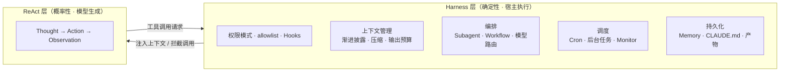

# Claude Code 的驾驭工程：相对普通 ReAct Agent 的差异

> **一句话结论**：ReAct 把「如何行动」全部交给模型在上下文里即兴决定；harness 把这些决定拆开——**能确定的用代码、必须灵活的留给模型、稀缺的上下文省着用、不可逆的操作加闸门。**

---

## 0. 核心判断

**ReAct 是 prompt 层的工程，harness 是进程层的工程。**

| | 普通 ReAct Agent | Claude Code（harness） |
|---|---|---|
| 模型是什么 | 一个 while 循环里的一个函数 | 一个有文件系统、有权限、有子进程、有调度器的进程 |
| 循环形态 | `Thought → Action → Observation`，单线程同步 | 循环仍在，但被多层宿主代码包裹 |
| 状态在哪 | 一个不断增长的 message list | 上下文 + 磁盘 + 会话存储 + 外部产物 |
| 决策谁做 | 全部由模型吐 token 决定 | 关键环节下沉到宿主代码 |

ReAct 有三个硬伤，harness 工程基本都是在补这三点：

1. **上下文会爆** —— 工具结果无节制堆积，到窗口上限就截断或崩溃
2. **模型生成的控制流不可靠** —— 让模型「记得每次都做 X」是概率保证，不是确定性保证
3. **状态不跨会话** —— 每次启动都是白纸

---

## 1. 上下文工程

最大、也最能体现功力的一块。核心思路是**分层加载**与**主动瘦身**，而不是把所有东西塞进一个 prompt。

| 普通 ReAct | Claude Code |
|---|---|
| 工具结果原样堆进 message list | Read 有行数上限、输出可截断；Monitor 把「输出量本身就是对话消息」当作一种成本来管 |
| 所有能力一次性写进 prompt | **渐进披露**：技能 / agent / 工具先只给一行描述，命中才加载全文 |
| 无记忆，超长就截断或直接崩 | 到阈值触发 **compaction**，摘要带进新窗口继续 |
| 子任务结果全部回灌主上下文 | **Subagent 独立窗口**，只回一个结论，由主 agent 转述 |
| 靠 `cat` / `grep` shell 捞文件 | 专用 Grep / Glob / Read，加 Explore 这类只读检索 agent，避免大文件倒进上下文 |

两个容易被忽略的点：

- **输出预算是一等公民**。工具返回多少内容，直接决定了主循环能跑多久。所以「查文件」这件事宁可多花一次工具调用，也要用带行数限制的专用工具，而不是 `cat` 一整个文件。
- **委派本身就是上下文技术**。Subagent 的价值不只是并行，更是**上下文隔离**——它读过的几十个文件不必污染主窗口，主窗口只留下结论。

---

## 2. 控制流工程

> 这是我认为最本质的一条。ReAct 里所有决策都是模型吐 token；harness 决定其中哪些改由宿主代码做。

- **Hooks** —— 在工具调用前后插入确定性逻辑，**由 harness 执行而非模型**。凡是「以后每次做 X 都要 Y」这类要求，prompt 约束不住，必须落到 hooks。
- **权限模式与 allowlist** —— 逐次确认 / acceptEdits / plan / bypass 几种档位，外加细到单条命令的白名单。ReAct 是模型想执行什么就执行什么。
- **Plan mode** —— 计划与执行分离，写代码前有一个显式的人工闸门。
- **Workflow** —— 编排逻辑写成**脚本**，fan-out、pipeline、校验由代码控制，模型只做叶子节点。纯靠模型输出协调几十个 agent 是不可靠的。
- **Cron / 自我调度** —— 模型可以给自己排未来的唤醒时间。ReAct 是被动的请求-响应，不会主动回来。

判断标准很简单：

> **要求「必须发生」的 → 代码（hooks / 权限 / workflow）；要求「灵活应变」的 → 模型。**

---

## 3. 委派与隔离

- 子 agent 拥有**独立上下文窗口**、可选**不同模型**（贵的做规划、便宜的做检索）、可跑在 **git worktree 或远程沙箱**里。
- **并行与流水线原语**：pipeline 让每个维度的校验在该维度评审一完成就立刻启动，不必等全部评审结束——省的是 wall-clock，不是 token。
- **失败语义也写进 harness**：「被拒绝的调用意味着用户拒绝了它——调整，不要原样重试」。把工具层的信号翻译成模型能正确响应的语义，是 harness 的活。

---

## 4. 持续性与跨会话状态

- **文件记忆 + 索引**：每会话加载一份索引（`MEMORY.md`），具体条目按相关性检索。
- **两种持久指令的语义差异**，这个区分很重要：

  | | `CLAUDE.md` | 记忆文件 |
  |---|---|---|
  | 加载方式 | 每次会话强制加载 | 按相关性检索 |
  | 语义 | **必须遵守的指令** | **最好知道的参考** |
  | 适合 | 「永远用中文回答」 | 「这个项目在做什么」 |

  想要「每次都遵守」就写 `CLAUDE.md`；只是想让模型知道背景，写记忆。
- **产物（Artifact）有自己的运行时契约**：能力声明、CSP 白名单、版本冲突处理、从页面自发布回流的更新通知。
- 会话被压缩或中断后可恢复。

---

## 5. 信任与安全边界

ReAct 基本没有这一层，模型输出什么就执行什么。harness 加上：

- **沙箱**与隔离执行环境
- **权限闸门**：不可逆 / 外向的操作默认先确认
- **拒绝语义**：被拒绝 ≠ 出错，是用户做了决定，模型应调整策略而非重试
- **结构化上报**：用 schema 约束输出（如代码审查的 findings），而不是让模型自由发挥格式

---

## 6. 经济性

harness 显式对成本建模，这一点 ReAct 几乎不考虑：

- **缓存 TTL 决定调度节奏**。5 分钟 prompt cache 的窗口意味着：等 300 秒是最差选择——付了 cache miss 的钱，又没摊薄它。要么短到窗口内（如 270 秒），要么长到值得那次 miss（20 分钟以上）。
- **模型路由**：子 agent 按任务难度分配模型，检索类用便宜的。
- **输出体积即成本**：每个 stdout 行都变成一条对话消息，所以过滤器要挑「会采取行动的那几行」。

---

## 7. 架构总览

---

## 8. 一页速查

| 维度 | 普通 ReAct | Claude Code |
|---|---|---|
| 上下文 | 单一窗口，只增不减 | 分层披露 + 压缩 + 隔离 |
| 控制流 | 全由模型生成 | 关键路径下沉为代码 |
| 状态 | 会话内 message list | 跨会话持久化 |
| 并行 | 无 | Subagent / Workflow |
| 调度 | 被动响应 | 可自我调度 |
| 权限 | 无 | 分档 + 白名单 + 沙箱 |
| 成本 | 不建模 | 显式优化 cache / 模型 / 输出量 |
| 本质 | prompt 层工程 | 进程层工程 |
