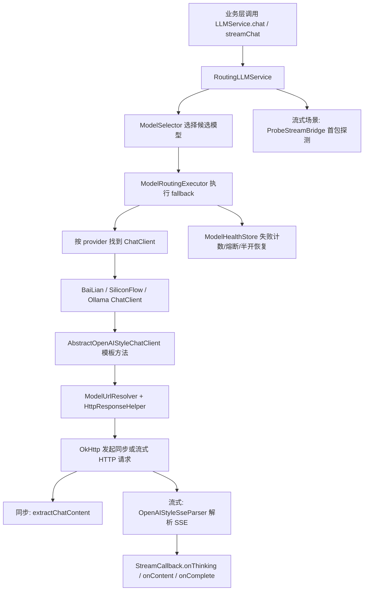
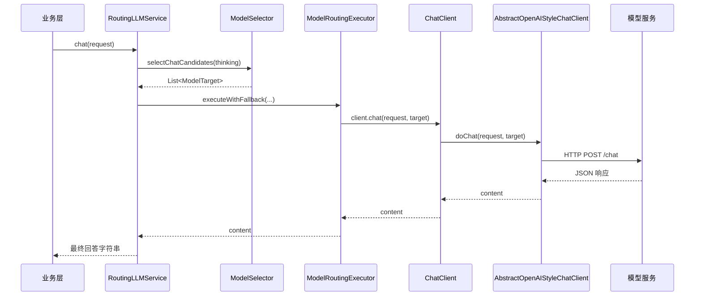

# Ragent infra-ai chat 链路详解

## 1. 文档目标

本文聚焦 `infra-ai` 模块中的 `chat` 路径，完整解释以下问题：

- `infra-ai/chat` 在整个项目中的定位是什么
- 同步聊天链路从 `LLMService.chat()` 到真实 HTTP 请求是如何跑通的
- 流式聊天链路从 `streamChat()` 到 SSE 解析、首包探测、取消控制是如何设计的
- 模型路由、候选选择、健康检查、熔断与 fallback 是如何协作的
- OpenAI 兼容协议是如何被抽象为统一模板的
- 供应商客户端、HTTP 工具类、异常分类在链路中分别扮演什么角色
- 这条链路体现了哪些关键工程思想

本文覆盖 `infra-ai/chat` 目录及其依赖的 `model`、`config`、`http` 相关类，力求把整个聊天能力链路讲清楚。

## 2. 模块定位

`infra-ai` 模块不是业务编排层，而是 AI 基础设施层。

在 `chat` 路径中，它主要解决四类问题：

- 给上层业务提供统一的聊天接口，不暴露供应商差异
- 根据配置和健康状态选择合适的模型
- 封装同步与流式调用，统一流式输出协议
- 处理模型错误、首包超时、无内容、取消等底层复杂性

因此，`infra-ai/chat` 的本质是一个：

- 模型聊天统一抽象层
- 路由执行层
- 流式协议适配层

## 3. 总体结构

`chat` 路径下的核心类如下：

- `LLMService`
  - 对上暴露统一聊天接口
- `RoutingLLMService`
  - 聊天总入口，负责路由、fallback、流式首包探测
- `ChatClient`
  - 供应商聊天客户端接口
- `AbstractOpenAIStyleChatClient`
  - OpenAI 兼容协议模板实现
- `BaiLianChatClient` / `SiliconFlowChatClient` / `OllamaChatClient`
  - 具体供应商客户端
- `StreamCallback`
  - 流式输出回调接口
- `StreamAsyncExecutor`
  - 流式异步执行器
- `StreamCancellationHandle` / `StreamCancellationHandles`
  - 流式取消句柄
- `ProbeStreamBridge`
  - 首包探测桥接器
- `OpenAIStyleSseParser`
  - OpenAI 风格流式响应解析器

依赖的关键支撑类：

- `AIModelProperties`
  - AI 模型与 provider 配置
- `ModelSelector`
  - 候选模型选择器
- `ModelRoutingExecutor`
  - fallback 路由执行器
- `ModelHealthStore`
  - 模型健康状态和熔断器
- `ModelTarget`
  - 一次实际模型调用的目标描述
- `ModelUrlResolver`
  - 解析最终请求 URL
- `HttpResponseHelper`
  - 响应读取与公共校验
- `ModelClientException`
  - 模型客户端异常

## 4. 总框图

## 5. 顶层接口：`LLMService`

统一聊天接口定义在：

- `LLMService`

它对外提供两类能力：

- 同步聊天
  - `chat(String prompt)`
  - `chat(ChatRequest request)`
  - `chat(ChatRequest request, String modelId)`
- 流式聊天
  - `streamChat(String prompt, StreamCallback callback)`
  - `streamChat(ChatRequest request, StreamCallback callback)`

### 5.1 为什么要有 `LLMService`

它解决的是“业务层不应该直接依赖具体供应商客户端”这个问题。

上层业务只需要知道：

- 我传一个 `ChatRequest`
- 你给我字符串结果，或者流式回调结果

至于底层到底是：

- 百炼
- SiliconFlow
- Ollama
- 还是以后新增的 OpenAI 风格服务

都不应该暴露到业务层。

### 5.2 默认方法的意义

`chat(String)` 和 `streamChat(String, callback)` 是简化入口。

它们只是把单个字符串包装成：

- `ChatRequest.builder().messages(List.of(ChatMessage.user(prompt))).build()`

这样做的意义是：

- 简单场景更方便
- 复杂场景仍保留完整 `ChatRequest` 能力

## 6. 聊天总入口：`RoutingLLMService`

`RoutingLLMService` 是 `LLMService` 的主实现，也是聊天链路真正的总入口。

它承担两个职责：

- 同步聊天路由
- 流式聊天路由

### 6.1 为什么叫 Routing

因为它不是简单转发请求，而是先做：

- 候选模型选择
- 健康状态检查
- provider client 解析
- 失败回退

之后才真正把请求交给某个供应商客户端。

也就是说：

- `RoutingLLMService` 是“聊天路由器”
- 不是“聊天客户端”

## 7. 同步聊天链路

同步聊天入口在：

- `RoutingLLMService.chat(ChatRequest request)`

核心逻辑非常短：

1. 根据 `thinking` 选择聊天候选模型
2. 调用 `ModelRoutingExecutor.executeWithFallback(...)`
3. 根据 `target.provider` 找到对应 `ChatClient`
4. 执行 `client.chat(request, target)`
5. 成功则返回完整字符串
6. 失败则自动尝试下一个模型

### 7.1 同步链路时序图

## 8. 流式聊天链路

流式聊天入口在：

- `RoutingLLMService.streamChat(ChatRequest request, StreamCallback callback)`

它比同步链路复杂得多，因为除了模型路由，还要解决：

- 流式首包是否成功
- 是否有内容
- 是否需要快速切备用模型
- 如何取消
- 如何避免首包前就把脏数据推给下游

### 8.1 流式链路核心流程

1. 选择候选模型
2. 检查是否有可用模型
3. 逐个尝试模型
4. 为每个模型创建 `ProbeStreamBridge`
5. 调 `client.streamChat(request, bridge, target)`
6. 阻塞等待首包探测结果
7. 首包成功则提交缓冲并返回取消句柄
8. 首包失败、超时、无内容则标记失败并切下一个模型
9. 所有模型都失败则 `callback.onError(...)`

### 8.2 为什么流式链路不能直接复用同步 fallback

同步场景里：

- 一次 `client.chat()` 要么返回完整字符串，要么抛异常

流式场景里：

- 请求一旦发出，可能先建立连接，再过很久才首包
- 也可能启动成功但一直没有内容
- 还可能只收到一半就断流

因此，流式聊天必须引入：

- 首包探测
- 缓冲提交
- 取消句柄
- 无内容判断

这也是 `RoutingLLMService.streamChat()` 单独实现而不直接走 `executeWithFallback()` 的根本原因。

## 9. 模型候选选择：`ModelSelector`

无论同步还是流式，第一步都会调用：

- `ModelSelector.selectChatCandidates(deepThinking)`

### 9.1 `ModelSelector` 做了什么

它会：

- 读取 `AIModelProperties.chat`
- 根据 `deepThinking` 决定优先模型
- 过滤掉禁用模型
- 如果是思考模式，过滤掉不支持 `supportsThinking` 的模型
- 按优先级排序
- 过滤掉已经被熔断的模型
- 最终构造 `List<ModelTarget>`

### 9.2 什么是 `ModelTarget`

`ModelTarget` 是“实际待调用模型”的统一描述对象。

它至少包含：

- `id`
  - 模型目标唯一标识
- `candidate`
  - 候选模型配置
- `provider`
  - provider 基础配置

它的意义是：

- 把一次模型调用所需的配置全部收敛起来

后面所有调用都围绕 `ModelTarget` 展开。

## 10. 路由执行器：`ModelRoutingExecutor`

同步聊天真正的 fallback 执行由：

- `ModelRoutingExecutor.executeWithFallback(...)`

负责。

### 10.1 它的抽象很关键

这个方法接收四个参数：

- `capability`
  - 当前能力类型，如 `CHAT`
- `targets`
  - 候选模型列表
- `clientResolver`
  - 如何从 `target` 找到具体 client
- `caller`
  - 如何用 `client + target` 发起调用

这说明：

- 路由器本身不关心聊天、Embedding、Rerank 的细节
- 它只关心“候选遍历 + 成功返回 + 失败切换”

因此它是一个可复用的通用 AI 路由模板。

### 10.2 核心逻辑

它的执行流程非常直白：

1. 候选为空直接抛异常
2. 遍历每个 `target`
3. 通过 `clientResolver` 找 `client`
4. 检查 `healthStore.allowCall(target.id())`
5. 执行 `caller.call(client, target)`
6. 成功则 `markSuccess` 并返回
7. 失败则 `markFailure` 并继续
8. 所有候选失败则抛 `RemoteException`

## 11. 模型健康管理：`ModelHealthStore`

`ModelHealthStore` 是聊天路由稳定性的关键支撑。

它实现了一个轻量级断路器。

### 11.1 三种状态

- `CLOSED`
  - 正常可用
- `OPEN`
  - 熔断打开，不允许调用
- `HALF_OPEN`
  - 试探恢复，只允许单次探活

### 11.2 状态转换逻辑

- 连续失败次数达到 `failureThreshold`
  - 进入 `OPEN`
- `OPEN` 持续到 `openUntil`
  - 超时后转 `HALF_OPEN`
- `HALF_OPEN` 成功
  - 回到 `CLOSED`
- `HALF_OPEN` 失败
  - 重新 `OPEN`

### 11.3 为什么这个设计重要

如果没有健康状态：

- 每次都会优先尝试已经坏掉的模型
- 每次都会在第一个模型上浪费时间

有了 `ModelHealthStore`：

- 坏模型能临时跳过
- 故障恢复后又能自动试探恢复

这是生产可用性非常关键的一环。

## 12. 供应商客户端抽象：`ChatClient`

`ChatClient` 是供应商聊天客户端统一接口。

它定义两个能力：

- `chat(request, target)`
- `streamChat(request, callback, target)`

这说明对于任意 provider，只要能实现这两个方法，就能接入整个聊天路由体系。

### 12.1 为什么还要有 `provider()`

`provider()` 返回 provider 标识，例如：

- `bailian`
- `siliconflow`
- `ollama`

`RoutingLLMService` 会把所有 `ChatClient` 注入成：

- `Map<String, ChatClient> clientsByProvider`

然后通过：

- `target.candidate().getProvider()`

找到正确的 client。

## 13. 供应商实现：三个具体 ChatClient

当前主要实现有：

- `BaiLianChatClient`
- `SiliconFlowChatClient`
- `OllamaChatClient`

它们都非常薄，只做三件事：

- 声明自己的 `provider()`
- 同步调用委托给 `doChat()`
- 流式调用委托给 `doStreamChat()`

### 13.1 为什么实现这么薄

因为大部分协议共性被抽到了：

- `AbstractOpenAIStyleChatClient`

也就是说，当前这些 provider 都被视为：

- OpenAI 兼容协议的不同实例

这正是模板方法模式的价值。

### 13.2 `OllamaChatClient` 的特殊点

它覆写了：

- `requiresApiKey()`

返回 `false`。

这说明基类模板已经考虑到了：

- 某些 provider 需要鉴权
- 某些本地服务不需要 API Key

## 14. OpenAI 兼容模板基类：`AbstractOpenAIStyleChatClient`

这是 `chat` 路径中最核心的一个类。

它把 OpenAI 风格协议下的绝大多数公共逻辑都抽象出来了。

### 14.1 同步调用模板：`doChat()`

同步调用流程如下：

1. 校验 provider 配置存在
2. 校验 API Key（如果需要）
3. 构建请求体 `buildRequestBody(request, target, false)`
4. 构建带鉴权头的 OkHttp 请求
5. 发起同步 HTTP 调用
6. 如果 HTTP 非 2xx，抛 `ModelClientException`
7. 将响应体解析成 JSON
8. 用 `extractChatContent()` 提取 `choices[0].message.content`

这条链路说明它遵循的是标准 OpenAI Chat Completions 风格响应格式。

### 14.2 流式调用模板：`doStreamChat()`

流式调用流程如下：

1. 校验 provider 与 API Key
2. 构建请求体，并设置 `stream=true`
3. 增加 `Accept: text/event-stream`
4. 使用 `streamingHttpClient.newCall(...)`
5. 交给 `StreamAsyncExecutor.submit(...)` 异步执行
6. 返回 `StreamCancellationHandle`

真正的流式读取发生在：

- `doStream(...)`

### 14.3 请求体构建：`buildRequestBody()`

这个方法统一构建 OpenAI 风格请求体：

- `model`
- `stream`
- `messages`
- `temperature`
- `top_p`
- `top_k`
- `max_tokens`

其中 `messages` 来源于 `ChatRequest.getMessages()`，会被统一转成：

- `system`
- `user`
- `assistant`

这一步非常关键，因为它把项目内部的 `ChatMessage` 抽象，转换成了供应商协议需要的标准字段。

### 14.4 扩展钩子：`customizeRequestBody()`

这是模板方法模式里的扩展点。

默认实现会在 `thinking=true` 时加入：

- `enable_thinking=true`

如果未来某个 provider 有额外私有字段，也可以在子类覆写这里。

这意味着：

- 共性字段统一处理
- 差异字段通过钩子扩展

## 15. 流式读取核心：`doStream()`

`doStream()` 是流式 HTTP 读循环的核心实现。

它的职责是：

- 执行 OkHttp 调用
- 逐行读取 SSE 响应
- 解析每一行事件
- 调用下游 `StreamCallback`

### 15.1 流式读取逻辑

读取过程大致如下：

1. `call.execute()`
2. 检查 HTTP 状态码
3. 获取 `ResponseBody.source()`
4. 循环 `readUtf8Line()`
5. 跳过空行
6. 调 `OpenAIStyleSseParser.parseLine(...)`
7. 根据结果触发：
   - `callback.onThinking(...)`
   - `callback.onContent(...)`
   - `callback.onComplete()`

### 15.2 为什么要逐行解析

OpenAI 风格的流式响应本质上是：

- SSE 格式
- 每一行以 `data:` 开头
- 最后以 `[DONE]` 结束

因此逐行读取是最自然、也最稳妥的做法。

### 15.3 取消处理

循环条件中会不断检查：

- `cancelled.get()`

如果取消：

- 直接结束读取
- 不再继续向下回调内容

这保证了用户点击“停止生成”后，底层不会继续输出残余内容。

### 15.4 为什么 `onComplete()` 只在解析到完成时触发

代码中只有在解析结果明确 `completed=true` 时才调用：

- `callback.onComplete()`

如果没有完成标记、只是连接异常结束，会抛：

- `ModelClientException(provider + " 流式响应异常结束", INVALID_RESPONSE, null)`

这体现了一个很重要的设计：

- 正常完成和异常断流必须区分

## 16. SSE 解析器：`OpenAIStyleSseParser`

这个类负责把每一行 SSE 文本解析成结构化事件。

### 16.1 它支持哪些输入格式

它兼容两种 OpenAI 风格字段：

- `choice.delta.content`
- `choice.message.content`

并且可选解析：

- `reasoning_content`

这意味着它不仅支持普通聊天增量内容，也兼容“思考过程”字段。

### 16.2 完成判定

它通过两种方式判断完成：

- 数据行为 `[DONE]`
- `finish_reason` 非空

然后返回：

- `ParsedEvent.completed = true`

### 16.3 为什么解析器独立成类

如果把解析逻辑散在 `doStream()` 里：

- 代码会很臃肿
- 不利于协议适配和扩展

独立出来后：

- 协议层更清晰
- 流式读取和流式解析职责分离

## 17. 流式回调接口：`StreamCallback`

流式输出统一通过 `StreamCallback` 向上游传递。

它定义四个事件：

- `onContent(String content)`
- `onThinking(String content)`
- `onComplete()`
- `onError(Throwable error)`

### 17.1 为什么不能直接把 HTTP 输出给业务层

因为业务层不应该关心：

- SSE 行格式
- OkHttp
- `[DONE]`
- `delta/message` 字段

业务层更关心的是：

- 来了一段正文
- 来了一段思考内容
- 正常结束了
- 出错了

`StreamCallback` 就是这个“协议语义翻译层”。

## 18. 流式异步执行器：`StreamAsyncExecutor`

流式请求不是阻塞当前线程去读完整个响应，而是交给线程池异步执行。

`StreamAsyncExecutor.submit(...)` 负责：

- 创建 `cancelled` 标志位
- 将流式任务提交到 `Executor`
- 如果线程池拒绝执行，立刻 `call.cancel()` 并回调错误
- 返回 `StreamCancellationHandle`

### 18.1 为什么需要单独的异步执行器

它把下面这些逻辑统一抽出来了：

- 线程池提交
- 提交失败兜底
- 取消句柄构造

避免这些样板代码在每个 provider client 里重复出现。

## 19. 流式取消机制：`StreamCancellationHandle`

流式调用返回的不是字符串，而是：

- `StreamCancellationHandle`

它对上暴露一个很简单的能力：

- `cancel()`

### 19.1 具体实现：`StreamCancellationHandles.fromOkHttp(...)`

实际取消句柄会同时做两件事：

- `cancelled.set(true)`
- `call.cancel()`

并通过 `AtomicBoolean once` 保证：

- 多次取消是幂等的

### 19.2 为什么取消要双层控制

只调 `call.cancel()` 不够，因为业务循环里还在判断本地状态；
只改 `cancelled` 也不够，因为底层 HTTP 连接可能还挂着。

双层取消能同时覆盖：

- 本地读取循环
- 底层网络连接

## 20. 首包探测桥接器：`ProbeStreamBridge`

这是整个 `chat` 路径中非常有工程含量的一部分。

它的作用是：

- 在真正确认流式输出“可用”之前，先缓冲内容
- 等待首包探测结果
- 成功后再把缓冲内容统一提交给下游

### 20.1 为什么需要首包探测

流式请求常见失败场景有：

- 请求建立成功，但迟迟没有首包
- 请求完成了，但没有任何内容
- 请求启动时就报错

如果没有首包探测：

- 上游会过早认为流式调用成功
- 甚至可能已经给前端推了一半不完整的状态

### 20.2 它怎么工作

`ProbeStreamBridge` 本身实现了 `StreamCallback`。

它在内部维护：

- `probe`
  - `CompletableFuture<ProbeResult>`，记录首包探测结果
- `buffer`
  - 缓冲的回调动作
- `committed`
  - 是否已提交缓冲

### 20.3 事件如何影响探测结果

- `onContent()` / `onThinking()`
  - 认为探测成功
- `onComplete()`
  - 认为无内容完成
- `onError()`
  - 认为探测失败

### 20.4 `awaitFirstPacket()` 的意义

`RoutingLLMService` 在发起流式调用后，会阻塞等待：

- `bridge.awaitFirstPacket(timeout)`

如果结果是：

- `SUCCESS`
  - 提交缓冲，认为当前模型可用
- `TIMEOUT`
  - 切备用模型
- `NO_CONTENT`
  - 切备用模型
- `ERROR`
  - 切备用模型

这样实现了：

- 首包级别的流式 fallback

这比普通同步 fallback 更适合流式大模型场景。

## 21. URL 与 HTTP 公共工具

### 21.1 `ModelUrlResolver`

它负责解析最终请求 URL，优先级是：

- 候选模型 URL
- 否则 provider baseUrl + capability endpoint

这使得模型配置支持两种模式：

- 某个模型单独指定 URL
- 沿用 provider 公共 URL 和端点配置

### 21.2 `HttpResponseHelper`

它统一处理这些公共逻辑：

- `readBody()`
  - 安全读取响应体文本
- `parseJson()`
  - 将响应体解析为 JSON
- `requireProvider()`
  - 校验 provider 配置存在
- `requireApiKey()`
  - 校验 API Key 存在
- `requireModel()`
  - 校验模型名存在

这些看似琐碎，但非常重要，因为它们把：

- 配置校验
- 响应处理
- 异常语义

从主链路中抽离了出来。

## 22. 错误处理与异常模型

底层 HTTP 和模型调用异常统一使用：

- `ModelClientException`

并通过：

- `ModelClientErrorType`

做分类，包括：

- `UNAUTHORIZED`
- `RATE_LIMITED`
- `SERVER_ERROR`
- `CLIENT_ERROR`
- `NETWORK_ERROR`
- `INVALID_RESPONSE`
- `PROVIDER_ERROR`

### 22.1 为什么这样设计

如果所有错误都只是普通 `RuntimeException`：

- 上层很难知道是：
  - 网络波动
  - HTTP 429
  - provider 认证失败
  - 响应结构错误

而错误分类后，可以：

- 更好做日志治理
- 更好做熔断决策
- 更好排查问题

## 23. thinking 模式是如何传递的

`ChatRequest` 中有：

- `thinking`

它会在多个层面起作用：

### 23.1 候选选择层

`ModelSelector.selectChatCandidates(deepThinking)`

只会保留：

- `supportsThinking = true`

的模型。

### 23.2 请求体层

在 `AbstractOpenAIStyleChatClient.customizeRequestBody()` 中：

- 如果 `thinking=true`
- 默认会加入 `enable_thinking=true`

### 23.3 流式解析层

流式读取时：

- `isReasoningEnabledForStream(request)`

决定是否解析：

- `reasoning_content`

这说明 thinking 不是单点开关，而是贯穿：

- 选模型
- 发请求
- 解析响应

的完整链路。

## 24. 这条链路的关键设计思想

### 24.1 接口统一，供应商解耦

业务层只面对 `LLMService`，不直接依赖任何 provider。

### 24.2 配置驱动，而不是硬编码驱动

模型候选、provider、优先级、thinking 支持、端点路径全部来自配置。

### 24.3 模板方法复用协议共性

`AbstractOpenAIStyleChatClient` 把 OpenAI 协议共性抽出来，最大化复用。

### 24.4 路由层与 client 层职责分离

- 路由层决定“调谁”
- client 层决定“怎么调”

### 24.5 流式链路重视“可用性验证”

通过 `ProbeStreamBridge` 做首包探测，而不是只要发起成功就当成功。

### 24.6 取消语义完整

取消不是简单停前端，而是：

- 本地状态停止
- HTTP 连接中断

双重保障。

### 24.7 错误分类明确

底层异常被标准化，有利于 fallback、熔断和排障。

## 25. 同步与流式的本质差异

### 25.1 同步调用

特点：

- 一次请求
- 一次结果
- fallback 简单

### 25.2 流式调用

特点：

- 请求与输出持续时间长
- 需要异步执行
- 需要取消句柄
- 需要首包探测
- 需要区分正常完成和异常断流

因此，流式调用的复杂度显著高于同步调用，这也是 `infra-ai/chat` 设计重点所在。

## 26. 边界场景与容错

### 26.1 没有可用模型

同步：

- `ModelRoutingExecutor` 直接抛 `RemoteException`

流式：

- `RoutingLLMService.streamChat()` 直接抛无可用模型错误

### 26.2 provider client 缺失

如果 `clientsByProvider` 找不到对应 `ChatClient`：

- 记录 warn
- 跳过当前 target

### 26.3 HTTP 非 2xx

会被包装成：

- `ModelClientException`

并进入 fallback / 错误处理链路。

### 26.4 流式线程池繁忙

`StreamAsyncExecutor` 捕获 `RejectedExecutionException` 后：

- 取消底层 call
- 回调 `onError`
- 返回空操作句柄

### 26.5 流式无内容结束

如果建立了流但没有首包内容，`ProbeStreamBridge` 会返回：

- `NO_CONTENT`

然后路由层切下一个模型。

### 26.6 流式解析失败

单行解析失败只会：

- 记录 warn

不会直接中断整条流，这是一种“局部容错”设计。

## 27. 推荐阅读顺序

建议按下面顺序阅读源码：

1. `LLMService`
2. `RoutingLLMService`
3. `ModelSelector`
4. `ModelRoutingExecutor`
5. `ModelHealthStore`
6. `ChatClient`
7. `AbstractOpenAIStyleChatClient`
8. `OpenAIStyleSseParser`
9. `ProbeStreamBridge`
10. `StreamAsyncExecutor`
11. `StreamCancellationHandles`
12. `HttpResponseHelper`
13. `ModelUrlResolver`
14. `BaiLianChatClient / SiliconFlowChatClient / OllamaChatClient`

这样最容易把“入口 -> 路由 -> 执行 -> 协议 -> 流式 -> 容错”串起来。

## 28. 一句话总结

`infra-ai/chat` 本质上是一套面向大模型聊天能力的基础设施实现：它通过 `LLMService` 统一对外接口，借助 `RoutingLLMService + ModelSelector + ModelRoutingExecutor + ModelHealthStore` 完成模型候选选择、熔断降级和 fallback，再通过 `AbstractOpenAIStyleChatClient` 抽象 OpenAI 兼容协议下的同步/流式调用细节，并结合 `ProbeStreamBridge`、`OpenAIStyleSseParser`、取消句柄和错误分类机制，构建出一条兼顾统一性、可扩展性和生产稳定性的聊天能力链路。
