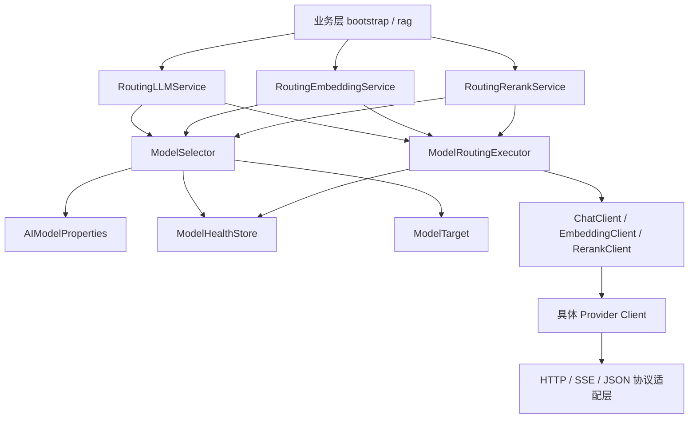
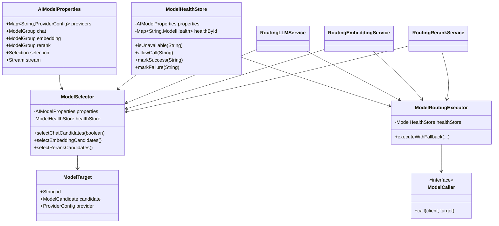
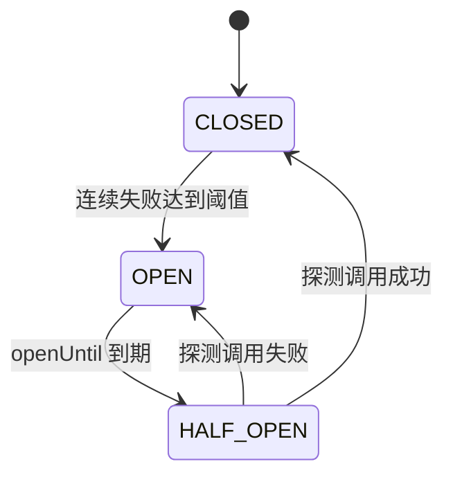
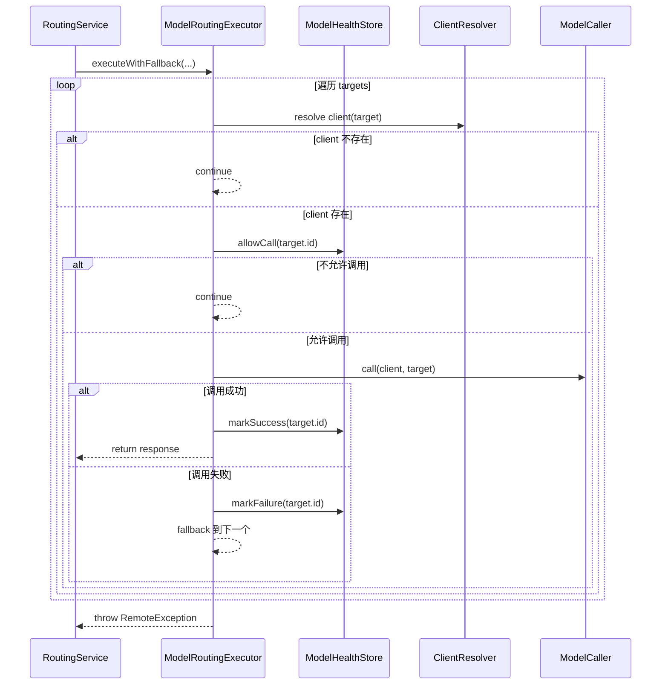
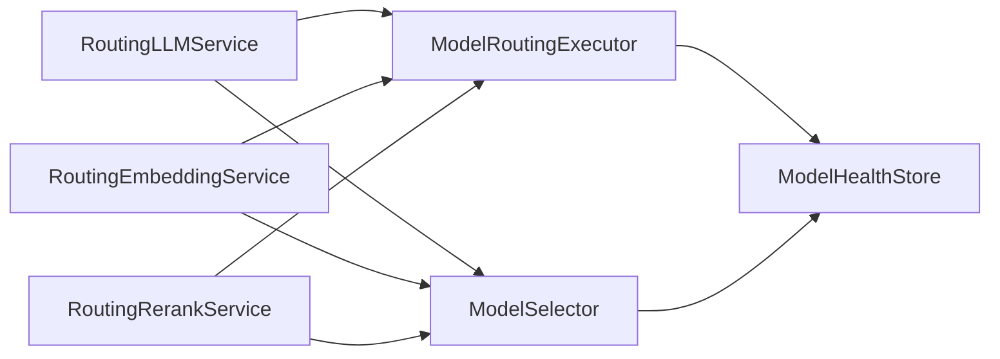

# Ragent `infra-ai/model` 模块技术文档

## 1. 文档目标

本文聚焦 `infra-ai` 模块中的 `model` 子包，系统解释以下问题：

- `model` 模块在整个 `Ragent` 架构中的定位是什么
- 它解决了哪些核心工程问题
- `ModelSelector`、`ModelRoutingExecutor`、`ModelHealthStore`、`ModelTarget`、`ModelCaller` 分别承担什么职责
- 模型候选选择、熔断、失败回退、半开恢复的设计思想是什么
- 模块内部使用了哪些 Java / Spring / 并发 / 函数式编程技术
- Chat / Embedding / Rerank 三条能力链路如何复用这套路由治理中枢
- 后续如果要新增模型供应商、新增能力或者调整路由策略，应该从哪里扩展

本文不是只解释单个类，而是把 `model` 子包当成一个完整的“模型路由治理中枢”来理解。

---

## 2. 模块定位

`infra-ai/model` 不是业务模型定义层，也不是具体供应商协议适配层，而是整个 AI 基础设施中的 **模型选择与故障治理中枢**。

它位于：

- 上层：`RoutingLLMService` / `RoutingEmbeddingService` / `RoutingRerankService`
- 下层：各类 `ChatClient` / `EmbeddingClient` / `RerankClient`

中间，负责把“应该调用哪个模型”和“当前哪些模型还能用”这两个问题统一收敛。

从职责上看，这个模块主要解决 4 类问题：

- **候选选择**：从配置中选出当前请求可用的模型
- **优先级排序**：把默认模型、深度思考模型、优先级配置转成可执行顺序
- **健康治理**：对连续失败模型进行熔断，避免每次都打到坏模型
- **失败回退**：当前模型失败时自动切下一个候选模型

换句话说，`model` 模块解决的核心问题不是“怎么发 HTTP 请求”，而是：

- 谁有资格参与调用
- 谁优先被尝试
- 谁应该暂时被跳过
- 当前模型失败后如何平滑切备用模型

---

## 3. 在整体架构中的位置

`infra-ai` 的总体分层大致是：

- 配置层：`config`
- 能力门面层：`chat` / `embedding` / `rerank`
- 路由治理层：`model`
- 协议 / HTTP 适配层：`http` 和各能力抽象基类

其中 `model` 子包正好处于路由治理层。

### 3.1 总体位置框图



### 3.2 一句话总结位置

- `config` 负责“把配置读进来”
- `model` 负责“决定调谁、是否还能调”
- `chat/embedding/rerank` 负责“把业务请求交给路由器”
- provider client 负责“真正发请求”

因此，`model` 模块本质上是整个 AI 调用链路的 **决策层**。

---

## 4. 模块文件总览

`infra-ai/model` 目录下的核心类如下：

- [ModelSelector](file:///e:/java/workspace/ragent/infra-ai/src/main/java/com/nageoffer/ai/ragent/infra/model/ModelSelector.java)
- [ModelRoutingExecutor](file:///e:/java/workspace/ragent/infra-ai/src/main/java/com/nageoffer/ai/ragent/infra/model/ModelRoutingExecutor.java)
- [ModelHealthStore](file:///e:/java/workspace/ragent/infra-ai/src/main/java/com/nageoffer/ai/ragent/infra/model/ModelHealthStore.java)
- [ModelTarget](file:///e:/java/workspace/ragent/infra-ai/src/main/java/com/nageoffer/ai/ragent/infra/model/ModelTarget.java)
- [ModelCaller](file:///e:/java/workspace/ragent/infra-ai/src/main/java/com/nageoffer/ai/ragent/infra/model/ModelCaller.java)

紧邻依赖包括：

- [AIModelProperties](file:///e:/java/workspace/ragent/infra-ai/src/main/java/com/nageoffer/ai/ragent/infra/config/AIModelProperties.java)
- [ModelCapability](file:///e:/java/workspace/ragent/infra-ai/src/main/java/com/nageoffer/ai/ragent/infra/enums/ModelCapability.java)

直接调用方包括：

- [RoutingLLMService](file:///e:/java/workspace/ragent/infra-ai/src/main/java/com/nageoffer/ai/ragent/infra/chat/RoutingLLMService.java)
- [RoutingEmbeddingService](file:///e:/java/workspace/ragent/infra-ai/src/main/java/com/nageoffer/ai/ragent/infra/embedding/RoutingEmbeddingService.java)
- [RoutingRerankService](file:///e:/java/workspace/ragent/infra-ai/src/main/java/com/nageoffer/ai/ragent/infra/rerank/RoutingRerankService.java)

---

## 5. 核心设计思想

在进入类级别之前，先理解这个模块背后的设计思想。

### 5.1 配置驱动而不是代码硬编码

模型候选、默认模型、深度思考模型、供应商、优先级、开关、熔断参数，都来自 [AIModelProperties](file:///e:/java/workspace/ragent/infra-ai/src/main/java/com/nageoffer/ai/ragent/infra/config/AIModelProperties.java) 绑定的 `application.yaml` 配置。

这样做的价值是：

- 新增模型不需要改业务代码
- 变更优先级不需要重新设计类结构
- 本地 / 测试 / 生产可以用不同候选集

### 5.2 路由决策与协议调用分离

`model` 模块只负责：

- 选模型
- 排顺序
- 健康判断
- fallback

它不负责：

- HTTP 如何发
- JSON 怎么解析
- SSE 如何处理

这些都交给具体的 `Client` 和 `http` / `chat` / `embedding` / `rerank` 子包。

这就是典型的 **职责分离**。

### 5.3 统一治理三类能力

Chat、Embedding、Rerank 虽然调用协议不同，但“候选模型选择 -> 熔断判断 -> 失败回退”的治理流程是相同的。

因此作者把这部分抽成统一中枢：

- `ModelSelector`
- `ModelRoutingExecutor`
- `ModelHealthStore`

从而避免三套重复实现。

### 5.4 轻量断路器而非重型框架

这里没有引入 Resilience4j、Sentinel 之类的通用熔断框架，而是自己用：

- `ConcurrentHashMap`
- `compute`
- `AtomicBoolean`
- 状态机

实现了一个小而专用的模型健康控制器。

这样做的好处是：

- 逻辑非常贴合“模型路由”场景
- 状态简单，容易调试
- 依赖少，侵入小

### 5.5 优雅降级优先于一次失败即中断

这套模块的默认思想不是“某个模型失败就整个请求失败”，而是：

- 先看下一个候选能不能成功
- 只要有一个候选成功，请求就整体成功

这体现的是 **高可用优先** 的设计取向。

---

## 6. 配置模型：`AIModelProperties`

`model` 模块的所有决策都建立在 [AIModelProperties](file:///e:/java/workspace/ragent/infra-ai/src/main/java/com/nageoffer/ai/ragent/infra/config/AIModelProperties.java) 上。

它通过：

```java
@ConfigurationProperties(prefix = "ai")
```

把 `application.yaml` 中的 `ai.*` 读取进来。

### 6.1 配置结构

主要包括：

- `providers`
- `chat`
- `embedding`
- `rerank`
- `selection`
- `stream`

### 6.2 关键结构说明

#### `ProviderConfig`

表示某个模型供应商的公共连接信息：

- `url`
- `apiKey`
- `endpoints`

适合承载：

- 百炼
- SiliconFlow
- Ollama
- 未来其他 OpenAI 风格服务

#### `ModelGroup`

表示某一类能力的模型组，例如：

- chat 模型组
- embedding 模型组
- rerank 模型组

内部包括：

- `defaultModel`
- `deepThinkingModel`
- `candidates`

#### `ModelCandidate`

表示单个候选模型，关键字段有：

- `id`
- `provider`
- `model`
- `url`
- `dimension`
- `priority`
- `enabled`
- `supportsThinking`

### 6.3 选择策略配置

`Selection` 定义了熔断相关参数：

- `failureThreshold`
- `openDurationMs`

这两个值决定：

- 连续失败多少次后进入 OPEN
- 进入 OPEN 后保持多久

### 6.4 配置示例

实际样例见 [application.yaml:L104-L179](file:///e:/java/workspace/ragent/bootstrap/src/main/resources/application.yaml#L104-L179)。

这说明 `model` 模块的决策完全基于配置驱动。

---

## 7. 类关系图



---

## 8. `ModelTarget`：运行时模型目标

对应源码：[ModelTarget](file:///e:/java/workspace/ragent/infra-ai/src/main/java/com/nageoffer/ai/ragent/infra/model/ModelTarget.java)

### 8.1 它是什么

`ModelTarget` 是一个 Java `record`：

```java
public record ModelTarget(
        String id,
        AIModelProperties.ModelCandidate candidate,
        AIModelProperties.ProviderConfig provider
) {
}
```

### 8.2 `record` 语法解释

`record` 是 Java 16+ 的轻量数据载体语法，适合表示不可变的数据对象。

它相当于自动生成了：

- 构造器
- `id() / candidate() / provider()` 访问器
- `equals/hashCode`
- `toString`

这类对象非常适合“运行时上下文快照”。

### 8.3 为什么需要它

直接传 `ModelCandidate` 不够，因为一次真实调用不仅需要候选模型配置，还需要：

- 解析后的唯一 `id`
- 关联的 provider 配置

因此作者把调用时真正需要的信息收敛成 `ModelTarget`。

### 8.4 设计价值

- 统一了路由执行器的输入
- 减少多参数传递
- 把“配置对象”提升为“运行时调用目标”

---

## 9. `ModelCaller`：把调用逻辑当作参数传入

对应源码：[ModelCaller](file:///e:/java/workspace/ragent/infra-ai/src/main/java/com/nageoffer/ai/ragent/infra/model/ModelCaller.java)

### 9.1 接口定义

```java
@FunctionalInterface
public interface ModelCaller<C, T> {
    T call(C client, ModelTarget target) throws Exception;
}
```

### 9.2 语法解释

#### `@FunctionalInterface`

表示这是一个函数式接口，只允许有一个抽象方法，因此可以用 Lambda 表达式实现。

#### `<C, T>`

这是泛型参数：

- `C`：客户端类型
- `T`：返回结果类型

这使得它可以被三类能力复用：

- `ChatClient -> String`
- `EmbeddingClient -> List<Float>`
- `RerankClient -> List<RetrievedChunk>`

### 9.3 为什么需要这个接口

`ModelRoutingExecutor` 不应该知道“每种模型具体怎么调”，它只应该知道：

- 候选怎么切
- 成功失败怎么记

因此作者把“真正调用模型”的逻辑用 `ModelCaller` 抽成参数传入。

这就是典型的：

- **策略模式**
- **函数式回调**
- **控制反转**

---

## 10. `ModelSelector`：选择哪些模型有资格被调用

对应源码：[ModelSelector](file:///e:/java/workspace/ragent/infra-ai/src/main/java/com/nageoffer/ai/ragent/infra/model/ModelSelector.java)

这是整个模块的第一个核心类。

### 10.1 核心职责

它负责：

- 从配置读取候选模型
- 根据调用场景决定第一优先模型
- 过滤掉禁用模型
- 深度思考模式下过滤掉不支持 `thinking` 的模型
- 根据优先规则排序
- 结合健康状态剔除当前不可用模型
- 构建 `ModelTarget`

### 10.2 对外方法

主要有三个入口：

- `selectChatCandidates(boolean deepThinking)`
- `selectEmbeddingCandidates()`
- `selectRerankCandidates()`

这说明三种能力走的是同一套选择器，只是参数和模型组不同。

### 10.3 Chat 为什么有特殊逻辑

Chat 需要处理“深度思考模式”，因此会先走：

- `resolveFirstChoiceModel(group, deepThinking)`

逻辑是：

- 如果当前请求启用了 `deepThinking`
  - 优先使用 `deepThinkingModel`
- 否则
  - 使用 `defaultModel`

这体现了 **能力场景驱动路由**。

### 10.4 候选过滤与排序

核心逻辑在 [ModelSelector.java:L94-L107](file:///e:/java/workspace/ragent/infra-ai/src/main/java/com/nageoffer/ai/ragent/infra/model/ModelSelector.java#L94-L107)：

```java
List<AIModelProperties.ModelCandidate> enabled = candidates.stream()
        .filter(c -> c != null && !Boolean.FALSE.equals(c.getEnabled()))
        .filter(c -> !deepThinking || Boolean.TRUE.equals(c.getSupportsThinking()))
        .sorted(Comparator
                .comparing((AIModelProperties.ModelCandidate c) ->
                        !Objects.equals(resolveId(c), firstChoiceModelId))
                .thenComparing(AIModelProperties.ModelCandidate::getPriority,
                        Comparator.nullsLast(Integer::compareTo))
                .thenComparing(AIModelProperties.ModelCandidate::getId,
                        Comparator.nullsLast(String::compareTo)))
        .collect(Collectors.toList());
```

#### 第一层过滤：启用状态

```java
.filter(c -> c != null && !Boolean.FALSE.equals(c.getEnabled()))
```

这表示：

- 显式 `enabled=false` 的模型被排除
- `enabled=true` 保留
- `enabled=null` 也保留

作者的默认策略是：

- **只有明确禁用才排除**

#### 第二层过滤：thinking 能力

```java
.filter(c -> !deepThinking || Boolean.TRUE.equals(c.getSupportsThinking()))
```

意思是：

- 普通模式不过滤
- 深度思考模式下只保留 `supportsThinking=true`

#### 排序规则

排序由 3 层组成：

1. **首选模型优先**
2. **priority 越小越靠前**
3. **id 字典序兜底**

第一层写法：

```java
!Objects.equals(resolveId(c), firstChoiceModelId)
```

利用布尔排序把“命中首选模型”的候选排到前面。

### 10.5 `resolveId` 的设计

源码在 [ModelSelector.java:L141-L148](file:///e:/java/workspace/ragent/infra-ai/src/main/java/com/nageoffer/ai/ragent/infra/model/ModelSelector.java#L141-L148)

逻辑是：

- 优先使用配置中的 `id`
- 如果没配 `id`
  - 自动生成 `provider::model`

这样做的目的：

- 保证每个候选都有一个稳定唯一标识
- 健康状态记录、日志打印、fallback 追踪都能依赖这个标识

### 10.6 `buildAvailableTargets`：从候选配置到运行时目标

源码在 [ModelSelector.java:L116-L139](file:///e:/java/workspace/ragent/infra-ai/src/main/java/com/nageoffer/ai/ragent/infra/model/ModelSelector.java#L116-L139)

这里做了两件非常关键的事：

- 在选择阶段提前跳过不可用模型
- 把候选配置组装成 `ModelTarget`

其中：

```java
if (healthStore.isUnavailable(modelId)) {
    return null;
}
```

这说明选择器在“进入执行器之前”就已经做了一次健康过滤。

然后：

```java
AIModelProperties.ProviderConfig provider = providers.get(candidate.getProvider());
if (provider == null && !ModelProvider.NOOP.matches(candidate.getProvider())) {
    log.warn(...);
    return null;
}
```

这里处理了 provider 配置缺失的情况。

### 10.7 设计价值

`ModelSelector` 的价值不是简单读配置，而是把：

- 原始配置
- 场景约束
- 健康状态
- 排序策略

综合成一组**真正可执行的候选目标列表**。

因此它是整个模块的 **准入层**。

---

## 11. `ModelHealthStore`：轻量熔断器与健康状态中心

对应源码：[ModelHealthStore](file:///e:/java/workspace/ragent/infra-ai/src/main/java/com/nageoffer/ai/ragent/infra/model/ModelHealthStore.java)

这是整个模块的第二个核心类。

### 11.1 核心职责

它负责维护每个模型的健康状态，支持：

- `CLOSED`
- `OPEN`
- `HALF_OPEN`

并提供以下能力：

- 查询当前是否不可用
- 判断当前调用是否允许进入
- 记录成功
- 记录失败

### 11.2 内部数据结构

```java
private final Map<String, ModelHealth> healthById = new ConcurrentHashMap<>();
```

#### 为什么用 `ConcurrentHashMap`

因为模型调用是并发场景：

- 多个请求可能同时调用同一个模型
- 需要线程安全地维护状态

#### `ModelHealth` 存了什么

内部状态包括：

- `consecutiveFailures`
- `openUntil`
- `halfOpenInFlight`
- `state`

这正好覆盖了一个轻量断路器的核心状态。

### 11.3 状态机说明



### 11.4 `isUnavailable`：选择阶段的粗粒度过滤

源码在 [ModelHealthStore.java:L40-L49](file:///e:/java/workspace/ragent/infra-ai/src/main/java/com/nageoffer/ai/ragent/infra/model/ModelHealthStore.java#L40-L49)

逻辑是：

- 如果状态是 `OPEN` 且未到恢复时间
  - 不可用
- 如果状态是 `HALF_OPEN` 且已经有探测请求在飞
  - 不可用
- 其他情况
  - 可用

这个方法会在 `ModelSelector` 里被用到，用于提前过滤。

### 11.5 `allowCall`：执行阶段的精细控制

源码在 [ModelHealthStore.java:L52-L83](file:///e:/java/workspace/ragent/infra-ai/src/main/java/com/nageoffer/ai/ragent/infra/model/ModelHealthStore.java#L52-L83)

它和 `isUnavailable` 的区别是：

- `isUnavailable` 偏选择阶段、快速判断
- `allowCall` 偏执行阶段、状态切换和并发控制

#### 为什么还要再做一层 `allowCall`

因为选择器和执行器之间有时间差，在并发场景下不能只依赖一次筛选。

所以这里做了第二道闸门。

#### 关键技术：`compute`

```java
healthById.compute(id, (k, v) -> { ... })
```

`ConcurrentHashMap.compute` 的好处是：

- 对单个 key 的更新具备原子性
- 可以在一次操作里安全完成“读旧值 + 算新值 + 写回”

这比：

- 先 `get`
- 再判断
- 再 `put`

更适合并发控制。

#### 关键技术：`AtomicBoolean`

由于 `compute` 回调里需要向外传递“本次是否允许调用”的结果，所以作者用了：

```java
AtomicBoolean allowed = new AtomicBoolean(false);
```

这是为了在 Lambda 里修改外部变量。

因为 Java Lambda 对局部变量有“必须是 effectively final”的限制，不能直接修改普通局部变量。

### 11.6 `markSuccess`

源码在 [ModelHealthStore.java:L85-L99](file:///e:/java/workspace/ragent/infra-ai/src/main/java/com/nageoffer/ai/ragent/infra/model/ModelHealthStore.java#L85-L99)

成功后会：

- 状态重置为 `CLOSED`
- 失败计数归零
- `openUntil` 清零
- `halfOpenInFlight=false`

这表示模型重新恢复健康。

### 11.7 `markFailure`

源码在 [ModelHealthStore.java:L101-L125](file:///e:/java/workspace/ragent/infra-ai/src/main/java/com/nageoffer/ai/ragent/infra/model/ModelHealthStore.java#L101-L125)

逻辑分两种：

#### 普通关闭态失败

- `consecutiveFailures++`
- 如果达到阈值
  - 状态切到 `OPEN`
  - 设置 `openUntil = now + openDurationMs`
  - 失败计数清零

#### 半开探测失败

- 立即切回 `OPEN`
- 重新进入熔断窗口
- 探测位复位

### 11.8 设计亮点

`ModelHealthStore` 的设计亮点在于：

- 状态很少，逻辑很清晰
- 直接贴合“模型调用”场景
- 同时兼顾选择阶段和执行阶段
- 对半开探测做了并发控制，避免多个线程同时试探同一个坏模型

---

## 12. `ModelRoutingExecutor`：统一执行 fallback

对应源码：[ModelRoutingExecutor](file:///e:/java/workspace/ragent/infra-ai/src/main/java/com/nageoffer/ai/ragent/infra/model/ModelRoutingExecutor.java)

这是第三个核心类，也是“执行层总控”。

### 12.1 核心职责

它负责：

- 遍历候选模型
- 解析 client
- 二次健康检查
- 执行实际调用
- 成功则返回
- 失败则标记并切下一个模型
- 所有候选失败则抛统一异常

### 12.2 方法签名详解

核心方法在 [ModelRoutingExecutor.java:L41-L45](file:///e:/java/workspace/ragent/infra-ai/src/main/java/com/nageoffer/ai/ragent/infra/model/ModelRoutingExecutor.java#L41-L45)

```java
public <C, T> T executeWithFallback(
        ModelCapability capability,
        List<ModelTarget> targets,
        Function<ModelTarget, C> clientResolver,
        ModelCaller<C, T> caller)
```

#### `public`

公共方法，可被其他服务调用。

#### `<C, T>`

这是泛型方法声明：

- `C`：客户端类型
- `T`：返回结果类型

它使得这个执行器能同时服务于：

- Chat
- Embedding
- Rerank

#### `Function<ModelTarget, C> clientResolver`

Java 标准函数式接口，表示：

- 输入：`ModelTarget`
- 输出：某种客户端 `C`

例如：

- `ModelTarget -> ChatClient`
- `ModelTarget -> EmbeddingClient`
- `ModelTarget -> RerankClient`

#### `ModelCaller<C, T> caller`

自定义函数式接口，表示：

- 给定 `client` 和 `target`
- 由调用方定义具体怎样调用
- 最终返回 `T`

这使执行器不关心具体协议细节。

### 12.3 核心执行流程



### 12.4 为什么它很重要

如果没有这个类，三条能力链路都会写出类似逻辑：

- 遍历候选
- 拿 client
- 判断健康
- try/catch
- 成功返回
- 失败记账
- 全部失败抛异常

这会导致大量重复代码。

作者把它抽成通用执行模板，形成：

- **统一 fallback 策略**
- **统一健康状态更新**
- **统一错误出口**

### 12.5 错误处理策略

当所有候选都失败后，会抛出：

```java
throw new RemoteException(
        "All " + label + " model candidates failed: " + ...,
        last,
        BaseErrorCode.REMOTE_ERROR
);
```

这意味着：

- 向上层暴露统一远程异常
- 同时保留最后一次底层异常作为 cause

这种设计兼顾了：

- 业务层统一处理
- 排障时保留根因

---

## 13. 两道健康闸门：为什么既有 `isUnavailable` 又有 `allowCall`

这是整个模块最值得讲清楚的设计点之一。

### 13.1 第一层：选择阶段过滤

在 `ModelSelector.buildModelTarget()` 中：

```java
if (healthStore.isUnavailable(modelId)) {
    return null;
}
```

作用是：

- 在生成候选列表时，先排除明显不可用模型

### 13.2 第二层：执行阶段准入

在 `ModelRoutingExecutor.executeWithFallback()` 中：

```java
if (!healthStore.allowCall(target.id())) {
    continue;
}
```

作用是：

- 在真正调用前，再做一次原子判断

### 13.3 为什么要两层

因为系统是并发的，不能只靠一次静态筛选。

典型场景：

1. 线程 A 选模型时，模型看起来可用
2. 线程 B 先一步调用失败，把模型打成 `OPEN`
3. 线程 A 如果不二次判断，就会错误地继续调用这个模型

因此需要：

- **选择阶段：减少明显坏模型进入候选**
- **执行阶段：保证最终调用前状态仍然有效**

这是一种典型的 **双层校验 / 防御式设计**。

---

## 14. `ModelCapability`：统一能力标签

对应源码：[ModelCapability](file:///e:/java/workspace/ragent/infra-ai/src/main/java/com/nageoffer/ai/ragent/infra/enums/ModelCapability.java)

定义了 3 种能力：

- `CHAT`
- `EMBEDDING`
- `RERANK`

它的作用不只是枚举，更重要的是：

- 统一日志标签
- 统一 URL endpoint key 推导
- 统一错误文案

例如：

- `ModelCapability.CHAT.getDisplayName()` 用于日志
- `capability.name().toLowerCase()` 被 [ModelUrlResolver](file:///e:/java/workspace/ragent/infra-ai/src/main/java/com/nageoffer/ai/ragent/infra/http/ModelUrlResolver.java) 用于解析 provider endpoint

这体现了一个细节设计：

- 用枚举统一“能力语义”
- 减少魔法字符串分散在各处

---

## 15. 三条主调用链如何复用 `model` 模块

### 15.1 Chat 路由链

对应 [RoutingLLMService.java](file:///e:/java/workspace/ragent/infra-ai/src/main/java/com/nageoffer/ai/ragent/infra/chat/RoutingLLMService.java)

同步聊天入口：

```java
return executor.executeWithFallback(
        ModelCapability.CHAT,
        selector.selectChatCandidates(Boolean.TRUE.equals(request.getThinking())),
        target -> clientsByProvider.get(target.candidate().getProvider()),
        (client, target) -> client.chat(request, target)
);
```

可以看到：

- 选择器负责拿候选
- 执行器负责 fallback
- `clientResolver` 负责按 provider 找到 `ChatClient`
- `caller` 负责真正 `chat(...)`

#### 流式聊天为什么没完全复用

`streamChat()` 场景因为需要：

- 首包探测
- 流式无内容判断
- 取消句柄

所以没有直接复用同步版 `executeWithFallback()` 的整套实现，而是在 [RoutingLLMService.java:L98-L218](file:///e:/java/workspace/ragent/infra-ai/src/main/java/com/nageoffer/ai/ragent/infra/chat/RoutingLLMService.java#L98-L218) 中自定义了流式版本的 fallback 逻辑。

但它仍然复用了：

- `ModelSelector`
- `ModelHealthStore`

这说明作者在“复用”和“流式特殊性”之间做了平衡。

### 15.2 Embedding 路由链

对应 [RoutingEmbeddingService.java](file:///e:/java/workspace/ragent/infra-ai/src/main/java/com/nageoffer/ai/ragent/infra/embedding/RoutingEmbeddingService.java)

单文本和批量文本都复用了同一套执行器：

- `embed(text)`
- `embedBatch(texts)`
- 以及指定 `modelId` 的定向调用

这是泛型执行器的典型收益。

### 15.3 Rerank 路由链

对应 [RoutingRerankService.java](file:///e:/java/workspace/ragent/infra-ai/src/main/java/com/nageoffer/ai/ragent/infra/rerank/RoutingRerankService.java)

它和 Embedding 更像，直接复用统一 fallback 执行器。

### 15.4 统一复用框图



---

## 16. 与 HTTP / Provider 适配层的边界

虽然本文聚焦 `model` 模块，但要理解它，必须看清它和协议层的边界。

### 16.1 `model` 不负责 URL 拼接

URL 解析由 [ModelUrlResolver](file:///e:/java/workspace/ragent/infra-ai/src/main/java/com/nageoffer/ai/ragent/infra/http/ModelUrlResolver.java) 完成。

它的优先级是：

- 候选模型自定义 `url`
- 否则使用 provider `url + endpoint`

### 16.2 `model` 不负责 HTTP 错误分类

HTTP 失败类型统一由 [ModelClientErrorType](file:///e:/java/workspace/ragent/infra-ai/src/main/java/com/nageoffer/ai/ragent/infra/http/ModelClientErrorType.java) 和相关异常类处理。

### 16.3 `model` 只关心调用是否成功

不管底层是：

- 401
- 429
- 500
- 网络超时
- JSON 解析失败

最终到了 `ModelRoutingExecutor` 这一层，都统一表现为：

- 这次模型调用成功
- 或者失败并触发 fallback

这是一种非常清晰的层次边界。

---

## 17. 关键技术点详解

这一节专门解释模块里涉及到的技术。

### 17.1 Spring 组件化

核心类都使用：

- `@Component`
- `@Service`
- `@Configuration`

这意味着：

- 由 Spring 容器统一管理生命周期
- 通过构造器注入依赖
- 业务方只需注入门面服务，不需要手动组装

### 17.2 Lombok

常见注解：

- `@RequiredArgsConstructor`
- `@Slf4j`
- `@Data`

它们减少了样板代码：

- 自动生成构造器
- 自动生成 logger
- 自动生成 getter/setter

### 17.3 Java Stream

在 `ModelSelector` 中大量使用：

- `stream()`
- `filter()`
- `sorted()`
- `collect()`

适合表达“候选筛选 + 排序”这一类集合变换逻辑。

### 17.4 Comparator 链式排序

`Comparator.comparing(...).thenComparing(...)`

用于表达多层排序规则：

- 首选模型
- priority
- id

比手写 if/else 更清晰。

### 17.5 泛型

`ModelCaller<C, T>` 和 `executeWithFallback(<C, T>)` 里的泛型是模块复用的关键。

它让同一套 fallback 机制可以作用于多种客户端和返回值。

### 17.6 函数式接口

`Function<ModelTarget, C>` 和 `ModelCaller<C, T>` 都属于函数式风格。

好处是：

- 路由逻辑与调用逻辑解耦
- 执行器不依赖具体 client 接口
- 复用能力大幅提升

### 17.7 并发容器与原子更新

`ConcurrentHashMap.compute()` 让状态机更新具有线程安全特性。

相比显式加锁，这种写法：

- 粒度更小
- 可读性更高
- 性能更适中

### 17.8 断路器模式

`ModelHealthStore` 实现的是经典断路器模式：

- `CLOSED`
- `OPEN`
- `HALF_OPEN`

这是整个模块高可用设计的核心。

---

## 18. 典型调用过程分析

下面用一个具体例子说明整个 `model` 模块是如何工作的。

### 场景：一次同步 Chat 调用

假设：

- `qwen3-max` 是首选模型
- `glm-4.7` 是次选模型
- `qwen3-local` 是第三备选

调用过程如下：

1. `RoutingLLMService.chat(request)` 被调用
2. `ModelSelector.selectChatCandidates(thinking)` 从配置中筛出可用候选
3. 候选按优先级排序，形成：
   - `qwen3-max`
   - `glm-4.7`
   - `qwen3-local`
4. `ModelRoutingExecutor.executeWithFallback(...)` 开始遍历
5. 先尝试 `qwen3-max`
6. 如果调用成功：
   - `markSuccess(qwen3-max)`
   - 直接返回响应
7. 如果失败：
   - `markFailure(qwen3-max)`
   - 自动切到 `glm-4.7`
8. 如果 `glm-4.7` 成功：
   - 本次业务成功
   - 上层甚至不一定感知到首选模型失败过
9. 如果全部失败：
   - 抛出统一 `RemoteException`

### 18.1 对业务层的意义

业务层只感知两种结果：

- 成功拿到结果
- 失败拿到统一异常

至于中间切了几个模型，全部由基础设施层消化。

---

## 19. 扩展方法：如何新增模型或调整策略

### 19.1 新增一个新的 Chat Provider

通常需要：

1. 新增 `ChatClient` 实现
2. 让它成为 Spring Bean
3. 在 `application.yaml` 增加 provider 配置
4. 在 `ai.chat.candidates` 增加候选项

`model` 模块本身通常不需要修改。

### 19.2 新增一个新的能力类型

如果以后增加例如：

- `MODERATION`
- `OCR`
- `TOOL_REASONING`

则可能需要：

1. 扩展 `ModelCapability`
2. 在 `AIModelProperties` 新增模型组
3. 新增一个 RoutingService
4. 继续复用 `ModelSelector` / `ModelRoutingExecutor` / `ModelHealthStore`

这说明当前设计具备不错的能力扩展空间。

### 19.3 调整路由策略

如果要改“谁优先被调用”，主要改 `ModelSelector`。

如果要改“失败后多久恢复”，改：

- `ai.selection.failure-threshold`
- `ai.selection.open-duration-ms`

如果要改“失败时是否立即切下一个”，主要看 `ModelRoutingExecutor`。

---

## 20. 设计优点与局限

### 20.1 优点

- **结构清晰**
  - 选择、执行、健康管理各司其职
- **复用性高**
  - 三类能力共用一套治理逻辑
- **配置驱动**
  - 易于切换模型与环境
- **高可用**
  - 支持熔断与 fallback
- **扩展友好**
  - 新增 provider 基本不需要改路由核心

### 20.2 当前局限

- 健康状态只存在内存中
  - 服务重启后会丢失
- 熔断策略较轻量
  - 没有滑动窗口、失败比例、慢调用统计等高级特性
- `ModelSelector` 和 `ModelRoutingExecutor` 都会访问健康状态
  - 逻辑虽然合理，但理解门槛略高
- fallback 是顺序式的
  - 不支持并发竞速、加权负载、成本感知调度

### 20.3 为什么这些局限是可接受的

对于当前项目定位来说，这套设计的重点是：

- 简单
- 可读
- 易扩展
- 足够稳定

它没有追求一个超复杂的分布式模型网关，而是做了一个非常适合当前系统规模的中型方案。

---

## 21. 源码阅读顺序建议

如果你准备从源码层面真正吃透这个模块，建议按以下顺序阅读：

1. [AIModelProperties](file:///e:/java/workspace/ragent/infra-ai/src/main/java/com/nageoffer/ai/ragent/infra/config/AIModelProperties.java)
2. [ModelTarget](file:///e:/java/workspace/ragent/infra-ai/src/main/java/com/nageoffer/ai/ragent/infra/model/ModelTarget.java)
3. [ModelCapability](file:///e:/java/workspace/ragent/infra-ai/src/main/java/com/nageoffer/ai/ragent/infra/enums/ModelCapability.java)
4. [ModelSelector](file:///e:/java/workspace/ragent/infra-ai/src/main/java/com/nageoffer/ai/ragent/infra/model/ModelSelector.java)
5. [ModelHealthStore](file:///e:/java/workspace/ragent/infra-ai/src/main/java/com/nageoffer/ai/ragent/infra/model/ModelHealthStore.java)
6. [ModelCaller](file:///e:/java/workspace/ragent/infra-ai/src/main/java/com/nageoffer/ai/ragent/infra/model/ModelCaller.java)
7. [ModelRoutingExecutor](file:///e:/java/workspace/ragent/infra-ai/src/main/java/com/nageoffer/ai/ragent/infra/model/ModelRoutingExecutor.java)
8. [RoutingEmbeddingService](file:///e:/java/workspace/ragent/infra-ai/src/main/java/com/nageoffer/ai/ragent/infra/embedding/RoutingEmbeddingService.java)
9. [RoutingRerankService](file:///e:/java/workspace/ragent/infra-ai/src/main/java/com/nageoffer/ai/ragent/infra/rerank/RoutingRerankService.java)
10. [RoutingLLMService](file:///e:/java/workspace/ragent/infra-ai/src/main/java/com/nageoffer/ai/ragent/infra/chat/RoutingLLMService.java)

这样可以先理解“数据和决策”，再看“执行与接入”。

---

## 22. 总结

`infra-ai/model` 模块的本质不是“模型配置类集合”，而是整个 AI 基础设施里的 **模型路由治理核心**。

它通过 5 个关键抽象把复杂性拆开：

- `AIModelProperties`：描述配置世界
- `ModelSelector`：决定谁有资格被调用
- `ModelTarget`：描述一次真实调用目标
- `ModelHealthStore`：维护模型健康状态
- `ModelRoutingExecutor`：统一执行 fallback

这套设计体现了几个很鲜明的工程思想：

- 配置驱动
- 职责分离
- 模板化复用
- 轻量熔断
- 优雅降级

如果把 `infra-ai` 看成一个 AI 基础设施层，那么 `model` 模块就是其中负责“路由与治理”的中枢神经系统。

---

## 23. 面试高频问题与回答要点

这一节不从源码细节出发，而是从架构思想、设计权衡、可用性治理和可扩展性角度，整理一组面试官可能会问的问题。

建议你的回答方式不要陷入“某个类第几行怎么写”，而是聚焦：

- 为什么这样设计
- 解决了什么问题
- 这种设计相比简单方案优势在哪里
- 当前方案的边界和未来演进方向是什么

### 23.1 你为什么要单独做一个 `model` 模块，而不是把逻辑直接写在 Chat / Embedding / Rerank 里？

**回答要点：**

- 因为 Chat、Embedding、Rerank 虽然能力不同，但“候选选择、健康检查、熔断、fallback”这套治理逻辑是共性的。
- 如果把这些逻辑分别写在三条链路里，会导致重复代码、策略不一致、后续难以维护。
- 单独抽出 `model` 模块，本质上是在做“能力调用治理中台”。
- 这样做的价值是：
  - 路由策略统一
  - 健康治理统一
  - 可扩展性更强
  - 新增能力时可以复用现有机制

**一句话表达：**

- 我把协议调用和路由治理分层了，`model` 模块负责“调谁”，具体 client 负责“怎么调”。

### 23.2 你这个模块最核心解决的是什么问题？

**回答要点：**

- 最核心解决的是多模型场景下的**稳定性和可治理性**问题。
- 在真实生产环境里，模型服务并不是永远稳定的：
  - 有的模型快但贵
  - 有的模型便宜但质量一般
  - 有的模型偶发超时或限流
- 如果没有一层统一路由治理，业务代码会直接暴露在这些不稳定性面前。
- `model` 模块做的事情就是：
  - 根据场景选候选
  - 在失败时自动切备用
  - 对坏模型暂时熔断
  - 尽量保证业务请求成功

**一句话表达：**

- 它不是在解决“如何访问大模型”，而是在解决“多模型环境下如何稳定地访问大模型”。

### 23.3 你为什么采用“配置驱动”而不是写死模型路由规则？

**回答要点：**

- 模型供应商、默认模型、优先级、开关、熔断参数都属于高变更项，不适合硬编码。
- 不同环境对模型组合的要求不同：
  - 本地开发可能偏本地模型
  - 测试环境可能走低成本模型
  - 生产环境可能同时启用多个云模型
- 配置驱动的价值是：
  - 变更成本低
  - 适合多环境部署
  - 便于运营和运维调整
  - 能把“模型治理”从代码问题转成配置问题

**你可以补一句：**

- 这样设计也是为了让 AI 基础设施具备“平台化”潜力，而不是只服务一个固定模型。

### 23.4 你为什么选择“首选模型 + fallback”的模式，而不是只配一个默认模型？

**回答要点：**

- 单模型方案在 Demo 阶段够用，但在生产环境风险很高。
- 大模型服务常见问题包括：
  - 网络抖动
  - provider 限流
  - 服务端 5xx
  - 响应超时
  - 某个模型能力突然下降
- “首选模型 + fallback”的思路本质上是高可用设计：
  - 优先走效果最好的模型
  - 一旦失败，自动切换备用模型
  - 业务层无需显式处理失败重试细节

**一句话表达：**

- 这是把传统分布式系统里的高可用思想，迁移到了 AI 模型调用层。

### 23.5 你为什么自己实现轻量熔断，而不是直接用 Resilience4j 之类的框架？

**回答要点：**

- 这里的目标不是做一个通用服务熔断平台，而是做一个非常贴合“模型路由场景”的轻量治理器。
- 当前场景的特点是：
  - 熔断对象是模型 ID
  - 逻辑很明确，就是 `CLOSED / OPEN / HALF_OPEN`
  - 状态粒度比较小
  - 依赖越少越好
- 自己实现的好处：
  - 代码更容易理解
  - 行为更可控
  - 和路由器结合更自然
  - 不引入重型依赖

**但要补充边界意识：**

- 如果未来需要滑动窗口、失败比例、慢调用统计、指标上报等更复杂能力，完全可以再升级到更成熟的熔断框架。

**这种回答会显得你有设计取舍意识，而不是“重复造轮子”。**

### 23.6 为什么既在选择阶段过滤健康状态，又在执行阶段再次检查？

**回答要点：**

- 这是典型的“双层校验”设计。
- 原因是系统存在并发，选择和执行之间有时间差。
- 只在选择阶段判断不够，因为：
  - 线程 A 选模型时它还是健康的
  - 线程 B 紧接着把它打成了 OPEN
  - 线程 A 如果不在执行前再检查，就会错误调用已失效模型
- 所以：
  - 选择阶段做快速过滤，减少明显坏模型进入候选列表
  - 执行阶段再做一次原子判断，保证最终调用前状态仍然有效

**一句话表达：**

- 这是一个面向并发场景的防御式设计。

### 23.7 为什么 `ModelRoutingExecutor` 要做成泛型方法？

**回答要点：**

- 因为 Chat、Embedding、Rerank 三条链路的“调用治理逻辑”相同，但：
  - client 类型不同
  - 返回值不同
- 如果不用泛型，就会写出三套重复的 fallback 执行逻辑。
- 用泛型后，执行器只关心：
  - 候选怎么遍历
  - 成功失败怎么处理
  - 健康状态怎么更新
- 不关心：
  - 具体是聊天还是向量化还是重排

**一句话表达：**

- 泛型的作用是把“能力调用逻辑差异”和“治理逻辑共性”分离开。

### 23.8 这个模块体现了哪些典型设计模式？

**回答要点：**

- **策略模式**
  - 不同 provider client 是不同调用策略
- **模板方法思想**
  - 统一的路由和 fallback 流程由执行器定义
- **函数式策略注入**
  - 用 `Function` 和 `ModelCaller` 注入不同解析与调用行为
- **断路器模式**
  - `CLOSED / OPEN / HALF_OPEN`
- **门面模式**
  - 上层通过 `RoutingLLMService` / `RoutingEmbeddingService` / `RoutingRerankService` 访问底层复杂能力

你不需要把“设计模式”说得特别教科书化，但能把思想讲出来会很加分。

### 23.9 如果面试官问：为什么不用注册中心或服务发现来管理模型？

**回答要点：**

- 当前这个模块要解决的是“模型调用治理”，不是“分布式模型服务注册中心”。
- 模型供应商多数是外部 HTTP 服务，不是内部微服务实例池。
- 因此当前最合适的方式是：
  - 用配置描述 provider 和模型候选
  - 用路由模块做可用性治理
- 如果未来模型部署平台化、自建推理集群增多，完全可以往更动态的服务发现体系演进。

**重点是表达阶段性合理性：**

- 当前设计是针对当前系统复杂度做的最优解，不是无限上纲上线。

### 23.10 这个模块最大的优点是什么？

**回答要点：**

- 我认为最大优点不是“功能多”，而是**边界清晰、职责单一、复用性高**。
- 它把复杂的模型调用问题拆成了几个明确问题：
  - 如何表达配置
  - 如何选候选
  - 如何维护健康状态
  - 如何统一 fallback
- 这样后续扩展 provider、能力类型、策略规则时，心智负担比较低。

### 23.11 这个模块目前最大的局限是什么？

**回答要点：**

- 健康状态只在内存里，实例重启会丢失
- 熔断策略偏轻量，不支持失败率窗口、慢调用统计等高级能力
- 路由策略目前主要还是静态优先级，不是真正的动态打分路由
- 不具备租户级、成本级、实验流量级治理能力

**重点不是回避缺点，而是说明你知道系统边界。**

### 23.12 如果让你继续升级这个模块，你会先做什么？

**回答要点：**

优先级可以这样回答：

1. 把“单个 `deepThinking` 布尔值”升级成完整的路由上下文
2. 把固定 `Comparator` 排序升级成“多维打分模型”
3. 把熔断从“连续失败次数”升级成“失败率 / 延迟 / 错误类型”综合治理
4. 补充路由可解释性，能知道模型为什么被选中或被过滤

这个回答会显得你不是只会看当前代码，而是能看出系统演进方向。

### 23.13 为什么这个模块适合放在 `infra-ai` 而不是 `bootstrap`？

**回答要点：**

- 因为它处理的是 AI 基础设施共性，而不是业务域逻辑。
- 它不关心：
  - RAG 检索
  - 意图树
  - 会话管理
  - 知识库业务
- 它只关心：
  - 模型怎么选
  - 模型失败怎么切
  - provider 如何治理

这正符合基础设施层的职责定义。

### 23.14 如果面试官问：这个设计最像哪个公司/哪类系统的思路？

**回答要点：**

- 它更像一个“轻量版模型网关 / AI Gateway”的设计
- 思想上类似：
  - API Gateway 的路由与降级
  - RPC 框架的负载均衡与容错
  - 分布式系统的断路器与高可用设计
- 只是对象从“微服务实例”换成了“模型候选”

这个类比非常适合面试场景，因为面试官一般更容易理解传统分布式系统概念。

### 23.15 如果面试官不看代码，你应该怎么总结这部分？

**推荐口径：**

- 我们在 AI 基础设施层抽了一个模型路由治理模块，统一处理多模型选择、优先级排序、健康检查、熔断和失败切换。
- 这样业务层不需要感知具体模型供应商，也不用自己处理失败重试。
- 它的核心价值是提升多模型场景下的稳定性、可扩展性和治理能力。
- 这部分设计本质上是把传统分布式系统里的高可用思想，迁移到了大模型调用层。

---

## 24. 面试表达建议

如果你拿这个模块去面试，建议你优先突出下面 4 个关键词：

- **配置驱动**
- **职责分离**
- **高可用**
- **可扩展**

你可以按这个顺序讲：

1. 先讲业务问题：多模型环境不稳定，不能把调用写死
2. 再讲模块定位：这是模型路由治理层
3. 再讲核心设计：选择器、健康存储、fallback 执行器三件套
4. 最后讲取舍：当前是轻量版，后续可演进成动态打分和更完整的模型网关

这样即使面试官完全不看源码，也能快速理解你的设计能力和技术深度。
