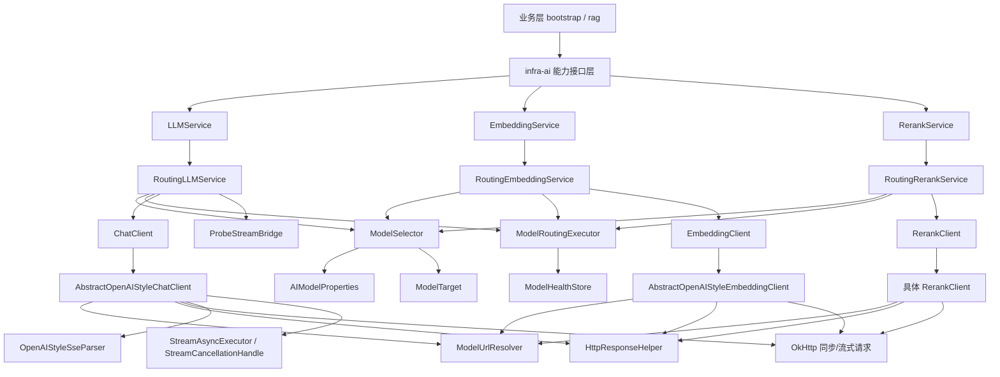

# Ragent `infra-ai` 模块架构详解

## 1. 文档目标

本文用于系统化学习 `infra-ai` 模块，重点回答以下问题：

- `infra-ai` 在整个项目中的定位是什么
- 它是如何把不同 AI 供应商统一抽象起来的
- `chat`、`embedding`、`rerank` 三条能力链路分别如何工作
- 模型选择、熔断、失败回退、流式首包探测等治理能力如何协同
- 配置层、路由层、协议适配层、HTTP 层分别承担什么职责
- 这个模块体现了哪些值得学习的工程设计思想

本文覆盖 `infra-ai` 模块下的以下包：

- `chat`
- `embedding`
- `rerank`
- `model`
- `config`
- `http`
- `token`
- `enums`
- `util`

目标不是只解释某一个类，而是把整个模块当成一个完整的 AI 基础设施层来理解。

---

## 2. 模块定位

`infra-ai` 不是业务编排层，而是整个项目的 **AI 基础设施层**。

它位于业务模块和具体模型供应商之间，主要解决四类问题：

- 统一能力抽象：对外只暴露聊天、向量化、重排等统一接口
- 屏蔽供应商差异：不同厂商的 URL、鉴权、协议格式不暴露给业务层
- 路由治理：支持候选模型选择、熔断、失败回退、健康状态管理
- 协议适配：统一处理同步响应、流式 SSE、OpenAI 风格返回结构

因此可以把 `infra-ai` 理解成：

- AI 能力网关
- 模型路由中台
- 协议适配层
- 供应商集成层

上层业务只需要关心：

- 我要聊天
- 我要做 embedding
- 我要做 rerank

至于：

- 调哪个模型
- 挂了怎么切备用
- 流式怎么读
- provider URL 怎么拼
- API Key 从哪取

这些复杂度都由 `infra-ai` 内部消化。

---

## 3. 模块依赖与边界

`infra-ai` 是一个独立 Maven 模块，见 [pom.xml](file:///e:/java/workspace/ragent/infra-ai/pom.xml)。

它当前只显式依赖：

- `framework`
- `okhttp`

这说明它的边界比较清晰：

- 不直接依赖业务模块
- 不关心 RAG 流程编排
- 不关心意图树、检索、记忆等业务概念

它只关心两件事：

- 如何向模型服务发请求
- 如何把模型能力稳定地提供给上层

---

## 4. 总体分层

从目录结构看，`infra-ai` 可以分成 5 层：

- 配置层
  - `config`
- 能力门面层
  - `chat` / `embedding` / `rerank`
- 路由治理层
  - `model`
- 协议与 HTTP 适配层
  - `chat` 基类、`http`
- 工具与辅助层
  - `token` / `util` / `enums`

### 4.1 总框图

---

## 5. 包级职责总览

### 5.1 `config`

核心类：

- [AIModelProperties](file:///e:/java/workspace/ragent/infra-ai/src/main/java/com/nageoffer/ai/ragent/infra/config/AIModelProperties.java)

职责：

- 从 `application.yaml` 读取 AI 相关配置
- 统一描述 provider、模型候选、选择策略、流式参数

### 5.2 `model`

核心类：

- [ModelSelector](file:///e:/java/workspace/ragent/infra-ai/src/main/java/com/nageoffer/ai/ragent/infra/model/ModelSelector.java)
- [ModelRoutingExecutor](file:///e:/java/workspace/ragent/infra-ai/src/main/java/com/nageoffer/ai/ragent/infra/model/ModelRoutingExecutor.java)
- [ModelHealthStore](file:///e:/java/workspace/ragent/infra-ai/src/main/java/com/nageoffer/ai/ragent/infra/model/ModelHealthStore.java)
- [ModelTarget](file:///e:/java/workspace/ragent/infra-ai/src/main/java/com/nageoffer/ai/ragent/infra/model/ModelTarget.java)

职责：

- 选择候选模型
- 生成运行时模型目标
- 维护健康状态与熔断
- 统一执行 fallback

### 5.3 `chat`

核心类：

- [LLMService](file:///e:/java/workspace/ragent/infra-ai/src/main/java/com/nageoffer/ai/ragent/infra/chat/LLMService.java)
- [RoutingLLMService](file:///e:/java/workspace/ragent/infra-ai/src/main/java/com/nageoffer/ai/ragent/infra/chat/RoutingLLMService.java)
- [ChatClient](file:///e:/java/workspace/ragent/infra-ai/src/main/java/com/nageoffer/ai/ragent/infra/chat/ChatClient.java)
- [AbstractOpenAIStyleChatClient](file:///e:/java/workspace/ragent/infra-ai/src/main/java/com/nageoffer/ai/ragent/infra/chat/AbstractOpenAIStyleChatClient.java)

职责：

- 提供统一聊天能力
- 封装同步与流式调用
- 适配 OpenAI 风格 provider 协议

### 5.4 `embedding`

核心类：

- [EmbeddingService](file:///e:/java/workspace/ragent/infra-ai/src/main/java/com/nageoffer/ai/ragent/infra/embedding/EmbeddingService.java)
- [RoutingEmbeddingService](file:///e:/java/workspace/ragent/infra-ai/src/main/java/com/nageoffer/ai/ragent/infra/embedding/RoutingEmbeddingService.java)
- [EmbeddingClient](file:///e:/java/workspace/ragent/infra-ai/src/main/java/com/nageoffer/ai/ragent/infra/embedding/EmbeddingClient.java)
- [AbstractOpenAIStyleEmbeddingClient](file:///e:/java/workspace/ragent/infra-ai/src/main/java/com/nageoffer/ai/ragent/infra/embedding/AbstractOpenAIStyleEmbeddingClient.java)

职责：

- 提供单文本和批量文本向量化
- 复用模型路由层
- 复用 OpenAI 风格协议抽象

### 5.5 `rerank`

核心类：

- [RerankService](file:///e:/java/workspace/ragent/infra-ai/src/main/java/com/nageoffer/ai/ragent/infra/rerank/RerankService.java)
- [RoutingRerankService](file:///e:/java/workspace/ragent/infra-ai/src/main/java/com/nageoffer/ai/ragent/infra/rerank/RoutingRerankService.java)
- [RerankClient](file:///e:/java/workspace/ragent/infra-ai/src/main/java/com/nageoffer/ai/ragent/infra/rerank/RerankClient.java)

职责：

- 对检索结果重排
- 复用统一路由和治理能力

### 5.6 `http`

核心类：

- [HttpResponseHelper](file:///e:/java/workspace/ragent/infra-ai/src/main/java/com/nageoffer/ai/ragent/infra/http/HttpResponseHelper.java)
- [ModelUrlResolver](file:///e:/java/workspace/ragent/infra-ai/src/main/java/com/nageoffer/ai/ragent/infra/http/ModelUrlResolver.java)
- [ModelClientException](file:///e:/java/workspace/ragent/infra-ai/src/main/java/com/nageoffer/ai/ragent/infra/http/ModelClientException.java)
- [ModelClientErrorType](file:///e:/java/workspace/ragent/infra-ai/src/main/java/com/nageoffer/ai/ragent/infra/http/ModelClientErrorType.java)

职责：

- 统一 URL 解析
- 统一响应读取与 JSON 解析
- 统一错误分类

### 5.7 `token` 与 `util`

核心类：

- [HeuristicTokenCounterService](file:///e:/java/workspace/ragent/infra-ai/src/main/java/com/nageoffer/ai/ragent/infra/token/HeuristicTokenCounterService.java)
- [LLMResponseCleaner](file:///e:/java/workspace/ragent/infra-ai/src/main/java/com/nageoffer/ai/ragent/infra/util/LLMResponseCleaner.java)

职责：

- 提供轻量 token 估算
- 对模型返回做辅助清洗

---

## 6. 配置体系：`AIModelProperties`

整个模块是 **配置驱动** 的，这一点非常重要。

配置入口在 [AIModelProperties](file:///e:/java/workspace/ragent/infra-ai/src/main/java/com/nageoffer/ai/ragent/infra/config/AIModelProperties.java)。

它包含 5 组核心配置：

- `providers`
  - 各 provider 的基础 URL、API Key、端点映射
- `chat`
  - 聊天模型组
- `embedding`
  - 向量模型组
- `rerank`
  - 重排模型组
- `selection`
  - 熔断与失败策略
- `stream`
  - 流式输出配置

### 6.1 `ProviderConfig`

每个 provider 配置包含：

- `url`
  - provider 基础 URL
- `apiKey`
  - 鉴权密钥
- `endpoints`
  - 不同能力的路径映射，如 `chat` / `embedding` / `rerank`

### 6.2 `ModelGroup`

每个能力组包含：

- `defaultModel`
- `deepThinkingModel`
- `candidates`

### 6.3 `ModelCandidate`

每个候选模型包含：

- `id`
- `provider`
- `model`
- `url`
- `dimension`
- `priority`
- `enabled`
- `supportsThinking`

这意味着模型接入不是写死在代码里，而是：

- 配置 provider
- 配置候选模型
- 运行时动态选择

这比“代码写死某个模型名”要成熟很多。

---

## 7. 运行时对象：`ModelTarget`

[ModelTarget](file:///e:/java/workspace/ragent/infra-ai/src/main/java/com/nageoffer/ai/ragent/infra/model/ModelTarget.java) 是整个模块的运行时核心对象之一。

它把一次真实调用需要的关键信息打包成一个 record：

- `id`
- `candidate`
- `provider`

### 7.1 为什么不直接传 `ModelCandidate`

因为一次实际调用不只需要候选模型本身，还需要：

- 对应 provider 配置
- 解析后的运行时唯一 ID

所以 `ModelTarget` 代表的不是“静态配置项”，而是：

> 一次已经准备好可调用的模型目标。

后续很多链路都围绕它展开：

- URL 解析
- provider 客户端选择
- 熔断状态检查
- HTTP 请求体构建

---

## 8. 路由治理层详解

`model` 包是整个模块最有工程价值的一层。

### 8.1 `ModelSelector`：负责选谁

[ModelSelector](file:///e:/java/workspace/ragent/infra-ai/src/main/java/com/nageoffer/ai/ragent/infra/model/ModelSelector.java) 的职责是：

- 从配置中读取候选模型
- 过滤禁用模型
- 在 deep thinking 场景下只保留支持思考的模型
- 按默认模型、优先级排序
- 过滤掉当前已经不可用的模型
- 输出 `List<ModelTarget>`

#### 关键方法

- `selectChatCandidates(boolean deepThinking)`
- `selectEmbeddingCandidates()`
- `selectRerankCandidates()`

#### 关键策略

- deep thinking 时优先 `deepThinkingModel`
- 普通聊天优先 `defaultModel`
- 通过 `priority` 做次级排序
- 通过 `healthStore.isUnavailable(modelId)` 提前剔除熔断模型

这层的本质是：

> 决定“当前最值得尝试哪些模型”。

### 8.2 `ModelRoutingExecutor`：负责怎么切

[ModelRoutingExecutor](file:///e:/java/workspace/ragent/infra-ai/src/main/java/com/nageoffer/ai/ragent/infra/model/ModelRoutingExecutor.java) 是一个能力无关的通用 fallback 执行器。

其核心抽象参数有四个：

- `capability`
- `targets`
- `clientResolver`
- `caller`

#### 它的执行逻辑

1. 候选为空直接报错
2. 逐个遍历 `target`
3. 通过 `clientResolver` 解析 client
4. `healthStore.allowCall(target.id())`
5. 调用 `caller.call(client, target)`
6. 成功则 `markSuccess`
7. 失败则 `markFailure` 并尝试下一个
8. 全部失败后抛 `RemoteException`

#### 为什么这个抽象好

因为它并不关心：

- 是聊天
- 还是 embedding
- 还是 rerank

它只关心“候选 -> 尝试 -> 失败切换 -> 成功返回”。

所以它被三条能力链路复用。

### 8.3 `ModelHealthStore`：负责断路器

[ModelHealthStore](file:///e:/java/workspace/ragent/infra-ai/src/main/java/com/nageoffer/ai/ragent/infra/model/ModelHealthStore.java) 实现了一套轻量断路器。

#### 状态机

- `CLOSED`
- `OPEN`
- `HALF_OPEN`

#### 行为规则

- 连续失败达到阈值 -> `OPEN`
- `OPEN` 持续到 `openUntil`
- 超时后进入 `HALF_OPEN`
- 半开成功 -> 回到 `CLOSED`
- 半开失败 -> 重新 `OPEN`

#### 关键细节

- `isUnavailable()`
  - 用于候选选择阶段提前过滤
- `allowCall()`
  - 用于执行阶段控制是否允许本次调用
- `markSuccess()`
  - 清空失败计数并关闭熔断
- `markFailure()`
  - 增加失败次数，必要时打开熔断

#### 为什么这层重要

如果没有这一层：

- 每次都会先打坏模型
- fallback 代价会持续被放大

有了健康状态后：

- 故障模型会被短时间跳过
- 恢复后又能自动试探

这是生产级稳定性设计。

---

## 9. 三条能力链路的统一模式

`chat`、`embedding`、`rerank` 三个包虽然处理的任务不同，但架构模式高度一致。

它们都遵循：

1. 暴露统一 Service 接口
2. 由 RoutingService 作为主入口
3. 通过 ModelSelector 选候选
4. 通过 ModelRoutingExecutor 执行 fallback
5. 通过 provider -> client 映射找到具体客户端
6. 由 client 负责真正协议适配和 HTTP 调用

这说明 `infra-ai` 的核心设计不是“聊天单点设计”，而是：

> 面向多种 AI 能力的统一路由式基础设施。

---

## 10. `chat` 路径：最复杂的一条能力链

`chat` 是整个模块最复杂、也最有含金量的路径。

详细源码链路可参考 [infra-ai-chat链路详解.md](file:///e:/java/workspace/ragent/docs/infra-ai-chat链路详解.md)。

这里从模块架构角度总结它的关键点。

### 10.1 顶层接口：`LLMService`

[LLMService](file:///e:/java/workspace/ragent/infra-ai/src/main/java/com/nageoffer/ai/ragent/infra/chat/LLMService.java) 对外提供：

- `chat(...)`
- `streamChat(...)`

业务层只感知：

- 同步拿字符串
- 或流式拿 callback/取消句柄

### 10.2 门面实现：`RoutingLLMService`

[RoutingLLMService](file:///e:/java/workspace/ragent/infra-ai/src/main/java/com/nageoffer/ai/ragent/infra/chat/RoutingLLMService.java) 是聊天总入口。

#### 同步链路

- `selectChatCandidates(thinking)`
- `executeWithFallback(...)`
- `client.chat(request, target)`

#### 流式链路

除了选择候选、调用 client 之外，还要额外处理：

- 首包探测
- 无内容完成
- 首包超时
- 流式 fallback
- 取消控制

### 10.3 供应商接口：`ChatClient`

[ChatClient](file:///e:/java/workspace/ragent/infra-ai/src/main/java/com/nageoffer/ai/ragent/infra/chat/ChatClient.java) 定义：

- `chat(request, target)`
- `streamChat(request, callback, target)`

具体实现：

- [BaiLianChatClient](file:///e:/java/workspace/ragent/infra-ai/src/main/java/com/nageoffer/ai/ragent/infra/chat/BaiLianChatClient.java)
- [SiliconFlowChatClient](file:///e:/java/workspace/ragent/infra-ai/src/main/java/com/nageoffer/ai/ragent/infra/chat/SiliconFlowChatClient.java)
- [OllamaChatClient](file:///e:/java/workspace/ragent/infra-ai/src/main/java/com/nageoffer/ai/ragent/infra/chat/OllamaChatClient.java)

这些实现都很薄，主要依赖：

- [AbstractOpenAIStyleChatClient](file:///e:/java/workspace/ragent/infra-ai/src/main/java/com/nageoffer/ai/ragent/infra/chat/AbstractOpenAIStyleChatClient.java)

### 10.4 模板方法模式：`AbstractOpenAIStyleChatClient`

这个类抽取了所有 OpenAI 风格 provider 的公共逻辑：

- provider 与 API Key 校验
- 请求体构建
- 同步请求发送
- 流式请求发送
- SSE 逐行读取
- 响应解析
- thinking 字段支持

#### 同步调用模板

- `doChat(...)`

#### 流式调用模板

- `doStreamChat(...)`
- `doStream(...)`

#### 关键设计思想

- 共性进基类
- 差异留钩子
- provider 子类尽量变薄

### 10.5 流式专有能力

`chat` 路径比其他能力复杂，核心是多了这几组对象：

- [ProbeStreamBridge](file:///e:/java/workspace/ragent/infra-ai/src/main/java/com/nageoffer/ai/ragent/infra/chat/ProbeStreamBridge.java)
- [OpenAIStyleSseParser](file:///e:/java/workspace/ragent/infra-ai/src/main/java/com/nageoffer/ai/ragent/infra/chat/OpenAIStyleSseParser.java)
- [StreamAsyncExecutor](file:///e:/java/workspace/ragent/infra-ai/src/main/java/com/nageoffer/ai/ragent/infra/chat/StreamAsyncExecutor.java)
- [StreamCancellationHandle](file:///e:/java/workspace/ragent/infra-ai/src/main/java/com/nageoffer/ai/ragent/infra/chat/StreamCancellationHandle.java)
- [StreamCancellationHandles](file:///e:/java/workspace/ragent/infra-ai/src/main/java/com/nageoffer/ai/ragent/infra/chat/StreamCancellationHandles.java)

#### 为什么需要它们

因为流式调用相比同步调用要额外解决：

- 请求已发出但没有首包
- 请求建立成功但没有内容
- 流式输出中断
- 用户中途取消
- 思考内容和正文内容分离

所以 `chat` 路径不是简单“多了个 stream=true”，而是多了一整套流式治理能力。

---

## 11. `embedding` 路径：统一但更轻

[RoutingEmbeddingService](file:///e:/java/workspace/ragent/infra-ai/src/main/java/com/nageoffer/ai/ragent/infra/embedding/RoutingEmbeddingService.java) 体现了 `infra-ai` 的统一模式。

### 11.1 提供的能力

- `embed(String text)`
- `embedBatch(List<String> texts)`
- 支持显式指定 `modelId`

### 11.2 它的链路

1. 选择 embedding 候选模型
2. 执行 fallback
3. 按 provider 找 `EmbeddingClient`
4. 调用 `client.embed(...)` 或 `client.embedBatch(...)`

### 11.3 和 chat 的差异

- 没有流式处理
- 没有首包探测
- 没有 thinking 模式
- 但依然复用统一路由层和 provider 适配逻辑

### 11.4 学习意义

它说明 `infra-ai` 的架构不是围绕聊天特化出来的，而是已经抽象成一套通用模式。

---

## 12. `rerank` 路径：能力最窄但模式一致

[RoutingRerankService](file:///e:/java/workspace/ragent/infra-ai/src/main/java/com/nageoffer/ai/ragent/infra/rerank/RoutingRerankService.java) 负责重排。

### 12.1 输入输出

- 输入：`query + RetrievedChunk 列表 + topN`
- 输出：按相关性重排后的 chunk 列表

### 12.2 它的链路

1. 选 rerank 模型
2. fallback 执行
3. 找 provider 对应 `RerankClient`
4. 执行 `client.rerank(...)`

### 12.3 意义

虽然重排业务上较窄，但它和聊天、embedding 共享了相同的基础设施模式，这正体现了模块架构的一致性。

---

## 13. HTTP 层：统一的出网工具与错误模型

`http` 包承担的是“底层但高频”的公共职责。

### 13.1 `ModelUrlResolver`

[ModelUrlResolver](file:///e:/java/workspace/ragent/infra-ai/src/main/java/com/nageoffer/ai/ragent/infra/http/ModelUrlResolver.java) 负责生成最终请求 URL。

优先级是：

- 候选模型自己的 `url`
- 否则 provider `url + endpoint`

#### 设计价值

- 支持模型级自定义 URL
- 也支持 provider 级公共端点
- 增强灵活性，减少配置重复

### 13.2 `HttpResponseHelper`

[HttpResponseHelper](file:///e:/java/workspace/ragent/infra-ai/src/main/java/com/nageoffer/ai/ragent/infra/http/HttpResponseHelper.java) 把很多细碎但重要的逻辑统一收口：

- `readBody()`
- `parseJson()`
- `requireProvider()`
- `requireApiKey()`
- `requireModel()`

#### 为什么值得抽出来

如果这些逻辑散在每个 client 里，会导致：

- 重复代码
- 错误语义不一致
- 可读性变差

统一抽到工具类以后：

- 模板方法更简洁
- 公共校验一致
- 错误行为更可预测

### 13.3 错误模型

错误统一使用：

- [ModelClientException](file:///e:/java/workspace/ragent/infra-ai/src/main/java/com/nageoffer/ai/ragent/infra/http/ModelClientException.java)
- [ModelClientErrorType](file:///e:/java/workspace/ragent/infra-ai/src/main/java/com/nageoffer/ai/ragent/infra/http/ModelClientErrorType.java)

这使得系统能区分：

- 认证问题
- 限流问题
- 网络问题
- 服务端问题
- 响应格式问题

这种错误标准化对：

- fallback
- 熔断
- 日志排查

都很重要。

---

## 14. `token` 包：轻量估算，而不是精确 tokenizer

[HeuristicTokenCounterService](file:///e:/java/workspace/ragent/infra-ai/src/main/java/com/nageoffer/ai/ragent/infra/token/HeuristicTokenCounterService.java) 的定位不是精确分词器，而是一个轻量级估算器。

它的策略是：

- ASCII 字符约 4 个字符算 1 token
- 其他字符约 2 个字符算 1 token
- CJK 字符近似按 1 字 1 token

### 14.1 为什么这样设计

这个项目并不需要在每个地方都拿到绝对精确 token 数，而更需要：

- 快速估算上下文长度
- 低成本做阈值判断
- 避免额外引入复杂 tokenizer 依赖

这是一个典型的工程折中：

- 精度适中
- 性能和依赖成本更低

---

## 15. 模块的启动与装配方式

虽然没有一个单独的“总配置类”来显式画出 wiring，但从 Spring 注解和构造函数依赖可以看出它的装配方式。

### 15.1 Spring Bean 形态

- `@Service`
  - 各能力 Service
- `@Component`
  - 路由器、健康存储、URL 工具辅助类依赖
- `@Primary`
  - `RoutingLLMService`
  - `RoutingEmbeddingService`
  - `RoutingRerankService`

### 15.2 provider client 的装配方式

像 `RoutingLLMService`、`RoutingEmbeddingService`、`RoutingRerankService` 都是通过：

- `List<ChatClient>`
- `List<EmbeddingClient>`
- `List<RerankClient>`

再转成：

- `Map<String, Client>`

键就是各自 `provider()` 返回值。

这样一来，新增 provider 时只需要：

1. 实现某种 `Client`
2. 声明 `provider()`
3. 注册成 Spring Bean

原有路由层几乎不用改。

这是一种非常典型的 **策略注册表模式**。

---

## 16. 这个模块最核心的设计思想

如果你是为了系统学习，这个模块最值得提炼的是下面这些设计思想。

### 16.1 统一接口，隔离供应商

业务层只认：

- `LLMService`
- `EmbeddingService`
- `RerankService`

不认任何具体 provider。

这保证了：

- 上层稳定
- 底层可替换

### 16.2 路由层与 client 层分离

- 路由层决定“调谁”
- client 层决定“怎么调”

这让：

- fallback
- 熔断
- provider 适配

彼此解耦。

### 16.3 模板方法最大化复用协议共性

像 OpenAI 风格 provider：

- 同步 HTTP
- 流式 SSE
- 请求体格式
- 响应结构

高度相似。

因此抽成抽象基类是非常合适的。

### 16.4 配置驱动优于代码写死

模型候选、provider URL、API Key、端点、优先级、thinking 能力，全部来自配置。

这让系统具备：

- 可运维性
- 可切换性
- 可扩展性

### 16.5 同步与流式分开治理

同步 fallback 相对简单；
流式调用需要额外处理：

- 首包探测
- 无内容完成
- 取消控制
- 异步线程管理

这说明作者没有偷懒把流式当同步调用的变体，而是认真对待了流式场景的特殊复杂度。

### 16.6 轻量熔断而不是重型框架

这里没有引入复杂的外部熔断框架，而是自己实现了一个足够简单、足够有效的 `ModelHealthStore`。

这体现的是：

- 工程上够用
- 依赖尽量少
- 与当前模型路由场景强匹配

---

## 17. 从学习角度，应该怎么读这个模块

推荐按“从抽象到细节、从共性到特性”的顺序阅读。

### 第一轮：先理解总框架

1. [AIModelProperties](file:///e:/java/workspace/ragent/infra-ai/src/main/java/com/nageoffer/ai/ragent/infra/config/AIModelProperties.java)
2. [ModelTarget](file:///e:/java/workspace/ragent/infra-ai/src/main/java/com/nageoffer/ai/ragent/infra/model/ModelTarget.java)
3. [ModelSelector](file:///e:/java/workspace/ragent/infra-ai/src/main/java/com/nageoffer/ai/ragent/infra/model/ModelSelector.java)
4. [ModelRoutingExecutor](file:///e:/java/workspace/ragent/infra-ai/src/main/java/com/nageoffer/ai/ragent/infra/model/ModelRoutingExecutor.java)
5. [ModelHealthStore](file:///e:/java/workspace/ragent/infra-ai/src/main/java/com/nageoffer/ai/ragent/infra/model/ModelHealthStore.java)

### 第二轮：读 `chat` 主链路

1. [LLMService](file:///e:/java/workspace/ragent/infra-ai/src/main/java/com/nageoffer/ai/ragent/infra/chat/LLMService.java)
2. [RoutingLLMService](file:///e:/java/workspace/ragent/infra-ai/src/main/java/com/nageoffer/ai/ragent/infra/chat/RoutingLLMService.java)
3. [ChatClient](file:///e:/java/workspace/ragent/infra-ai/src/main/java/com/nageoffer/ai/ragent/infra/chat/ChatClient.java)
4. [AbstractOpenAIStyleChatClient](file:///e:/java/workspace/ragent/infra-ai/src/main/java/com/nageoffer/ai/ragent/infra/chat/AbstractOpenAIStyleChatClient.java)
5. [ProbeStreamBridge](file:///e:/java/workspace/ragent/infra-ai/src/main/java/com/nageoffer/ai/ragent/infra/chat/ProbeStreamBridge.java)
6. [OpenAIStyleSseParser](file:///e:/java/workspace/ragent/infra-ai/src/main/java/com/nageoffer/ai/ragent/infra/chat/OpenAIStyleSseParser.java)

### 第三轮：读 `embedding` 和 `rerank`

1. [RoutingEmbeddingService](file:///e:/java/workspace/ragent/infra-ai/src/main/java/com/nageoffer/ai/ragent/infra/embedding/RoutingEmbeddingService.java)
2. [AbstractOpenAIStyleEmbeddingClient](file:///e:/java/workspace/ragent/infra-ai/src/main/java/com/nageoffer/ai/ragent/infra/embedding/AbstractOpenAIStyleEmbeddingClient.java)
3. [RoutingRerankService](file:///e:/java/workspace/ragent/infra-ai/src/main/java/com/nageoffer/ai/ragent/infra/rerank/RoutingRerankService.java)

### 第四轮：读 HTTP 与辅助能力

1. [HttpResponseHelper](file:///e:/java/workspace/ragent/infra-ai/src/main/java/com/nageoffer/ai/ragent/infra/http/HttpResponseHelper.java)
2. [ModelUrlResolver](file:///e:/java/workspace/ragent/infra-ai/src/main/java/com/nageoffer/ai/ragent/infra/http/ModelUrlResolver.java)
3. [HeuristicTokenCounterService](file:///e:/java/workspace/ragent/infra-ai/src/main/java/com/nageoffer/ai/ragent/infra/token/HeuristicTokenCounterService.java)

这样读的好处是：

- 先看通用抽象
- 再看最复杂路径
- 再看同模式的其他能力
- 最后补底层工具

不容易迷失在 provider 细节里。

---

## 18. 学习时最值得问自己的问题

在读这个模块时，建议反复问自己这几个问题：

- 为什么上层不是直接调某个 `ChatClient`
- 为什么 `ModelSelector` 和 `ModelRoutingExecutor` 要拆成两个类
- `ModelTarget` 为什么不能被 `ModelCandidate` 代替
- 为什么流式路径需要首包探测，但 embedding/rerank 不需要
- 为什么 OpenAI 风格协议要抽模板基类，而不是每个 provider 自己实现一遍
- 为什么错误要分类型，而不是都抛一个普通异常
- 为什么 token 估算选择启发式而不是精确 tokenizer

这些问题想通了，这个模块的架构思想基本也就真正掌握了。

---

## 19. 一句话总结

`infra-ai` 模块本质上是一套面向多 AI 能力的基础设施中台：它以配置驱动的方式统一管理 provider 和模型候选，通过 `ModelSelector + ModelRoutingExecutor + ModelHealthStore` 构建模型选择、熔断与 fallback 能力，再以 `chat / embedding / rerank` 三条门面链路对上提供统一接口，并借助模板方法、协议适配、流式首包探测和错误标准化机制，把底层大模型供应商差异屏蔽在模块内部，为上层 RAG/Agent 业务提供稳定、可扩展、可治理的 AI 能力底座。
