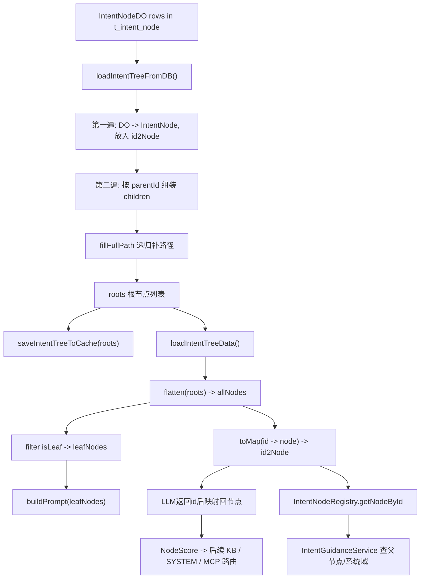

# Ragent 意图树链路详解

## 1. 文档目标

本文聚焦 Ragent 中“意图树”这条链路，完整解释以下问题：

- 意图树到底是什么，为什么系统需要它
- 意图树原始数据来自哪里
- 为什么数据库里存的是扁平结构，而运行时要构造成树
- `DefaultIntentClassifier.loadIntentTreeData()` 做了哪些事
- `allNodes`、`leafNodes`、`id2Node` 三种视图分别有什么作用
- Redis 缓存为什么要缓存整棵树，什么时候失效
- 这棵树最终是如何参与意图分类、歧义澄清、检索和工具调用的

本文覆盖从数据库 `t_intent_node` 到 Redis 缓存、再到分类器运行时使用的完整链路。

## 2. 一句话定义

意图树本质上是一棵“系统能力目录树”：

- 上层节点负责组织业务域和系统范围
- 下层叶子节点负责承载真正可执行的知识库、系统直答或 MCP 工具能力

换句话说，它不是简单的标签列表，而是一套带层级、带语义、带执行元数据的树形路由结构。

## 3. 总框图



## 4. 这条链路在系统中的位置

意图树链路的核心入口在：

- `DefaultIntentClassifier.loadIntentTreeData()`

分类时的调用顺序大致是：

```text
用户问题
  ->
IntentResolver.resolve(...)
  ->
IntentClassifier.classifyTargets(question)
  ->
DefaultIntentClassifier.loadIntentTreeData()
  ->
拿到 leafNodes / id2Node
  ->
构造分类 Prompt 给 LLM
```

因此，意图树并不是一个旁路组件，而是整个意图分类与能力路由的基础数据结构。

## 5. 原始数据层：数据库里存的是什么

底层实体是：

- `IntentNodeDO`

对应表：

- `t_intent_node`

数据库里存的是**扁平结构**，每一行代表一个节点，而不是天然的嵌套树。

### 5.1 关键字段

`IntentNodeDO` 中最关键的字段有：

- `intentCode`
  - 节点的业务唯一标识
- `parentCode`
  - 父节点的业务标识
- `level`
  - 节点层级：`DOMAIN / CATEGORY / TOPIC`
- `kind`
  - 节点类型：`KB / SYSTEM / MCP`
- `name`
  - 展示名称
- `description`
  - 节点描述
- `examples`
  - 示例问法
- `collectionName`
  - 对应 KB 节点的向量库集合
- `mcpToolId`
  - 对应 MCP 节点的工具 ID
- `topK`
  - 节点级检索参数
- `promptTemplate`
  - 节点级 Prompt 模板
- `paramPromptTemplate`
  - MCP 参数提取模板
- `enabled`
  - 是否启用

### 5.2 为什么数据库是扁平结构

扁平结构的优点很明显：

- 表设计简单
- CRUD 方便
- 节点增删改查成本低
- 容易与管理后台结合

但它不适合运行时分类，因为：

- 无法直接表达树形父子关系
- 无法直接拿到某个节点的路径
- 无法快速筛选叶子节点

所以系统选择：

- 存储层用扁平表
- 运行时再构造成树

这是一种很常见、也很合理的工程做法。

## 6. 运行时节点层：`IntentNode`

运行时真正使用的是：

- `IntentNode`

它相比数据库实体，多了几个非常重要的运行时能力字段：

- `id`
  - 节点唯一标识，实际使用 `intentCode`
- `parentId`
  - 父节点 ID，实际使用 `parentCode`
- `children`
  - 子节点列表
- `fullPath`
  - 从根到当前节点的完整路径
- `kind`
  - 节点能力类型
- `examples`
  - 示例问题列表

还提供了几个关键判断方法：

- `isLeaf()`
- `isKB()`
- `isMCP()`
- `isSystem()`

这说明 `IntentNode` 不只是数据容器，而是“运行时可参与分类与路由判断的节点对象”。

## 7. 整条链路的总入口：`loadIntentTreeData()`

这是整条意图树链路的总入口，职责可以概括成：

1. 先尝试从 Redis 读取已构建好的树
2. Redis 没有时，从数据库加载并构树
3. 从根节点列表进一步生成三种运行时视图

返回的是一个内部临时结构：

```java
private record IntentTreeData(
        List<IntentNode> allNodes,
        List<IntentNode> leafNodes,
        Map<String, IntentNode> id2Node
) {}
```

这三个字段是这条链路最关键的设计之一，后文会重点解释。

## 8. 第一步：优先从 Redis 读取整棵树

`loadIntentTreeData()` 进入后，第一步是：

```java
List<IntentNode> roots = intentTreeCacheManager.getIntentTreeFromCache();
```

缓存管理器是：

- `IntentTreeCacheManager`

### 8.1 Redis 里存的是什么

Redis key：

- `ragent:intent:tree`

缓存值是：

- 根节点列表 `List<IntentNode>` 序列化后的 JSON

也就是说，Redis 里缓存的不是扁平表数据，而是**已经构建好的整棵树**。

### 8.2 为什么缓存的是根节点列表

因为一棵树最自然的持久化入口就是：

- 所有根节点

只要根节点在，且每个节点都有 `children`，整棵树就能被完整还原。

### 8.3 为什么要用 Redis 缓存

原因主要有三点：

- 意图分类请求频繁，不能每次都查库构树
- 构树虽然不复杂，但重复做没有必要
- 意图树属于低频更新、高频读取的配置数据

因此，把整棵树缓存起来非常划算。

## 9. 第二步：缓存不存在时从数据库构树

如果 Redis 没有命中，系统会调用：

- `loadIntentTreeFromDB()`

这是真正把“扁平节点表”变成“树结构”的核心步骤。

它可以拆成四个阶段。

### 9.1 阶段一：查询所有有效节点

SQL 查询条件是：

- `deleted = 0`
- `enabled = 1`

这意味着只有：

- 未删除
- 已启用

的节点才会进入运行时意图树。

这样做的意义是：

- 禁用节点不会被模型看到
- 已逻辑删除节点不会污染分类结果

### 9.2 阶段二：第一遍遍历，先把所有节点建出来

这一阶段会把每条 `IntentNodeDO` 转成 `IntentNode`，并放入：

- `Map<String, IntentNode> id2Node`

这里最关键的映射是：

- `node.id = intentCode`
- `node.parentId = parentCode`

这意味着：

- 运行时真正依赖的是业务编码，而不是数据库主键

这么设计的好处是：

- 业务语义更稳定
- 父子关系表达更自然
- 便于管理后台和业务代码统一引用

同时，这一遍会保证：

- `children` 一定不为 `null`

这是为了让第二遍挂子节点时不发生空指针。

### 9.3 阶段三：第二遍遍历，组装父子关系

有了 `id2Node` 之后，系统开始真正构树：

- `parentId` 为空：视为根节点，加入 `roots`
- `parentId` 不为空且能找到父节点：挂到 `parent.children`
- `parentId` 不为空但找不到父节点：兜底也加入 `roots`

这一步的工程意义非常强：

- 父子关系在运行时才真正建立
- 即使配置存在脏数据，也尽量不丢节点

“找不到父节点也当根节点”的设计很实用，因为：

- 它优先保障“节点不丢失”
- 不让整棵树因为局部配置问题而断裂得更严重

### 9.4 阶段四：递归填充 `fullPath`

树组装完成后，会执行：

- `fillFullPath(roots, null)`

其逻辑是：

- 根节点：`fullPath = name`
- 子节点：`fullPath = parent.fullPath + " > " + name`

最终会形成类似：

- `业务系统`
- `业务系统 > OA系统`
- `业务系统 > OA系统 > 系统介绍`

`fullPath` 非常重要，因为它后面会进入 LLM 分类 Prompt，帮助模型理解节点的上层语义归属。

## 10. 第三步：构造 `IntentTreeData` 三种运行时视图

构树完成后，`loadIntentTreeData()` 还不会直接把 `roots` 交给分类器，而是进一步加工成三种运行时视图。

### 10.1 `allNodes`

通过 `flatten(roots)` 把整棵树拍平成一个列表。

它的作用是：

- 全量遍历所有节点
- 方便统一过滤和统计
- 为后续生成其他视图提供基础数据

### 10.2 `leafNodes`

从 `allNodes` 中筛出：

- `IntentNode.isLeaf() == true`

这代表真正参与分类的候选节点集合。

为什么只取叶子节点？

- 叶子节点最细粒度
- 叶子节点才真正绑定 KB / MCP / SYSTEM 执行信息
- 上层节点更适合做组织结构，而不是最终分类目标

### 10.3 `id2Node`

把 `allNodes` 再转成：

- `Map<String, IntentNode>`

它的作用是：

- 根据节点 ID 快速找回完整节点对象
- 把 LLM 返回的 `id` 映射回运行时节点
- 支持运行期“按节点 ID 查节点”的能力

这也是 `IntentNodeRegistry.getNodeById()` 的基础。

## 11. 为什么必须有这三种视图

这是整个实现里非常值得注意的设计点。

### 11.1 只有树结构不够

如果只有 `roots`：

- 遍历某个指定节点很慢
- 找叶子节点不方便
- 根据 ID 查节点也不方便

### 11.2 只有扁平列表也不够

如果只有 `allNodes`：

- 父子关系和路径语义不明显
- 无法方便地表达层级结构

### 11.3 三种视图各司其职

- `roots`
  - 用于保留完整树结构
- `allNodes`
  - 用于全量遍历
- `leafNodes`
  - 用于分类候选
- `id2Node`
  - 用于快速索引和结果映射

这说明作者没有把“树结构”当成唯一数据形态，而是根据运行场景准备了最合适的访问视图。

## 12. 这棵树是如何参与分类的

分类入口是：

- `classifyTargets(String question)`

这里最关键的一句就是：

- `IntentTreeData data = loadIntentTreeData();`

然后分类器使用：

- `data.leafNodes`
  - 构造 Prompt
- `data.id2Node`
  - 把模型返回的 `id` 找回完整节点

### 12.1 `leafNodes` 如何用于构造 Prompt

分类器会遍历每个叶子节点，拼出：

- `id`
- `path`
- `description`
- `type`
- `toolId`
- `examples`

再套进模板 `intent-classifier.st`。

也就是说，LLM 看到的不是 Java 树对象，而是一份“结构化意图目录清单”。

### 12.2 `id2Node` 如何用于映射分类结果

LLM 返回的是：

- `id`
- `score`

分类器再通过：

- `id2Node.get(id)`

把这个 `id` 映射回完整 `IntentNode`，从而得到：

- 节点类型
- 路径
- 工具 ID
- Collection 名称
- Prompt 模板

这一步非常关键，因为后续的 KB/MCP/SYSTEM 路由都依赖完整节点对象，而不是只有一个字符串 ID。

## 13. 这棵树还被谁使用

意图树不仅仅服务于分类器。

### 13.1 `IntentNodeRegistry.getNodeById()`

`DefaultIntentClassifier` 同时实现了：

- `IntentNodeRegistry`

因此其他组件可以通过它按 ID 查节点。

### 13.2 歧义澄清服务

`IntentGuidanceService` 会在分析歧义时，沿着节点的 `parentId` 向上找父节点：

- 找系统域
- 找 domain 名称
- 做歧义分组和澄清提示

这说明意图树不只是分类字典，也承载了“父子语义关系”。

### 13.3 检索与工具调用

后续路由依赖节点的：

- `kind`
- `collectionName`
- `mcpToolId`
- `topK`
- `promptTemplate`

所以叶子节点实际上就是：

- 路由节点
- 配置节点
- 执行节点

三者合一。

## 14. 缓存什么时候失效

意图树缓存不是永久可信的，它会在配置发生变化时被清除。

失效入口在：

- `IntentTreeServiceImpl`

以下操作后都会调用：

- `intentTreeCacheManager.clearIntentTreeCache()`

包括：

- 新增节点
- 更新节点
- 删除节点
- 批量启用
- 批量停用
- 批量删除

这说明意图树缓存遵循的是：

- 读取时尽量走缓存
- 写入配置后主动失效

这是一种非常典型的“配置缓存”模式。

## 15. 为什么这样设计是合理的

### 15.1 存储层简单

数据库存扁平表，方便管理和维护。

### 15.2 运行时高效

构造成树后，路径、叶子节点、父子关系都更容易处理。

### 15.3 分类更准确

借助 `fullPath + description + examples + type`，LLM 能更准确地区分同名或相近节点。

### 15.4 扩展性强

新增一个知识主题或 MCP 工具，不需要改分类器算法，只要新增配置节点即可。

### 15.5 路由与配置统一

节点既描述“是什么”，又描述“怎么执行”。

## 16. 关键设计思想

### 16.1 业务编码优先，而不是数据库主键优先

树关系基于：

- `intentCode`
- `parentCode`

而不是数据库主键。

这让整棵树更接近业务语义层。

### 16.2 上层节点负责组织，下层叶子节点负责执行

这是一种“树负责语义组织，叶子负责最终路由”的设计。

### 16.3 一棵树，多种访问视图

不是只保留树本身，而是按运行需求派生多种视图。

### 16.4 缓存的是构建结果，而不是原始表数据

这样下次读取时不用重复构树，性价比更高。

## 17. 边界情况与容错

### 17.1 Redis 读取失败

缓存读取失败会返回 `null`，随后自动回退到数据库构树。

### 17.2 数据库中不存在任何有效节点

系统会返回空的 `IntentTreeData`：

- `allNodes = []`
- `leafNodes = []`
- `id2Node = {}`

不会直接抛异常。

### 17.3 子节点引用了不存在的父节点

当前实现会把该节点兜底当根节点，避免节点直接丢失。

### 17.4 LLM 返回未知节点 ID

分类器会通过 `id2Node` 校验，找不到就直接跳过。

## 18. 推荐阅读顺序

建议按下面顺序阅读源码：

1. `DefaultIntentClassifier.loadIntentTreeData()`
2. `IntentTreeCacheManager`
3. `DefaultIntentClassifier.loadIntentTreeFromDB()`
4. `DefaultIntentClassifier.fillFullPath()`
5. `DefaultIntentClassifier.flatten()`
6. `IntentNode`
7. `DefaultIntentClassifier.buildPrompt()`
8. `DefaultIntentClassifier.classifyTargets()`
9. `IntentGuidanceService.fetchParent()`
10. `IntentTreeServiceImpl` 中的缓存失效逻辑

这样最容易把“构树 -> 缓存 -> 使用 -> 失效”整条链路串起来。

## 19. 一句话总结

Ragent 的意图树链路本质上是一套“扁平配置表到运行时能力树”的转换机制：系统先从 `t_intent_node` 读取启用节点，以 `intentCode / parentCode` 组装父子关系并递归补全 `fullPath`，再派生出 `allNodes`、`leafNodes`、`id2Node` 三种运行时视图，并将构建结果缓存到 Redis，最终为 LLM 意图分类、歧义澄清、知识检索和 MCP 工具路由提供统一的结构化能力地图。
