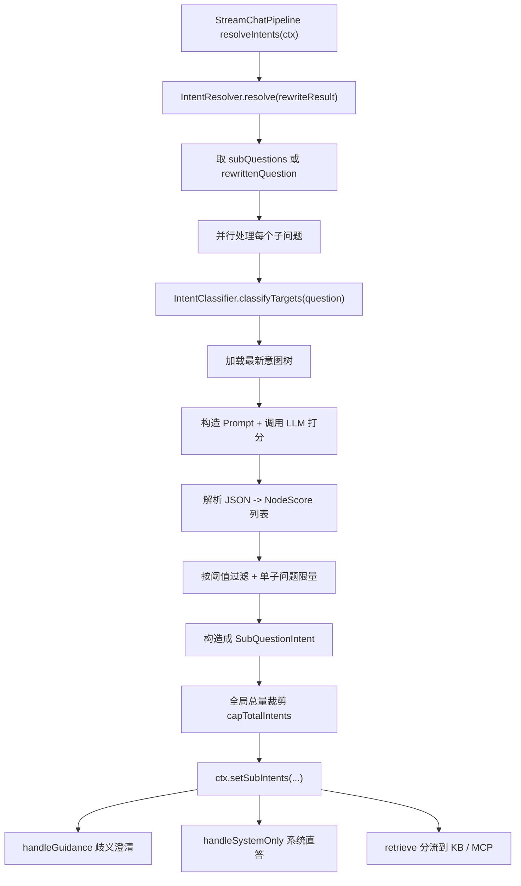

# Ragent 意图解析链路详解

## 1. 文档目标

本文聚焦 Ragent 问答主链路中的“意图解析”步骤，详细解释以下问题：

- `resolveIntents(ctx)` 这一步到底解决什么问题
- 为什么在 `rewriteQuery(ctx)` 之后必须紧接着做意图解析
- 一个问题如何从自然语言变成“可路由的意图候选”
- 意图解析结果如何影响后续的歧义澄清、系统直答、知识检索和 MCP 工具调用
- 这套实现的工程取舍、阈值控制和容错策略是什么

本文覆盖从 `StreamChatPipeline.resolveIntents()` 到 `IntentResolver`、`IntentClassifier`，再到后续消费链路的完整闭环。

## 2. 总体定位

在问答主流水线中，意图解析位于：

```text
loadMemory(ctx)
    ->
rewriteQuery(ctx)
    ->
resolveIntents(ctx)
    ->
handleGuidance(ctx)
    ->
handleSystemOnly(ctx)
    ->
retrieve(ctx)
```

这意味着它处在“问题理解”与“能力编排”之间，是整条链路的分流点。

一句话概括：

> `resolveIntents(ctx)` 的本质，是把“改写后的用户问题”变成“带分数的意图候选集合”，从而告诉系统接下来该走哪条处理路径。

## 3. 总框图



## 4. 入口代码

入口非常短，在 `StreamChatPipeline` 中：

```java
private void resolveIntents(StreamChatContext ctx) {
    List<SubQuestionIntent> subIntents = intentResolver.resolve(ctx.getRewriteResult());
    ctx.setSubIntents(subIntents);
}
```

表面看只有两行，但这一步完成了整个问答链路里最关键的“路由标签生成”工作。

它做的事情非常明确：

1. 接收上一步查询改写得到的 `RewriteResult`
2. 调用 `IntentResolver` 做意图识别
3. 把结果写回 `ctx.subIntents`

从这一步之后，系统就不再只是“拿着一个问题往下走”，而是拿着一组“子问题 -> 意图候选列表”继续处理。

## 5. 这一步到底有什么用

如果没有意图解析，系统只能用一种固定方式处理所有问题，例如：

- 所有问题都统一去做知识库检索
- 所有问题都统一交给大模型自由回答
- 所有问题都无法区分是否应该调用工具

这会导致几个明显问题：

- 该走工具调用的问题被错误拿去检索
- 该直接回答的问题多走了一轮检索，成本更高
- 一个问题里混合多个子问题时，后续处理会非常粗糙
- 无法做歧义澄清，因为根本不知道候选方向有几个

因此这一步的根本价值是：

- 给问题做“能力路由”
- 把自然语言输入转换成结构化决策依据

## 6. 输入是什么

意图解析的输入是 `RewriteResult`，其结构是：

```java
public record RewriteResult(String rewrittenQuestion, List<String> subQuestions) {
}
```

也就是说，这一步并不是直接处理原始问题，而是处理已经经过查询改写的结果。

输入包含两部分：

### 6.1 `rewrittenQuestion`

这是改写后的主问题，通常：

- 术语更统一
- 表达更完整
- 指代更明确

### 6.2 `subQuestions`

这是对复杂问题进行拆分后的子问题列表。

例如用户问：

- “报销流程怎么走，审批记录在哪看，超预算怎么办？”

改写后可能变成：

- 主问题：围绕报销流程、审批记录和超预算处理的查询
- 子问题：
  - 报销流程怎么走？
  - 审批记录在哪看？
  - 超预算怎么办？

这就是后续意图解析要处理的基本单位。

## 7. 输出是什么

`resolveIntents()` 最终输出的是：

- `List<SubQuestionIntent>`

结构如下：

```java
public record SubQuestionIntent(String subQuestion, List<NodeScore> nodeScores) {
}
```

它表达的是：

- 每个子问题
- 对应一组意图候选
- 每个候选带一个匹配分数

而候选分数的结构是：

```java
public class NodeScore {
    private IntentNode node;
    private double score;
}
```

这意味着系统不是做“唯一分类”，而是做“带分数的候选分类”。

这种设计很重要，因为实际问题常常不是单意图的：

- 可能多问句混合
- 可能知识检索和工具调用混合
- 可能存在歧义，需要多个候选供后续判断

## 8. `IntentResolver.resolve()` 主流程

`IntentResolver.resolve()` 的核心流程可以概括为：

```text
从 RewriteResult 里拿到子问题
  ->
对每个子问题并行做意图分类
  ->
对每个子问题保留候选意图
  ->
做全局总量裁剪
  ->
返回 List<SubQuestionIntent>
```

下面分步骤展开。

## 9. 第一步：确定要处理哪些问题

核心逻辑如下：

```java
List<String> subQuestions = CollUtil.isNotEmpty(rewriteResult.subQuestions())
        ? rewriteResult.subQuestions()
        : List.of(rewriteResult.rewrittenQuestion());
```

这里的策略很简单：

- 如果上一步已经拆出了多个子问题，就逐个处理
- 如果没有拆分结果，就退化成只处理一个改写后的主问题

这说明系统天然支持两类情况：

- 单问题场景
- 多问句场景

也说明意图解析是面向“子问题粒度”的，而不是只针对整个大问题做粗分类。

## 10. 第二步：并行处理每个子问题

代码中使用了 `CompletableFuture.supplyAsync(...)`，并通过 `intentClassifyExecutor` 并行处理各个子问题。

### 10.1 为什么并行

原因有三个：

- 一个问题可能拆出多个子问题
- 每个子问题的分类都要走一遍 LLM 意图识别
- 串行会显著增加总耗时

所以这里的并行化，是为了降低整条问答链路在“问题理解阶段”的延迟。

### 10.2 并行粒度是什么

并行粒度不是“一个 LLM 调用内部并行”，而是：

- 每个子问题独立提交一个分类任务

这种粒度划分非常自然，因为子问题之间本来就是相互独立的。

## 11. 第三步：对子问题做意图分类

每个子问题内部，最终调用的是：

```java
intentClassifier.classifyTargets(question)
```

当前默认实现是：

- `DefaultIntentClassifier`

这个分类器不是写死 `if/else`，而是基于“意图树 + LLM 打分”的方式工作。

## 12. 分类器做了什么

`DefaultIntentClassifier.classifyTargets(question)` 可以拆成 6 个步骤。

### 12.1 加载最新意图树

分类器会先通过 `IntentTreeCacheManager` 从缓存读取意图树。

如果缓存没有，再从数据库加载，并回写到缓存。

这里的核心思想是：

- 意图定义不是硬编码在代码里的
- 而是配置化、树形化管理
- 并且允许在运行时保持最新

### 12.2 扁平化意图树并抽取叶子节点

分类器会把整棵树展开，然后只取叶子节点参与分类。

为什么只分类叶子节点？

- 叶子节点是最细粒度的可执行意图
- 后续做 KB 检索、工具调用、Prompt 选择都需要较细粒度的信息
- 如果只分类到大类，会损失精度

### 12.3 构造分类 Prompt

分类器会把所有叶子节点信息组织进一个专门的 Prompt，并构造如下请求：

- `system`: 意图分类规则
- `user`: 当前子问题文本

同时参数非常保守：

- `temperature = 0.1`
- `topP = 0.3`
- `thinking = false`

这表明这一步追求的是：

- 稳定
- 可重复
- 少发散

而不是创意表达。

### 12.4 调用 LLM 打分

LLM 返回的不是自然语言解释，而是结构化 JSON，里面通常包含：

- `id`
- `score`

这相当于把模型变成一个“树节点打分器”。

### 12.5 解析 JSON

分类器会把 LLM 返回的 JSON 转成 `NodeScore` 列表。

同时做容错：

- 允许返回数组
- 也兼容外层包一层 `results`
- 未知节点 ID 会跳过
- 解析失败则返回空列表

### 12.6 按分数降序排序

最终分类结果会按 `score` 从高到低排序，这样后续就可以直接做：

- 阈值过滤
- TopK 裁剪
- 歧义判断

## 13. 第四步：对子问题结果做阈值过滤

在 `IntentResolver.classifyIntents(question)` 里，分类结果会继续经过两层过滤：

```java
scores.stream()
    .filter(ns -> ns.getScore() >= INTENT_MIN_SCORE)
    .limit(MAX_INTENT_COUNT)
    .toList();
```

对应常量：

- `INTENT_MIN_SCORE = 0.35`
- `MAX_INTENT_COUNT = 3`

### 13.1 最低分数阈值的作用

`INTENT_MIN_SCORE` 的意义是：

- 低于这个分数的候选，认为相关性不够
- 不应该继续参与后续 RAG 处理

这可以避免：

- 模型“随便猜一个意图”
- 低置信候选污染后续检索和工具调用

### 13.2 单子问题意图数量上限的作用

`MAX_INTENT_COUNT` 限制单个子问题最多保留几个候选。

作用是：

- 防止意图过多导致后续分支爆炸
- 控制检索成本和工具调用规模
- 让后续歧义判断更聚焦

## 14. 第五步：局部异常降级

如果某个子问题在分类时抛异常，系统不会让整个链路失败，而是降级为：

- `new SubQuestionIntent(q, List.of())`

这说明这里的设计原则是：

- 局部失败，整体继续
- 允许某个子问题“无意图”
- 不因为一个子问题失败打挂整个会话

在生产系统里，这是非常关键的鲁棒性设计。

## 15. 第六步：全局总量裁剪

即使每个子问题都只保留最多 3 个候选，多个子问题叠加后，总意图数仍可能过多。

因此 `IntentResolver` 还做了一轮全局裁剪：`capTotalIntents(...)`。

### 15.1 为什么要做全局裁剪

例如：

- 有 3 个子问题
- 每个子问题都留下 3 个候选
- 总数就变成 9 个

这会导致：

- 后续检索范围太大
- MCP 工具调用过多
- 歧义空间过大
- 响应速度和准确率都受影响

### 15.2 裁剪策略

这个方法不是简单“全局取前 3”，而是做了一个更公平的策略：

1. 如果总数未超限，直接返回
2. 每个子问题至少保留 1 个最高分意图
3. 剩余配额再按全局高分继续分配

这套策略的好处是：

- 不会因为总量裁剪让某个子问题完全没有意图
- 同时又能兼顾全局高分优先

这是一种非常实用的工程折中。

## 16. 意图结果如何被后续消费

这一步的价值，最终体现在后续几个阶段如何使用它。

### 16.1 用于歧义澄清：`handleGuidance(ctx)`

在 `StreamChatPipeline` 中，意图解析之后立刻调用歧义检测：

- 使用 `ctx.getRewriteResult().rewrittenQuestion()`
- 使用 `ctx.getSubIntents()`

`IntentGuidanceService.detectAmbiguity(...)` 会根据：

- 候选数是否足够多
- 候选分数是否接近
- 是否命中不同系统/域

来判断是否需要先给用户一个澄清提示。

如果没有意图候选，就无法做这种“多候选歧义判断”。

### 16.2 用于系统直答：`handleSystemOnly(ctx)`

系统会检查：

- 每个子问题是否都是 `SYSTEM` 类型

如果全部都是系统类意图，就直接走：

- `streamSystemResponse(...)`

而不进入知识检索。

这意味着意图解析的结果直接决定：

- 要不要绕过 RAG 检索

### 16.3 用于检索分流：`retrieve(ctx)`

检索阶段会对每个 `SubQuestionIntent` 再拆成：

- `kbIntents`
- `mcpIntents`

对应过滤工具就是：

- `NodeScoreFilters.kb(...)`
- `NodeScoreFilters.mcp(...)`

也就是说，意图解析的输出不是只决定“是否检索”，还决定：

- 哪些意图走知识库检索
- 哪些意图走 MCP 工具调用

### 16.4 用于 Prompt 规划：`mergeIntentGroup(...)`

在进入最终回答生成前，系统还会把多个子问题的意图合并成一个 `IntentGroup`：

- `mcpIntents`
- `kbIntents`

这样在 Prompt 构造和回答阶段，系统就知道这次回答整体上依赖了哪些能力来源。

## 17. `NodeScoreFilters` 的意义

`NodeScoreFilters` 是一个很小但很关键的工具类。

它统一了两个核心过滤规则：

### 17.1 `mcp(scores)`

只保留：

- `node != null`
- `kind = MCP`
- `mcpToolId` 非空

含义是：

- 只有真正能映射到工具执行器的意图，才算 MCP 意图

### 17.2 `kb(scores)`

只保留：

- `node != null`
- 类型为 KB 或默认可视作 KB

含义是：

- 这类意图适合进入知识检索通道

这个工具类的价值在于：

- 让“分类阶段”和“执行阶段”之间的语义边界更清晰
- 避免过滤逻辑在多个地方重复书写

## 18. 为什么说这一步是“能力路由层”

从架构职责上看，可以把前后步骤理解成：

### 18.1 `rewriteQuery(ctx)`

负责：

- 把问题整理清楚
- 统一术语
- 拆出子问题

### 18.2 `resolveIntents(ctx)`

负责：

- 判断问题属于哪些能力域
- 生成可执行候选
- 为后续路径选择提供依据

### 18.3 `retrieve(ctx)` / `streamSystemResponse(...)`

负责：

- 真正执行知识检索、工具调用、系统回答

因此 `resolveIntents(ctx)` 的本质位置就是：

- 从“理解问题”过渡到“路由能力”的桥梁层

## 19. 这套设计的优点

### 19.1 支持多问句

一个输入可以拆成多个子问题，各自分类，各自处理。

### 19.2 支持混合能力场景

同一次用户输入中，可以同时：

- 一部分走 KB
- 一部分走 MCP

### 19.3 支持歧义澄清

因为保留的是候选意图，而不是单一结果，所以后续可以做澄清。

### 19.4 可配置、可扩展

意图树来自缓存/数据库，而不是硬编码。

### 19.5 有阈值、有裁剪、有降级

这是比较成熟的生产实现特征。

## 20. 这套设计的代价与取舍

任何设计都有取舍，意图解析也不例外。

### 20.1 引入了额外一次 LLM 调用

好处：

- 问题理解更准

代价：

- 增加耗时和成本

### 20.2 多子问题并行会增加系统复杂度

好处：

- 总耗时更短

代价：

- 线程池管理、异常收敛更复杂

### 20.3 候选式分类比单选更灵活，但后续也更复杂

好处：

- 支持歧义澄清和混合意图

代价：

- 需要额外的阈值和裁剪逻辑

## 21. 值得注意的实现细节

### 21.1 只在改写之后做意图解析

这不是偶然，而是为了先把问题标准化，再做分类。

### 21.2 单子问题裁剪和全局裁剪是两层控制

第一层控制单问题复杂度，第二层控制整个请求复杂度。

### 21.3 分类器使用叶子节点，而不是中间节点

这让后续执行路径更明确。

### 21.4 歧义判断依赖的是“候选接近度”

所以保留多个候选是有意义的，不是冗余设计。

### 21.5 意图解析失败不会打断主链路

它是增强能力，但实现方式是容错优先。

## 22. 可能的边界场景

### 22.1 子问题没有任何高分候选

此时该子问题会得到空意图列表，后续可能：

- 进入检索空结果兜底
- 或被当成需要澄清/弱路由的情况

### 22.2 LLM 返回未知意图节点 ID

分类器会跳过这些节点，不会把脏数据带入主链路。

### 22.3 多个子问题总意图数过多

`capTotalIntents()` 会进行全局裁剪。

### 22.4 一个问题本身就是纯系统问题

这一步会给出 `SYSTEM` 候选，后续直接触发 `handleSystemOnly()`。

## 23. 推荐阅读顺序

建议按下面顺序读源码：

1. `StreamChatPipeline.resolveIntents()`
2. `IntentResolver.resolve()`
3. `IntentResolver.classifyIntents()`
4. `DefaultIntentClassifier.classifyTargets()`
5. `NodeScoreFilters`
6. `IntentGuidanceService.detectAmbiguity()`
7. `RetrievalEngine.buildSubQuestionContext()`

这样最容易把“生成意图 -> 消费意图”这条链路连起来。

## 24. 一句话总结

Ragent 的意图解析链路本质上是一套“基于改写结果、面向子问题粒度、使用意图树和 LLM 打分生成候选、再用阈值与裁剪控制复杂度”的能力路由机制：它不是简单回答“用户问了什么”，而是回答“这个问题接下来应该交给系统的哪类能力去处理”，并为歧义澄清、系统直答、知识检索和 MCP 工具调用提供统一的结构化决策依据。
