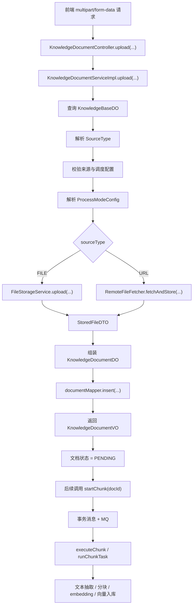

# Ragent 文件上传链路详解

## 1. 文档目标

本文聚焦 `knowledge` 模块中的“文件上传链路”，完整解释下面这些问题：

- 前端上传一个文件后，请求先进入哪里
- `Controller -> Service -> 存储 -> 数据库` 是如何串起来的
- 为什么上传成功后文档状态是 `PENDING`，而不是立刻完成
- 本地文件上传和 URL 导入分别怎么处理
- 上传时为什么还要同时保存 `processMode`、`chunkStrategy`、`pipelineId` 这些字段
- 上传阶段和后续“分块 / 向量化 / 入检索库”之间是如何衔接的

本文的重点不是只解释某一个方法，而是把整条链路从 HTTP 接口、参数绑定、业务校验、文件落存储、文档元数据建模，一直到后续异步分块触发的关系全部讲清楚。

## 2. 链路总览

先给出整条链路的总体图。



这个图体现了一个非常关键的事实：

> 上传链路的职责是“先把原始文件和文档元数据稳定落下来”，而不是“在上传接口里直接做完全部知识处理”。

## 3. 入口：`KnowledgeDocumentController.upload`

上传接口入口在 [KnowledgeDocumentController](file:///e:/java/workspace/ragent/bootstrap/src/main/java/com/nageoffer/ai/ragent/knowledge/controller/KnowledgeDocumentController.java#L63-L68)：

```java
@PostMapping(value = "/knowledge-base/{kb-id}/docs/upload", consumes = MediaType.MULTIPART_FORM_DATA_VALUE)
public Result<KnowledgeDocumentVO> upload(@PathVariable("kb-id") String kbId,
                                          @RequestPart(value = "file", required = false) MultipartFile file,
                                          @ModelAttribute KnowledgeDocumentUploadRequest requestParam) {
    return Results.success(documentService.upload(kbId, requestParam, file));
}
```

这段代码有 3 个关键点。

### 3.1 请求类型是 `multipart/form-data`

这说明接口支持同时接收：

- 二进制文件流
- 普通表单字段

也就是说，前端不是发纯 JSON，而是发一个混合表单。

### 3.2 `file` 是可选参数

`file` 的声明是：

```java
@RequestPart(value = "file", required = false) MultipartFile file
```

这意味着：

- 当 `sourceType=file` 时，必须有 `file`
- 当 `sourceType=url` 时，`file` 可以为空

这一点直接决定了该接口不是“只能传本地文件”的上传接口，而是统一兼容：

- 本地文件上传
- URL 文档导入

### 3.3 表单配置和文件内容是分开的

上传配置放在 [KnowledgeDocumentUploadRequest](file:///e:/java/workspace/ragent/bootstrap/src/main/java/com/nageoffer/ai/ragent/knowledge/controller/request/KnowledgeDocumentUploadRequest.java)：

- `sourceType`
- `sourceLocation`
- `scheduleEnabled`
- `scheduleCron`
- `processMode`
- `chunkStrategy`
- `chunkConfig`
- `pipelineId`

这说明一次“上传文档”请求，不只是把文件传上来，还同时声明了：

- 文档从哪里来
- 是否启用定时刷新
- 后续用什么方式处理

所以从 API 设计上看，上传接口更准确的语义不是“上传文件”，而是：

> 创建一条知识文档并定义它后续的处理策略。

## 4. 服务入口：`KnowledgeDocumentServiceImpl.upload`

真正的业务主线在 [KnowledgeDocumentServiceImpl.upload](file:///e:/java/workspace/ragent/bootstrap/src/main/java/com/nageoffer/ai/ragent/knowledge/service/impl/KnowledgeDocumentServiceImpl.java#L122-L154)：

```java
public KnowledgeDocumentVO upload(String kbId, KnowledgeDocumentUploadRequest requestParam, MultipartFile file)
```

这个方法可以拆成 6 个阶段：

1. 校验知识库存在
2. 解析来源类型
3. 校验来源和调度配置
4. 把原始内容落到存储中
5. 解析处理模式配置
6. 组装并插入文档记录

下面按顺序详细展开。

## 5. 第一阶段：校验知识库存在

代码在 [KnowledgeDocumentServiceImpl](file:///e:/java/workspace/ragent/bootstrap/src/main/java/com/nageoffer/ai/ragent/knowledge/service/impl/KnowledgeDocumentServiceImpl.java#L123-L124)：

```java
KnowledgeBaseDO kbDO = knowledgeBaseMapper.selectById(kbId);
Assert.notNull(kbDO, () -> new ClientException("知识库不存在"));
```

这一步看起来简单，但语义非常重要。

### 5.1 为什么上传必须先查知识库

因为文档不是一个孤立资源，它必须从属于某个知识库。

后续很多操作都依赖知识库：

- 文件要存到哪个 bucket
- 向量最终要写入哪个 collection
- 文档启停时要影响哪个知识空间

### 5.2 这里拿到的 `kbDO` 后续有什么用

上传链路里马上会用到：

- `kbDO.getCollectionName()`

它会被当作：

- 文件存储 bucket 名
- 后续向量空间关联标识

也就是说，知识库本身不仅是数据库里的一条元数据，还是后续资源定位的锚点。

## 6. 第二阶段：解析来源类型

代码在 [KnowledgeDocumentServiceImpl](file:///e:/java/workspace/ragent/bootstrap/src/main/java/com/nageoffer/ai/ragent/knowledge/service/impl/KnowledgeDocumentServiceImpl.java#L126-L127)：

```java
SourceType sourceType = SourceType.normalize(requestParam.getSourceType());
validateSourceAndSchedule(sourceType, requestParam);
```

来源类型定义在 [SourceType](file:///e:/java/workspace/ragent/bootstrap/src/main/java/com/nageoffer/ai/ragent/knowledge/enums/SourceType.java)：

- `FILE("file")`
- `URL("url")`

### 6.1 `normalize(...)` 做了什么

`SourceType.normalize(...)` 的逻辑是：

- 空值直接报错
- 兼容多种文件别名
  - `file`
  - `localfile`
  - `local_file`
- 非法值直接抛异常

这一步的目的不是简单做个枚举转换，而是：

- 尽早把输入归一化
- 从这里开始让后续代码只面向明确的两类来源处理

### 6.2 为什么来源类型这么关键

因为从这一刻起，上传链路会走两条不同分支：

- `FILE`
  - 直接接收 `MultipartFile`
  - 走本地文件上传逻辑
- `URL`
  - 不依赖上传文件
  - 走远程文件抓取逻辑

所以 `sourceType` 是整个上传链路的第一个分叉点。

## 7. 第三阶段：校验来源和调度配置

校验逻辑在 [validateSourceAndSchedule](file:///e:/java/workspace/ragent/bootstrap/src/main/java/com/nageoffer/ai/ragent/knowledge/service/impl/KnowledgeDocumentServiceImpl.java#L707-L726)。

它主要处理两类规则：

- 来源相关规则
- 定时刷新相关规则

### 7.1 URL 模式必须有 `sourceLocation`

```java
if (SourceType.URL == sourceType && !StringUtils.hasText(sourceLocation)) {
    throw new ClientException("来源地址不能为空");
}
```

这说明：

- `FILE` 模式依赖 `file`
- `URL` 模式依赖 `sourceLocation`

二者的输入要求是不一样的。

### 7.2 什么情况下才会校验定时刷新

方法内部先调用：

```java
if (!isScheduleEnabled(sourceType, request)) {
    return;
}
```

而 [isScheduleEnabled](file:///e:/java/workspace/ragent/bootstrap/src/main/java/com/nageoffer/ai/ragent/knowledge/service/impl/KnowledgeDocumentServiceImpl.java#L703-L705) 的定义是：

```java
return SourceType.URL == sourceType && Boolean.TRUE.equals(request.getScheduleEnabled());
```

这说明只有在下面两个条件同时满足时，调度才生效：

- 来源类型是 `URL`
- 请求显式开启 `scheduleEnabled=true`

### 7.3 定时表达式校验做了什么

如果定时刷新开启，系统会校验：

- `scheduleCron` 不能为空
- cron 表达式必须合法
- 触发间隔不能小于系统允许的最小周期

这一步使用了 `CronScheduleHelper.isIntervalLessThan(...)` 做最小间隔保护。

### 7.4 为什么上传阶段就做调度校验

因为调度配置本身就是文档的一部分。

这个项目的设计不是：

- 先上传文档
- 后面单独再创建定时任务

而是：

- 上传文档时一并定义“这份文档未来是否自动刷新”

这说明调度在知识文档模型里是内聚的，而不是外挂功能。

## 8. 第四阶段：把原始内容落存储

这是上传链路中最核心的物理落盘阶段。

代码入口在 [resolveStoredFile](file:///e:/java/workspace/ragent/bootstrap/src/main/java/com/nageoffer/ai/ragent/knowledge/service/impl/KnowledgeDocumentServiceImpl.java#L747-L753)：

```java
private StoredFileDTO resolveStoredFile(String bucketName, SourceType sourceType, String sourceLocation, MultipartFile file) {
    if (SourceType.FILE == sourceType) {
        Assert.notNull(file, () -> new ClientException("上传文件不能为空"));
        return fileStorageService.upload(bucketName, file);
    }
    return remoteFileFetcher.fetchAndStore(bucketName, sourceLocation);
}
```

这一步的设计意义非常大：

- 多种来源统一收敛成 `StoredFileDTO`
- 后续组装文档记录时，不再区分文件来自本地还是远程

也就是说：

> `resolveStoredFile(...)` 是“多来源归一化”的核心适配点。

下面分两条支线讲。

## 9. 分支一：本地文件上传链路

本地文件模式下，会调用：

- [FileStorageService.upload(String bucketName, MultipartFile file)](file:///e:/java/workspace/ragent/bootstrap/src/main/java/com/nageoffer/ai/ragent/rag/service/FileStorageService.java#L33-L33)

当前实现是：

- [S3FileStorageService.upload](file:///e:/java/workspace/ragent/bootstrap/src/main/java/com/nageoffer/ai/ragent/rag/service/impl/S3FileStorageService.java#L57-L76)

### 9.1 第一步：基础校验

```java
validateBucketName(bucketName);
Assert.isFalse(file == null || file.isEmpty(), "上传文件不能为空");
```

它确保：

- bucketName 合法
- 上传文件不为空

### 9.2 第二步：读取原始元信息

```java
String originalFilename = file.getOriginalFilename();
long size = file.getSize();
```

这里取的是上传文件的基础属性，后面会用于：

- 记录文档名
- 记录文件大小
- 构造 S3 key

### 9.3 第三步：用 Tika 探测 MIME 类型

```java
try (InputStream is = file.getInputStream()) {
    detectedContentType = TIKA.detect(is, originalFilename);
}
```

这里非常值得注意：

- 系统不只依赖前端传来的 content-type
- 而是主动用 `Tika` 探测文件类型

这样做的好处是：

- 更稳
- 不容易被前端错误声明的 MIME 类型误导
- 后续抽取和分类更可靠

### 9.4 第四步：再次打开流并上传

```java
try (InputStream is = file.getInputStream()) {
    return streamUploadToS3(bucketName, is, size, originalFilename, detectedContentType);
}
```

为什么这里重新打开了一次流？

代码注释已经解释：

- `MultipartFile.getInputStream()` 每次调用都会返回一个新流
- 第一次流被 Tika 用来探测类型
- 第二次流才真正拿去上传

### 9.5 第五步：流式上传到 S3

真正上传发生在 [streamUploadToS3](file:///e:/java/workspace/ragent/bootstrap/src/main/java/com/nageoffer/ai/ragent/rag/service/impl/S3FileStorageService.java#L122-L143)。

它分成三步：

#### 1. 生成 S3 key

```java
String s3Key = generateS3Key(originalFilename);
```

它不是直接使用原始文件名，而是用随机 key + 原扩展名。

这样做的好处：

- 避免重名覆盖
- URL 更稳定
- 与原始展示名解耦

#### 2. 生成预签名 PUT URL

```java
PresignedPutObjectRequest presignedReq = s3Presigner.presignPutObject(...)
```

#### 3. 用 `HttpURLConnection` 执行流式上传

```java
streamPutViaPresignedUrl(presignedReq, inputStream, size, detectedContentType);
```

这里是整个上传实现里最专业的地方之一。

作者没有直接使用同步 `putObject`，而是：

- 用预签名 URL
- 配合 `HttpURLConnection.setFixedLengthStreamingMode(size)`
- 直接把输入流持续写到远端

代码注释明确说明了原因：

- AWS SDK 某些同步/异步上传 API 在签名管线里可能缓冲 payload
- 对大文件上传不友好
- 预签名 URL + 流式 PUT 可以显著降低堆内存占用

这说明这里的上传实现不是“先求能用”，而是已经考虑了：

- 文件尺寸
- 内存占用
- 上传路径的工程稳定性

### 9.6 第六步：返回统一 `StoredFileDTO`

上传完成后会构造：

- `url`，例如 `s3://bucket/key`
- `detectedType`
- `size`
- `originalFilename`

这就是上传链路后续使用的统一文件描述对象。

## 10. 分支二：URL 导入链路

如果 `sourceType=url`，不会使用 `MultipartFile`，而是走：

- [RemoteFileFetcher.fetchAndStore](file:///e:/java/workspace/ragent/bootstrap/src/main/java/com/nageoffer/ai/ragent/knowledge/handler/RemoteFileFetcher.java#L59-L73)

这条链路更复杂，因为远程站点不可靠，系统要自己做更多保护。

### 10.1 第一步：尝试 HEAD 预检

```java
HttpClientHelper.HttpHeadResponse headResponse = tryHead(url);
```

目的：

- 拿 `Content-Length`
- 拿 `Content-Type`
- 拿文件名

如果 HEAD 失败，不会直接失败，而是：

- 记 debug 日志
- 继续走直接下载

这体现了远程导入链路的容错思路。

### 10.2 第二步：做大小限制检查

```java
checkSizeLimit(maxBytes, headContentLength);
```

也就是说，远程文件导入同样受系统上传大小限制控制。

### 10.3 第三步：打开远程流

```java
try (HttpClientHelper.HttpFetchStream response = httpClientHelper.openStream(url, Map.of(), maxBytes)) {
```

此时系统真正开始拉取远程文件内容。

### 10.4 第四步：为什么先落临时文件

核心代码：

```java
return uploadViaTemp(bucketName, response.bodyStream(), fileName, contentType, maxBytes);
```

这里作者没有直接把远程响应流转发给 S3。

原因在注释里写得非常清楚：

- 某些源站的 `Content-Length` 不可靠
- HEAD 返回值也不一定可信
- 如果用固定长度流式上传，一旦字节数和声明长度不一致，上传会失败

所以这里统一策略是：

- 先下载到本地 temp 文件
- 统计真实大小
- 再用真实大小上传到 S3

这是一种“牺牲一点临时磁盘 I/O，换上传稳定性”的工程取舍。

### 10.5 第五步：真正上传临时文件

在 [uploadViaTemp](file:///e:/java/workspace/ragent/bootstrap/src/main/java/com/nageoffer/ai/ragent/knowledge/handler/RemoteFileFetcher.java#L140-L163) 中：

- 先 `copyWithLimit(...)`
- 再用 `Files.newInputStream(tempFile)` 打开本地临时文件
- 调用 `fileStorageService.upload(bucketName, tempInputStream, size, fileName, contentType)`
- 最后删除临时文件

这意味着 URL 导入最终仍然统一复用了 `FileStorageService`。

所以从上层看：

- `FILE` 模式是“用户传本地文件 -> 存 S3”
- `URL` 模式是“系统拉远程文件 -> 临时落地 -> 再存 S3”

最后都收敛成相同的 `StoredFileDTO`。

## 11. 第五阶段：解析后续处理模式

文件一旦存好，上传链路就进入“文档处理配置建模”阶段。

逻辑在 [resolveProcessModeConfig](file:///e:/java/workspace/ragent/bootstrap/src/main/java/com/nageoffer/ai/ragent/knowledge/service/impl/KnowledgeDocumentServiceImpl.java#L728-L745)。

支持两种模式：

- `CHUNK`
- `PIPELINE`

### 11.1 `CHUNK` 模式

如果是 `chunk` 模式：

```java
ChunkingMode chunkingMode = ChunkingMode.fromValue(request.getChunkStrategy());
String chunkConfig = validateAndNormalizeChunkConfig(chunkingMode, request.getChunkConfig());
return new ProcessModeConfig(processMode, chunkingMode, chunkConfig, null);
```

这一步要求：

- 必须指定分块策略
- 必须指定合法的 chunkConfig JSON

并且 `validateAndNormalizeChunkConfig(...)` 会校验：

- JSON 语法合法
- 必要字段齐全

### 11.2 `PIPELINE` 模式

如果是 `pipeline` 模式：

```java
if (!StringUtils.hasText(request.getPipelineId())) {
    throw new ClientException("使用Pipeline模式时，必须指定Pipeline ID");
}
ingestionPipelineService.get(request.getPipelineId());
```

也就是说：

- 必须有 `pipelineId`
- 指定的 pipeline 必须真的存在

### 11.3 为什么上传阶段就要定死处理模式

因为这份文档后续处理不是临时决定的。

系统希望在文档记录里直接保存：

- 用什么模式处理
- 用什么分块策略
- 用哪个 pipeline

这样后续：

- 重试分块
- 定时刷新
- 启用/禁用后重建向量

都可以直接复用这份配置，而不需要用户每次重新传一遍参数。

## 12. 第六阶段：构建 `KnowledgeDocumentDO`

文件存好、处理模式解析完之后，系统开始构建文档数据库对象。

代码在 [KnowledgeDocumentServiceImpl](file:///e:/java/workspace/ragent/bootstrap/src/main/java/com/nageoffer/ai/ragent/knowledge/service/impl/KnowledgeDocumentServiceImpl.java#L131-L150)。

### 12.1 基础身份字段

```java
.kbId(kbId)
.docName(stored.getOriginalFilename())
```

- `kbId`
  - 该文档属于哪个知识库
- `docName`
  - 展示名称，直接取上传或远程推断出的原始文件名

### 12.2 初始状态字段

```java
.enabled(1)
.chunkCount(0)
.status(DocumentStatus.PENDING.getCode())
```

这里很关键：

- `enabled=1`
  - 文档默认可用
- `chunkCount=0`
  - 因为上传阶段还没开始分块
- `status=PENDING`
  - 表示“文件已经收到了，但还没真正处理”

这说明上传链路只是前半程，不代表内容已经进入检索系统。

### 12.3 文件元信息字段

```java
.fileUrl(stored.getUrl())
.fileType(stored.getDetectedType())
.fileSize(stored.getSize())
```

这三项分别表示：

- 原始文件存储地址
- 检测出的文件类型
- 文件大小

其中 `fileUrl` 很重要，它是后续：

- 文本抽取
- 重新处理
- 定时刷新后的旧文件清理

的基础定位信息。

### 12.4 来源与调度字段

```java
.sourceType(sourceType.getValue())
.sourceLocation(SourceType.URL == sourceType ? StrUtil.trimToNull(requestParam.getSourceLocation()) : null)
.scheduleEnabled(isScheduleEnabled(sourceType, requestParam) ? 1 : 0)
.scheduleCron(isScheduleEnabled(sourceType, requestParam) ? StrUtil.trimToNull(requestParam.getScheduleCron()) : null)
```

这组字段说明：

- 系统不会丢掉“原始来源”
- URL 文档的真实来源地址会被保留下来
- 是否自动刷新、刷新周期也会一起保存

这为后续调度系统提供了完整上下文。

### 12.5 处理模式字段

```java
.processMode(modeConfig.processMode().getValue())
.chunkStrategy(modeConfig.chunkingMode() != null ? modeConfig.chunkingMode().getValue() : null)
.chunkConfig(modeConfig.chunkConfig())
.pipelineId(modeConfig.pipelineId())
```

这组字段是整条链路里最重要的“后处理定义”。

它们告诉系统：

- 这份文档以后走 `chunk` 还是 `pipeline`
- 如果走 `chunk`，具体用哪种策略和参数
- 如果走 `pipeline`，对应哪个 pipeline

也就是说，文档记录本身已经变成了一个“可重复执行的处理任务定义”。

### 12.6 审计字段

```java
.createdBy(UserContext.getUsername())
.updatedBy(UserContext.getUsername())
```

这里保存了当前操作者。

这对管理后台和问题追踪很重要。

## 13. 第七阶段：写库并返回

构建完 `KnowledgeDocumentDO` 后，执行：

```java
documentMapper.insert(documentDO);
return BeanUtil.toBean(documentDO, KnowledgeDocumentVO.class);
```

### 13.1 写库代表什么

写库完成后，系统里已经稳定保存了：

- 原始文件存储地址
- 文档来源类型
- 调度配置
- 处理模式配置
- 文档当前状态

从这一刻起，这份文档已经是系统中的正式资源。

### 13.2 为什么返回 `KnowledgeDocumentVO`

因为前端通常需要立即展示：

- 文档名称
- 当前状态
- 文件大小
- 处理模式
- 是否开启调度

所以这里直接把 `DO` 转成 `VO` 返回，而不是只给一个 `docId`。

## 14. 上传完成后，为什么还没有分块

这是理解这条链路最关键的一点。

上传方法结束时，文档状态是：

- `PENDING`

这意味着：

- 文件已存储
- 文档元数据已写库
- 但还没有进行：
  - 文本抽取
  - chunk 切分
  - embedding
  - 向量入库

也就是说，上传只是知识处理生命周期的第一阶段。

真正开始处理内容，要调用：

- [startChunk](file:///e:/java/workspace/ragent/bootstrap/src/main/java/com/nageoffer/ai/ragent/knowledge/service/impl/KnowledgeDocumentServiceImpl.java#L156-L186)

## 15. 上传后如何衔接到分块处理

后续链路是：

1. 调用 `startChunk(docId)`
2. 事务消息把文档状态改成 `RUNNING`
3. 发送 `KnowledgeDocumentChunkEvent`
4. MQ 消费者调用 `executeChunk(docId)`
5. 最终进入 `runChunkTask(documentDO)`

对应代码：

- [startChunk](file:///e:/java/workspace/ragent/bootstrap/src/main/java/com/nageoffer/ai/ragent/knowledge/service/impl/KnowledgeDocumentServiceImpl.java#L156-L186)
- [executeChunk](file:///e:/java/workspace/ragent/bootstrap/src/main/java/com/nageoffer/ai/ragent/knowledge/service/impl/KnowledgeDocumentServiceImpl.java#L188-L197)
- [runChunkTask](file:///e:/java/workspace/ragent/bootstrap/src/main/java/com/nageoffer/ai/ragent/knowledge/service/impl/KnowledgeDocumentServiceImpl.java#L199-L241)
- [KnowledgeDocumentChunkConsumer](file:///e:/java/workspace/ragent/bootstrap/src/main/java/com/nageoffer/ai/ragent/knowledge/mq/KnowledgeDocumentChunkConsumer.java#L42-L58)

这条衔接链路说明：

- 上传阶段和处理阶段被明确解耦
- 用户上传请求不会阻塞在长耗时任务上
- 同一份文档可以后续重试、重跑、重新切分

## 16. 为什么这条上传链路这样设计

这条链路背后有几个很强的工程设计意图。

### 16.1 上传和处理解耦

如果在上传接口里直接做文本抽取、分块、embedding：

- 请求会很慢
- 容易超时
- 失败后用户体验差
- 难以支持重试

所以作者把它拆成：

- 上传阶段：确保文件和元数据可靠落地
- 处理阶段：异步消费，慢慢做内容处理

### 16.2 多来源统一收敛

无论是：

- 用户本地上传文件
- 系统远程拉 URL 文件

最终都会收敛成：

- `StoredFileDTO`

这让后续文档建模代码不需要关心来源差异。

### 16.3 文档记录不是“文件表”，而是“处理任务定义”

文档表里保存的不只是：

- 文件 URL
- 文件大小

还保存了：

- 来源信息
- 调度信息
- 分块策略
- pipeline 信息

这让文档成为一个可重复执行、可自动刷新、可重新入索引的业务对象。

### 16.4 对远程导入做了专门的稳定性设计

`RemoteFileFetcher` 这条链路很能体现作者的工程意识：

- 先 HEAD
- 做大小限制
- 远程流先落 temp
- 再用真实字节数上传
- 临时文件保证清理

这不是简单“下载一下文件”，而是明显考虑过：

- 远程站点不靠谱
- `Content-Length` 不稳定
- 大文件限制
- 流式上传兼容性

## 17. 关键代码片段与职责归纳

### 17.1 Controller 入口

- [KnowledgeDocumentController.upload](file:///e:/java/workspace/ragent/bootstrap/src/main/java/com/nageoffer/ai/ragent/knowledge/controller/KnowledgeDocumentController.java#L63-L68)
- 职责：
  - 接收 multipart 请求
  - 转发给 service

### 17.2 Service 主入口

- [KnowledgeDocumentServiceImpl.upload](file:///e:/java/workspace/ragent/bootstrap/src/main/java/com/nageoffer/ai/ragent/knowledge/service/impl/KnowledgeDocumentServiceImpl.java#L122-L154)
- 职责：
  - 串联整条上传业务逻辑

### 17.3 来源和调度校验

- [validateSourceAndSchedule](file:///e:/java/workspace/ragent/bootstrap/src/main/java/com/nageoffer/ai/ragent/knowledge/service/impl/KnowledgeDocumentServiceImpl.java#L707-L726)
- 职责：
  - 校验 `sourceLocation`
  - 校验 cron
  - 控制 URL 调度场景

### 17.4 文件归一化入口

- [resolveStoredFile](file:///e:/java/workspace/ragent/bootstrap/src/main/java/com/nageoffer/ai/ragent/knowledge/service/impl/KnowledgeDocumentServiceImpl.java#L747-L753)
- 职责：
  - 把 FILE / URL 两条支线统一成 `StoredFileDTO`

### 17.5 本地文件存储实现

- [S3FileStorageService.upload](file:///e:/java/workspace/ragent/bootstrap/src/main/java/com/nageoffer/ai/ragent/rag/service/impl/S3FileStorageService.java#L57-L76)
- [streamUploadToS3](file:///e:/java/workspace/ragent/bootstrap/src/main/java/com/nageoffer/ai/ragent/rag/service/impl/S3FileStorageService.java#L122-L143)
- 职责：
  - MIME 探测
  - S3 流式上传
  - 返回统一存储描述

### 17.6 URL 拉取实现

- [RemoteFileFetcher.fetchAndStore](file:///e:/java/workspace/ragent/bootstrap/src/main/java/com/nageoffer/ai/ragent/knowledge/handler/RemoteFileFetcher.java#L59-L73)
- [uploadViaTemp](file:///e:/java/workspace/ragent/bootstrap/src/main/java/com/nageoffer/ai/ragent/knowledge/handler/RemoteFileFetcher.java#L140-L163)
- 职责：
  - 远程 HEAD/GET
  - 大小限制
  - 临时文件落地
  - 再上传到统一存储

### 17.7 后续处理衔接

- [startChunk](file:///e:/java/workspace/ragent/bootstrap/src/main/java/com/nageoffer/ai/ragent/knowledge/service/impl/KnowledgeDocumentServiceImpl.java#L156-L186)
- [runChunkTask](file:///e:/java/workspace/ragent/bootstrap/src/main/java/com/nageoffer/ai/ragent/knowledge/service/impl/KnowledgeDocumentServiceImpl.java#L199-L241)
- 职责：
  - 把 `PENDING` 文档推进到真正的内容处理阶段

## 18. 一个完整的时序示例

假设用户上传一个 PDF 文件，并选择：

- `sourceType=file`
- `processMode=chunk`
- `chunkStrategy=structure_aware`

真实时序如下：

1. 前端发 `multipart/form-data`
2. Controller 收到 `kbId + file + requestParam`
3. Service 校验知识库存在
4. 解析 `sourceType=file`
5. 校验来源和调度配置
6. 调 `fileStorageService.upload(collectionName, file)`
7. `S3FileStorageService` 用 Tika 探测类型
8. 通过预签名 URL 流式 PUT 到 S3
9. 返回 `StoredFileDTO`
10. Service 解析 `processMode=chunk`
11. 校验 `chunkStrategy/chunkConfig`
12. 组装 `KnowledgeDocumentDO`
13. 插入 `knowledge_document` 表
14. 返回 `KnowledgeDocumentVO`
15. 此时状态为 `PENDING`
16. 后续用户再调用 `startChunk(docId)`
17. 系统异步执行文本抽取、分块、embedding 和向量入库

## 19. 学习这条链路的推荐顺序

建议按下面顺序阅读源码：

1. [KnowledgeDocumentController.upload](file:///e:/java/workspace/ragent/bootstrap/src/main/java/com/nageoffer/ai/ragent/knowledge/controller/KnowledgeDocumentController.java#L63-L68)
2. [KnowledgeDocumentServiceImpl.upload](file:///e:/java/workspace/ragent/bootstrap/src/main/java/com/nageoffer/ai/ragent/knowledge/service/impl/KnowledgeDocumentServiceImpl.java#L122-L154)
3. [validateSourceAndSchedule](file:///e:/java/workspace/ragent/bootstrap/src/main/java/com/nageoffer/ai/ragent/knowledge/service/impl/KnowledgeDocumentServiceImpl.java#L707-L726)
4. [resolveProcessModeConfig](file:///e:/java/workspace/ragent/bootstrap/src/main/java/com/nageoffer/ai/ragent/knowledge/service/impl/KnowledgeDocumentServiceImpl.java#L728-L745)
5. [resolveStoredFile](file:///e:/java/workspace/ragent/bootstrap/src/main/java/com/nageoffer/ai/ragent/knowledge/service/impl/KnowledgeDocumentServiceImpl.java#L747-L753)
6. [S3FileStorageService.upload](file:///e:/java/workspace/ragent/bootstrap/src/main/java/com/nageoffer/ai/ragent/rag/service/impl/S3FileStorageService.java#L57-L76)
7. [RemoteFileFetcher.fetchAndStore](file:///e:/java/workspace/ragent/bootstrap/src/main/java/com/nageoffer/ai/ragent/knowledge/handler/RemoteFileFetcher.java#L59-L73)
8. [startChunk](file:///e:/java/workspace/ragent/bootstrap/src/main/java/com/nageoffer/ai/ragent/knowledge/service/impl/KnowledgeDocumentServiceImpl.java#L156-L186)
9. [runChunkTask](file:///e:/java/workspace/ragent/bootstrap/src/main/java/com/nageoffer/ai/ragent/knowledge/service/impl/KnowledgeDocumentServiceImpl.java#L199-L241)

这样能最顺畅地把“上传”和“后续处理”连成一条完整链路。

## 20. 一句话总结

Ragent 的文件上传链路本质上是一条“先可靠入库、再异步处理”的知识文档创建链路：它先通过 `Controller -> KnowledgeDocumentServiceImpl.upload` 完成知识库校验、来源识别、调度参数校验和处理模式解析，再根据 `FILE` 或 `URL` 两种来源将原始内容统一落到 S3 存储并收敛为 `StoredFileDTO`，随后把文件元信息、来源信息、调度配置和后处理策略一起写入 `KnowledgeDocumentDO`，将文档状态置为 `PENDING`，最后通过 `startChunk -> MQ -> runChunkTask` 在后续阶段完成文本抽取、分块、embedding 与向量入库，从而把一次上传动作演化为一条可重试、可调度、可持续更新的知识处理任务。
