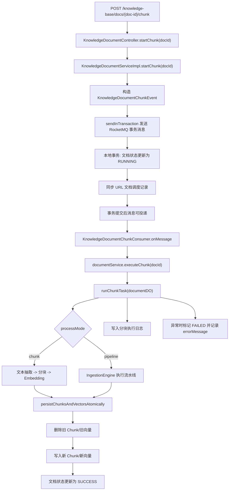

# Ragent 文档分块链路详解

## 1. 文档目标

本文聚焦 [KnowledgeDocumentController.startChunk](file:///e:/java/workspace/ragent/bootstrap/src/main/java/com/nageoffer/ai/ragent/knowledge/controller/KnowledgeDocumentController.java#L73-L77) 这条“文档分块”入口，完整解释下面几个问题：

- 用户点击“开始分块”之后，请求先进入哪里
- 为什么这里只是一个很短的接口，但背后实际是一条很长的异步处理链
- 为什么系统使用 RocketMQ 事务消息，而不是直接在接口里同步执行
- `chunk` 模式和 `pipeline` 模式分别怎么跑
- 文本是如何被抽取、切分、Embedding，并最终写入 Chunk 表和向量库的
- 失败时状态怎么回滚、日志怎么记录、为什么这条链路支持重复触发

本文的重点不是只解释某一个方法，而是把这条链路从 HTTP 入口、服务层状态机、事务消息、MQ 消费、分块策略、Embedding、向量持久化，到最终状态落库和运行日志全部串起来。

## 2. 链路总览

先看整体流程图：



这个图体现了一个关键事实：

> “开始分块”不是一个同步计算接口，而是一个“触发异步摄入任务”的入口。

也就是说，Controller 看起来只有一行 `documentService.startChunk(docId)`，但真实职责是：

- 接受用户触发
- 可靠地把文档状态切到 `RUNNING`
- 把异步任务可靠投递到 MQ
- 后续由消费者执行真正的重活

## 3. 入口：`KnowledgeDocumentController.startChunk`

入口代码在 [KnowledgeDocumentController](file:///e:/java/workspace/ragent/bootstrap/src/main/java/com/nageoffer/ai/ragent/knowledge/controller/KnowledgeDocumentController.java#L73-L77)：

```java
@PostMapping("/knowledge-base/docs/{doc-id}/chunk")
public Result<Void> startChunk(@PathVariable(value = "doc-id") String docId) {
    documentService.startChunk(docId);
    return Results.success();
}
```

这段代码本身很薄，只做两件事：

1. 通过 `@PathVariable` 取出文档 ID
2. 把业务交给 `KnowledgeDocumentService`

这是一种典型的分层设计：

- Controller 只负责 HTTP 协议层
- Service 负责业务状态流转

所以真正需要重点看的，不是 Controller，而是 [KnowledgeDocumentServiceImpl.startChunk](file:///e:/java/workspace/ragent/bootstrap/src/main/java/com/nageoffer/ai/ragent/knowledge/service/impl/KnowledgeDocumentServiceImpl.java#L157-L186)。

## 4. 服务入口：`KnowledgeDocumentServiceImpl.startChunk`

核心代码如下：

```java
public void startChunk(String docId) {
    KnowledgeDocumentChunkEvent event = KnowledgeDocumentChunkEvent.builder()
            .docId(docId)
            .operator(UserContext.getUsername())
            .build();

    messageQueueProducer.sendInTransaction(
            chunkTopic,
            docId,
            "文档分块",
            event,
            arg -> {
                int updated = documentMapper.update(
                        new LambdaUpdateWrapper<KnowledgeDocumentDO>()
                                .set(KnowledgeDocumentDO::getStatus, DocumentStatus.RUNNING.getCode())
                                .set(KnowledgeDocumentDO::getUpdatedBy, event.getOperator())
                                .eq(KnowledgeDocumentDO::getId, docId)
                                .ne(KnowledgeDocumentDO::getStatus, DocumentStatus.RUNNING.getCode())
                );
                if (updated == 0) {
                    KnowledgeDocumentDO documentDO = documentMapper.selectById(docId);
                    Assert.notNull(documentDO, () -> new ClientException("文档不存在"));
                    throw new ClientException("文档分块操作正在进行中，请稍后再试");
                }
                KnowledgeDocumentDO documentDO = documentMapper.selectById(docId);
                event.setKbId(documentDO.getKbId());
                scheduleService.upsertSchedule(documentDO);
            }
    );
}
```

这个方法可以拆成 4 个阶段：

1. 构造分块事件
2. 发送 RocketMQ 事务消息
3. 在本地事务里把文档状态切到 `RUNNING`
4. 补齐事件上下文并同步调度记录

下面逐段解释。

## 5. 第一阶段：构造任务事件

事件类定义在 [KnowledgeDocumentChunkEvent](file:///e:/java/workspace/ragent/bootstrap/src/main/java/com/nageoffer/ai/ragent/knowledge/mq/event/KnowledgeDocumentChunkEvent.java#L35-L54)：

```java
public class KnowledgeDocumentChunkEvent implements Serializable {
    private String docId;
    private String kbId;
    private String operator;
}
```

这里的 3 个字段分别承担不同职责：

- `docId`
  - 唯一定位这次要处理的文档
- `kbId`
  - 便于后续按知识库维度补充上下文
  - 注意它不是一开始就填，而是在本地事务里查文档后补进去
- `operator`
  - 记录是谁触发了这次任务
  - 这个字段后面会通过 `UserContext` 透传给消费者线程

这说明消息体不是“只带一个文档 ID”的极简载荷，而是带了最基本的操作上下文。

## 6. 第二阶段：为什么这里要用事务消息

### 6.1 如果直接同步执行，会有什么问题

如果在 HTTP 请求里直接做下面这些动作：

- 打开文件流
- 抽取文本
- 执行分块
- 调用 Embedding API
- 写 Chunk 表
- 写向量库

会有几个明显问题：

- 请求耗时很长，接口容易超时
- 一次文档重分块可能比较重，不适合占用 Web 线程
- 失败恢复麻烦，用户看不到稳定的处理中状态
- 多次重复点击时容易并发重入

所以项目采用的是：

> 请求线程只负责“可靠触发任务”，真正的重计算交给 MQ 消费者异步执行。

### 6.2 为什么不是普通异步消息，而是事务消息

这里最核心的一致性问题是：

- 如果消息先发出去了，但数据库状态没改成 `RUNNING`
- 或者数据库已经改成 `RUNNING`，但消息没发出去

系统状态都会不一致。

因此代码使用的是 [MessageQueueProducer.sendInTransaction](file:///e:/java/workspace/ragent/framework/src/main/java/com/nageoffer/ai/ragent/framework/mq/producer/MessageQueueProducer.java#L41-L55)：

- 先发 half 消息
- 再执行本地事务
- 本地事务成功才提交消息
- 本地事务失败则回滚消息

这就是“状态更新”和“任务投递”之间的可靠绑定。

## 7. RocketMQ 事务消息底座

### 7.1 生产者适配器

真正执行发送的是 [RocketMQProducerAdapter.sendInTransaction](file:///e:/java/workspace/ragent/framework/src/main/java/com/nageoffer/ai/ragent/framework/mq/producer/RocketMQProducerAdapter.java#L65-L90)。

它做了几件事：

- 为每次事务消息生成 `txId`
- 把本地事务逻辑注册到 `DelegatingTransactionListener`
- 用 `MessageWrapper` 包装业务载荷
- 在消息头里写入 `txId` 和 `topic`
- 调用 `rocketMQTemplate.sendMessageInTransaction(...)`

这里的 [MessageWrapper](file:///e:/java/workspace/ragent/framework/src/main/java/com/nageoffer/ai/ragent/framework/mq/MessageWrapper.java#L36-L62) 很重要，它统一包了：

- `keys`
- `body`
- `uuid`
- `timestamp`

也就是说，业务消息在进 MQ 之前先被封成一个统一信封，便于日志、幂等和回查。

### 7.2 本地事务监听器

[DelegatingTransactionListener](file:///e:/java/workspace/ragent/framework/src/main/java/com/nageoffer/ai/ragent/framework/mq/producer/DelegatingTransactionListener.java#L65-L102) 负责两件事：

- `executeLocalTransaction`
  - 从内存 Map 里取出当前消息对应的本地事务逻辑
  - 用 `TransactionTemplate` 包一层数据库事务
  - 成功返回 `COMMIT`
  - 异常返回 `ROLLBACK`
- `checkLocalTransaction`
  - Broker 回查时，按 `topic` 找到对应的 `TransactionChecker`
  - 再由业务实现类根据数据库状态判断到底该 `COMMIT` 还是 `ROLLBACK`

这套设计的关键点在于：

> 本地事务逻辑是“当前实例内存态”，但回查逻辑必须是“可跨实例共享的 DB 判断逻辑”。

因为 RocketMQ 回查时，Broker 可能把请求打到集群内任意一个实例。

### 7.3 文档分块的事务回查器

文档分块对应的回查实现是 [KnowledgeDocumentChunkTransactionChecker](file:///e:/java/workspace/ragent/bootstrap/src/main/java/com/nageoffer/ai/ragent/knowledge/mq/KnowledgeDocumentChunkTransactionChecker.java#L42-L65)。

核心判断只有一句：

```java
return documentDO != null
        && DocumentStatus.RUNNING.getCode().equals(documentDO.getStatus());
```

这句话的业务含义是：

- 如果数据库里文档已经变成 `RUNNING`
  - 说明本地事务已经提交
  - 这条消息应该被真正投递
- 如果不是 `RUNNING`
  - 说明本地事务没有成功提交
  - 这条消息应该回滚

这就把“MQ 最终是否投递”与“数据库状态是否切换成功”绑定起来了。

## 8. 第三阶段：本地事务里到底做了什么

`startChunk` 里的本地事务逻辑，不是简单更新状态，而是做了 3 件关键事。

### 8.1 用条件更新把文档状态切到 `RUNNING`

代码在 [KnowledgeDocumentServiceImpl.startChunk](file:///e:/java/workspace/ragent/bootstrap/src/main/java/com/nageoffer/ai/ragent/knowledge/service/impl/KnowledgeDocumentServiceImpl.java#L169-L175)：

```java
new LambdaUpdateWrapper<KnowledgeDocumentDO>()
        .set(KnowledgeDocumentDO::getStatus, DocumentStatus.RUNNING.getCode())
        .set(KnowledgeDocumentDO::getUpdatedBy, event.getOperator())
        .eq(KnowledgeDocumentDO::getId, docId)
        .ne(KnowledgeDocumentDO::getStatus, DocumentStatus.RUNNING.getCode())
```

这里最重要的是最后一行：

- `ne(status, RUNNING)`

它表示：

- 只有当前不在 `RUNNING` 状态时，才允许更新

这实际上就是一个轻量级防重入控制。

### 8.2 为什么 `updated == 0` 时要二次查询

如果更新条数为 0，代码会再次 `selectById(docId)`，然后区分两种情况：

- 文档不存在
- 文档存在，但已经在分块中

于是最终能给前端返回更准确的业务错误：

- `"文档不存在"`
- `"文档分块操作正在进行中，请稍后再试"`

这比简单抛一个“更新失败”要友好得多。

### 8.3 在这里同步调度记录

本地事务的最后还调用了 [KnowledgeDocumentScheduleServiceImpl.upsertSchedule](file:///e:/java/workspace/ragent/bootstrap/src/main/java/com/nageoffer/ai/ragent/knowledge/service/impl/KnowledgeDocumentScheduleServiceImpl.java#L50-L119)。

这个动作只会对 `URL` 类型文档生效，因为 `syncSchedule(...)` 里先判断了：

```java
if (!SourceType.URL.getValue().equalsIgnoreCase(documentDO.getSourceType())) {
    return;
}
```

这说明一个细节：

- 上传阶段只是保存“调度配置”
- 真正创建或更新调度记录，是在首次启动分块时

从业务语义上看，这相当于把“开始分块”视为文档正式进入托管生命周期的起点。

## 9. 状态机：文档状态如何流转

文档状态定义在 [DocumentStatus](file:///e:/java/workspace/ragent/bootstrap/src/main/java/com/nageoffer/ai/ragent/knowledge/enums/DocumentStatus.java#L30-L55)：

- `PENDING`
- `RUNNING`
- `FAILED`
- `SUCCESS`

结合上传链路和分块链路，完整状态流转是：

```text
上传成功 -> PENDING
触发分块 -> RUNNING
处理成功 -> SUCCESS
处理失败 -> FAILED
再次触发分块 -> 再次进入 RUNNING
```

注意这里有一个非常值得学习的设计点：

> 系统只禁止“RUNNING 时再次触发”，并不禁止对 `FAILED` 或 `SUCCESS` 文档重新分块。

这意味着：

- 失败后可以重试
- 成功后也可以重建 Chunk 和向量

这对知识库运维非常重要，因为分块策略、Embedding 模型、原始文件内容都可能变化。

## 10. MQ 消费入口：`KnowledgeDocumentChunkConsumer`

消息提交成功后，会由 [KnowledgeDocumentChunkConsumer](file:///e:/java/workspace/ragent/bootstrap/src/main/java/com/nageoffer/ai/ragent/knowledge/mq/KnowledgeDocumentChunkConsumer.java#L42-L58) 消费：

```java
public void onMessage(MessageWrapper<KnowledgeDocumentChunkEvent> message) {
    KnowledgeDocumentChunkEvent event = message.getBody();
    UserContext.set(LoginUser.builder().username(event.getOperator()).build());
    try {
        documentService.executeChunk(event.getDocId());
    } finally {
        UserContext.clear();
    }
}
```

这段代码的重点不是“调用了 `executeChunk`”，而是这句：

```java
UserContext.set(LoginUser.builder().username(event.getOperator()).build());
```

它说明消费者线程会把消息里的 `operator` 恢复成当前线程上下文。

这样后面这些写库动作仍然能拿到统一的操作人：

- `updatedBy`
- Chunk 的 `createdBy / updatedBy`
- 失败标记时的审计字段

这是异步任务里非常常见、也非常容易遗漏的技术细节。

## 11. 任务执行入口：`executeChunk`

[KnowledgeDocumentServiceImpl.executeChunk](file:///e:/java/workspace/ragent/bootstrap/src/main/java/com/nageoffer/ai/ragent/knowledge/service/impl/KnowledgeDocumentServiceImpl.java#L188-L197) 先做一次文档存在性检查：

```java
KnowledgeDocumentDO documentDO = documentMapper.selectById(docId);
if (documentDO == null) {
    log.warn("文档不存在，跳过分块任务, docId={}", docId);
    return;
}
runChunkTask(documentDO);
```

这一步的意义是：

- 防御消息延迟或重试导致的“文档已被删除”场景
- 避免消费者因为查不到文档而反复报错重试

真正的总编排逻辑在 [runChunkTask](file:///e:/java/workspace/ragent/bootstrap/src/main/java/com/nageoffer/ai/ragent/knowledge/service/impl/KnowledgeDocumentServiceImpl.java#L199-L248)。

## 12. 总编排：`runChunkTask`

`runChunkTask` 可以理解成“文档分块任务调度器”，它统一负责：

- 建立分块执行日志
- 判断走 `chunk` 还是 `pipeline`
- 执行实际处理
- 持久化 Chunk 和向量
- 更新最终状态
- 捕获异常并写失败日志

### 12.1 先插入一条运行日志

日志实体是 [KnowledgeDocumentChunkLogDO](file:///e:/java/workspace/ragent/bootstrap/src/main/java/com/nageoffer/ai/ragent/knowledge/dao/entity/KnowledgeDocumentChunkLogDO.java#L39-L119)。

在任务开始时会先插入一条 `RUNNING` 记录，提前把这些维度保存下来：

- `docId`
- `status`
- `processMode`
- `chunkStrategy`
- `pipelineId`
- `startTime`

这说明项目不是等任务结束后才补日志，而是采用：

> “先记开始，再记结果”的运行日志模型。

这样即使任务中途崩了，也至少知道它启动过。

### 12.2 记录分阶段耗时

`runChunkTask` 里维护了 4 组时间指标：

- `extractDuration`
- `chunkDuration`
- `embedDuration`
- `persistDuration`

再加上总耗时 `totalDuration`，就能很清楚地知道：

- 慢在文本抽取
- 还是慢在分块策略
- 还是慢在 Embedding API
- 还是慢在写库

这对后续性能调优和线上排障非常有用。

### 12.3 按 `processMode` 分叉

分支判断在 [runChunkTask](file:///e:/java/workspace/ragent/bootstrap/src/main/java/com/nageoffer/ai/ragent/knowledge/service/impl/KnowledgeDocumentServiceImpl.java#L219-L231)：

```java
if (ProcessMode.PIPELINE == processMode) {
    chunkResults = runPipelineProcess(documentDO);
} else {
    ChunkProcessResult result = runChunkProcess(documentDO);
    ...
    chunkResults = result.chunks();
}
```

这里的架构思想很清晰：

- 上层编排统一
- 下层处理实现可替换

不管走哪种模式，最后都要返回统一的 `List<VectorChunk>`，然后进入同一个持久化出口。

## 13. 默认主路径：`chunk` 模式

默认主路径是 [runChunkProcess](file:///e:/java/workspace/ragent/bootstrap/src/main/java/com/nageoffer/ai/ragent/knowledge/service/impl/KnowledgeDocumentServiceImpl.java#L298-L322)。

它实际上包含 3 个核心阶段：

1. Extract
2. Chunk
3. Embed

### 13.1 Extract：从文件存储里打开流并提取纯文本

代码是：

```java
try (InputStream is = fileStorageService.openStream(documentDO.getFileUrl())) {
    String text = parserSelector.select(ParserType.TIKA.getType()).extractText(is, documentDO.getDocName());
}
```

这里有两个关键角色。

第一个是 `fileStorageService.openStream(...)`：

- 不直接依赖本地磁盘
- 说明文档原始文件可能存放在 OSS、S3、NFS 或其他对象存储

第二个是 [DocumentParserSelector](file:///e:/java/workspace/ragent/bootstrap/src/main/java/com/nageoffer/ai/ragent/core/parser/DocumentParserSelector.java#L42-L82)：

- 这是一个解析器策略选择器
- 当前分块链路里固定选了 `TIKA`

真正做文本抽取的是 [TikaDocumentParser](file:///e:/java/workspace/ragent/bootstrap/src/main/java/com/nageoffer/ai/ragent/core/parser/TikaDocumentParser.java#L48-L78)：

- 调用 Apache Tika 解析 PDF、Word、Excel、PPT 等多种格式
- 解析后再走 `TextCleanupUtil.cleanup(text)` 做文本清洗

所以这里的“抽取文本”不是简单读字符串，而是一个文档理解过程：

- 二进制文件
- 经过 Tika 解析
- 变成后续可切分的纯文本

### 13.2 Chunk：按分块策略切成 `VectorChunk`

抽取完文本后，代码会先构造分块配置：

```java
ChunkingMode chunkingMode = ChunkingMode.fromValue(documentDO.getChunkStrategy());
ChunkingOptions config = buildChunkingOptions(chunkingMode, documentDO);
ChunkingStrategy chunkingStrategy = chunkingStrategyFactory.requireStrategy(chunkingMode);
List<VectorChunk> chunks = chunkingStrategy.chunk(text, config);
```

这一段背后有 4 层抽象。

#### 13.2.1 `ChunkingMode`

[ChunkingMode](file:///e:/java/workspace/ragent/bootstrap/src/main/java/com/nageoffer/ai/ragent/core/chunk/ChunkingMode.java#L34-L152) 定义了两种策略：

- `FIXED_SIZE`
- `STRUCTURE_AWARE`

并且每个模式都负责：

- 定义自己的默认参数
- 把 JSON 配置转成类型安全的 `ChunkingOptions`

这意味着“策略”和“配置结构”是绑在一起的，而不是所有策略共用一套松散 Map。

#### 13.2.2 `ChunkingOptions`

[ChunkingOptions](file:///e:/java/workspace/ragent/bootstrap/src/main/java/com/nageoffer/ai/ragent/core/chunk/ChunkingOptions.java#L22-L35) 是一个 sealed interface。

它的意义是：

- 固定大小策略用 `FixedSizeOptions`
- 结构感知策略用 `TextBoundaryOptions`

这样每个策略都能拿到自己强类型的参数对象，避免到处手写魔法字符串。

#### 13.2.3 `ChunkingStrategyFactory`

[ChunkingStrategyFactory](file:///e:/java/workspace/ragent/bootstrap/src/main/java/com/nageoffer/ai/ragent/core/chunk/ChunkingStrategyFactory.java#L34-L81) 会在启动时把所有 `ChunkingStrategy` Bean 注册成一个 `Map<ChunkingMode, ChunkingStrategy>`。

因此运行时只需要：

```java
chunkingStrategyFactory.requireStrategy(chunkingMode)
```

就能拿到对应实现。

这就是典型的“策略模式 + 工厂模式”组合。

#### 13.2.4 为什么文档里存的是 `chunkConfig` JSON

`buildChunkingOptions(...)` 的实现非常简单：

```java
Map<String, Object> config = parseChunkConfig(documentDO.getChunkConfig());
return mode.createOptions(config);
```

这说明数据库里保存的是一份 JSON 配置，而不是固定列。

好处是：

- 新增分块策略时不需要频繁改表
- 每种策略可以拥有不同配置键
- 上传时即可固化当时的分块参数

这对后续“重跑同一文档”很重要，因为它能复现当时的处理语义。

### 13.3 两种分块策略到底怎么切

#### 13.3.1 固定大小策略

[FixedSizeTextChunker](file:///e:/java/workspace/ragent/bootstrap/src/main/java/com/nageoffer/ai/ragent/core/chunk/strategy/FixedSizeTextChunker.java#L43-L156) 的核心特点是：

- 按 `chunkSize` 切分
- 相邻块保留 `overlapSize`
- 优先在换行、中文句末标点、英文句末标点处对齐边界
- 对 URL 断行、中文词软换行做保守归一化

它更像一种“通用文本切刀”：

- 追求稳定
- 配置直接
- 对普通纯文本比较友好

#### 13.3.2 结构感知策略

[StructureAwareTextChunker](file:///e:/java/workspace/ragent/bootstrap/src/main/java/com/nageoffer/ai/ragent/core/chunk/strategy/StructureAwareTextChunker.java#L43-L298) 更高级一些，它会先把文本扫描成块：

- 标题块
- 段落块
- 代码块
- 原子块（图片、链接）

再按 `min / target / max` 预算把这些“结构块”打包成最终 Chunk。

它的核心目标不是“严格按字数切”，而是：

> 尽量不破坏 Markdown/结构化文本的语义边界。

所以这个策略更适合：

- Markdown 文档
- 结构清晰的技术文档
- 希望标题、段落、代码块尽量完整保留的场景

### 13.4 Embed：批量生成向量

分块之后，代码会调用 [ChunkEmbeddingService.embed](file:///e:/java/workspace/ragent/bootstrap/src/main/java/com/nageoffer/ai/ragent/core/chunk/ChunkEmbeddingService.java#L34-L75)：

```java
chunkEmbeddingService.embed(chunks, embeddingModel);
```

它做了几件事：

- 如果 Chunk 为空，直接返回
- 如果每个 Chunk 已经有 embedding，就不重复算
- 提取所有文本内容，走 `embeddingService.embedBatch(...)`
- 再把返回的 `List<List<Float>>` 回填成 `float[]`

这里体现了两个工程点：

- 使用批量 Embedding，而不是逐条调用，减少模型 API 开销
- `VectorChunk` 作为统一中间对象，同时携带内容、索引、ID、metadata、embedding

也就是说，`VectorChunk` 是这条链路里贯穿处理阶段和持久化阶段的核心数据模型。

## 14. 可扩展路径：`pipeline` 模式

如果文档的 `processMode` 是 `pipeline`，则进入 [runPipelineProcess](file:///e:/java/workspace/ragent/bootstrap/src/main/java/com/nageoffer/ai/ragent/knowledge/service/impl/KnowledgeDocumentServiceImpl.java#L335-L378)。

这条路径不是直接用内置分块器，而是走 ingestion 子系统。

### 14.1 它先做什么

它会先：

- 读取 `pipelineId`
- 查询知识库拿 `collectionName`
- 读取整份文件字节数组
- 加载 `PipelineDefinition`

然后构造 [IngestionContext](file:///e:/java/workspace/ragent/bootstrap/src/main/java/com/nageoffer/ai/ragent/knowledge/service/impl/KnowledgeDocumentServiceImpl.java#L354-L363)：

```java
IngestionContext context = IngestionContext.builder()
        .taskId(docId)
        .pipelineId(pipelineId)
        .rawBytes(fileBytes)
        .mimeType(documentDO.getFileType())
        .vectorSpaceId(VectorSpaceId.builder()
                .logicalName(kbDO.getCollectionName())
                .build())
        .skipIndexerWrite(true)
        .build();
```

这里最值得注意的是：

- `skipIndexerWrite(true)`

### 14.2 为什么要 `skipIndexerWrite(true)`

因为 ingestion pipeline 里本来就可能有索引节点，但在知识文档链路里，项目不想让 pipeline 直接把结果写进向量库。

原因是这条链路希望：

- 无论走 `chunk` 还是 `pipeline`
- 最终都回到同一个 `persistChunksAndVectorsAtomically(...)` 出口

这样可以统一做：

- 删除旧 Chunk
- 新建 Chunk
- 删除旧向量
- 新建向量
- 更新文档状态

换句话说，pipeline 负责“加工结果”，而不是负责“最终提交”。

### 14.3 Pipeline 引擎如何执行

[IngestionEngine](file:///e:/java/workspace/ragent/bootstrap/src/main/java/com/nageoffer/ai/ragent/ingestion/engine/IngestionEngine.java#L57-L87) 的主流程是：

1. 构建节点映射
2. 验证流水线配置
3. 找起始节点
4. 按 `nextNodeId` 链式执行
5. 把结果和节点日志写回 `IngestionContext`

这说明 pipeline 不是写死的流程，而是一种配置驱动的图式执行引擎。

### 14.4 Pipeline 中的 Chunker / Indexer 节点

分块节点是 [ChunkerNode](file:///e:/java/workspace/ragent/bootstrap/src/main/java/com/nageoffer/ai/ragent/ingestion/node/ChunkerNode.java#L57-L78)：

- 从 `rawText` 或 `enhancedText` 取输入
- 按配置选择分块策略
- 生成 Chunk
- 直接在节点内做 Embedding
- 把结果放回 `context.setChunks(...)`

索引节点是 [IndexerNode](file:///e:/java/workspace/ragent/bootstrap/src/main/java/com/nageoffer/ai/ragent/ingestion/node/IndexerNode.java#L80-L112)：

- 检查向量空间
- 组装 `VectorChunk`
- 正常情况下可直接写向量库
- 但如果 `context.isSkipIndexerWrite()` 为真，就只准备数据、不真正落库

因此，在知识文档分块链路中：

- pipeline 内部可以完成解析、清洗、分块、embedding
- 但最终写库仍然由知识模块统一接管

这是一个非常典型的“可扩展处理 + 统一提交”设计。

## 15. 统一提交出口：`persistChunksAndVectorsAtomically`

不管前面走 `chunk` 还是 `pipeline`，最后都汇总成 `List<VectorChunk>`，然后进入 [persistChunksAndVectorsAtomically](file:///e:/java/workspace/ragent/bootstrap/src/main/java/com/nageoffer/ai/ragent/knowledge/service/impl/KnowledgeDocumentServiceImpl.java#L250-L274)。

核心逻辑如下：

```java
transactionOperations.executeWithoutResult(status -> {
    knowledgeChunkService.deleteByDocId(docId);
    knowledgeChunkService.batchCreate(docId, chunks);
    vectorStoreService.deleteDocumentVectors(collectionName, docId);
    vectorStoreService.indexDocumentChunks(collectionName, docId, chunkResults);
    documentMapper.updateById(updateDocumentDO);
});
```

这段代码体现了整条链路最重要的业务语义：

> 重分块不是“增量追加”，而是“整文档重建”。

也就是先删旧结果，再写新结果。

### 15.1 为什么先删旧 Chunk

`knowledgeChunkService.deleteByDocId(docId)` 的含义是：

- 文档重新分块时，旧 Chunk 全部失效
- 不尝试做复杂的 diff 合并

这样做的好处是：

- 逻辑简单
- 不会留下历史脏数据
- chunkIndex 可以从新的结果重新排序

### 15.2 为什么 `batchCreate` 不在这里直接写向量

[KnowledgeChunkServiceImpl.batchCreate](file:///e:/java/workspace/ragent/bootstrap/src/main/java/com/nageoffer/ai/ragent/knowledge/service/impl/KnowledgeChunkServiceImpl.java#L157-L236) 支持一个 `writeVector` 参数，但这里调用的是默认版本：

```java
knowledgeChunkService.batchCreate(docId, chunks);
```

也就是：

- 只写 Chunk 表
- 不重复写向量库

原因很简单：

- `VectorChunk` 在上游已经带好了 embedding
- 如果这里再让 ChunkService 自己 embed + 写向量，会造成重复计算

所以当前实现把职责拆开成：

- `KnowledgeChunkService`
  - 管理 Chunk 表元数据
- `VectorStoreService`
  - 管理向量索引

### 15.3 向量库写入时保存了什么

以 PostgreSQL 实现 [PgVectorStoreService](file:///e:/java/workspace/ragent/bootstrap/src/main/java/com/nageoffer/ai/ragent/rag/core/vector/PgVectorStoreService.java#L41-L123) 为例，插入的是：

- `id`
  - 使用 `chunkId`
- `content`
  - Chunk 文本
- `metadata`
  - JSON，至少带 `collection_name`、`doc_id`、`chunk_index`
- `embedding`
  - `pgvector` 类型的向量

这意味着向量表里的记录不仅能做相似度检索，还能反查：

- 属于哪个知识库
- 属于哪个文档
- 是该文档的第几个 Chunk

### 15.4 这个“Atomically”到底有多原子

方法名叫 `persistChunksAndVectorsAtomically`，它表达的核心意图是：

- 把 Chunk 表、向量索引、文档状态更新视为一个统一提交单元

但从工程上要分两层理解：

1. 业务语义层面
   - 代码把“删旧 + 建新 + 改状态”收敛到一个事务块里
   - 尽量避免部分成功、部分失败
2. 底层资源层面
   - 如果向量存储实现是 PostgreSQL 且复用同一事务资源，一致性更强
   - 如果切换到独立向量库实现，比如 Milvus，则这里更偏“应用层顺序一致”，并不是严格 XA 分布式事务

所以更准确的理解应当是：

> 这是一个“统一业务提交出口”，而不是承诺所有底层资源都具备严格分布式原子事务。

## 16. 失败处理：如何把任务收口到 `FAILED`

`runChunkTask` 外层包了一层 `try-catch`。

一旦任何环节抛异常，就会执行两件事：

### 16.1 标记文档失败

[markChunkFailed](file:///e:/java/workspace/ragent/bootstrap/src/main/java/com/nageoffer/ai/ragent/knowledge/service/impl/KnowledgeDocumentServiceImpl.java#L387-L395) 会把文档状态更新为 `FAILED`。

这保证了前端和运维侧能明确知道：

- 任务不是还在运行
- 而是已经结束，但失败了

### 16.2 更新分块执行日志

[updateChunkLog](file:///e:/java/workspace/ragent/bootstrap/src/main/java/com/nageoffer/ai/ragent/knowledge/service/impl/KnowledgeDocumentServiceImpl.java#L276-L292) 会把这些信息补齐：

- `status=failed`
- 各阶段耗时
- `totalDuration`
- `errorMessage`
- `endTime`

因此失败不会只停留在日志文件里，而是会被结构化地写进数据库，便于页面展示和问题排查。

## 17. 数据模型：这条链路最终落了哪些表

### 17.1 文档主表：`t_knowledge_document`

[KnowledgeDocumentDO](file:///e:/java/workspace/ragent/bootstrap/src/main/java/com/nageoffer/ai/ragent/knowledge/dao/entity/KnowledgeDocumentDO.java#L40-L156) 里和分块链路最相关的字段有：

- `processMode`
- `chunkStrategy`
- `chunkConfig`
- `pipelineId`
- `status`
- `chunkCount`
- `enabled`
- `fileUrl`

它记录的是“这份文档的处理配置和当前处理结果”。

### 17.2 Chunk 表：`t_knowledge_chunk`

[KnowledgeChunkDO](file:///e:/java/workspace/ragent/bootstrap/src/main/java/com/nageoffer/ai/ragent/knowledge/dao/entity/KnowledgeChunkDO.java#L40-L115) 保存的是结构化分块结果：

- `kbId`
- `docId`
- `chunkIndex`
- `content`
- `contentHash`
- `charCount`
- `tokenCount`
- `enabled`

它更像是“文档分块后的业务主表”。

### 17.3 分块日志表：`t_knowledge_document_chunk_log`

[KnowledgeDocumentChunkLogDO](file:///e:/java/workspace/ragent/bootstrap/src/main/java/com/nageoffer/ai/ragent/knowledge/dao/entity/KnowledgeDocumentChunkLogDO.java#L39-L119) 保存的是每次执行记录：

- 跑的是 `chunk` 还是 `pipeline`
- 用的什么策略
- 每个阶段耗时
- 成功还是失败
- 失败原因

也就是说，这张表记录的不是“当前状态”，而是“每一次运行历史”。

## 18. 这条链路的几个关键设计点

### 18.1 上传与分块解耦

上传成功后文档先进入 `PENDING`，等用户主动触发 `startChunk` 再进入真正处理。

这样做的好处是：

- 上传接口更轻
- 失败边界更清晰
- 允许上传后再调整处理配置

### 18.2 异步化但不丢一致性

它不是简单地“扔一条异步消息就完了”，而是通过事务消息确保：

- 状态更新成功，消息才能投递
- 状态更新失败，消息自动回滚

这是这条链路最核心的工程价值。

### 18.3 统一中间模型 `VectorChunk`

不管来自：

- 内置分块器
- pipeline 节点

最终都统一成 `VectorChunk`，再进入持久化。

这让上游处理方式可扩展，而下游持久化逻辑保持稳定。

### 18.4 重跑语义清晰

系统允许对非 `RUNNING` 文档重新触发分块，并采用“删旧建新”的方式重建：

- Chunk 全量重建
- 向量全量重建

这让运维操作和配置调整都比较简单，不容易产生脏状态。

## 19. 一句话总结整条链路

如果把这条链路压缩成一句话，可以这样理解：

> `startChunk` 本质上是“把文档处理任务可靠地切到异步执行系统中”，然后由消费者完成“文本抽取 -> 分块 -> Embedding -> Chunk/向量持久化 -> 状态更新 -> 执行日志记录”的完整摄入闭环。

## 20. 面试/汇报时可以怎么讲

如果你后面要把这部分作为项目亮点讲给面试官，可以抓住下面这几个点：

- 文档分块入口采用 `HTTP + RocketMQ 事务消息`，把“状态切换”和“任务投递”绑定，避免消息和数据库状态不一致
- 文档分块执行采用统一编排器 `runChunkTask`，支持 `chunk` 和 `pipeline` 两种处理模式
- 分块结果统一抽象为 `VectorChunk`，将上游处理策略和下游持久化解耦
- 重分块采用“删旧建新”的全量重建语义，简化一致性维护
- 执行过程记录结构化分块日志，包含分阶段耗时、错误信息和运行历史，便于排障与调优

如果你愿意，我下一步可以继续基于这份文档，帮你补一份“文档分块链路时序图版”或者“适合面试讲解的 3 分钟口述稿”。 
