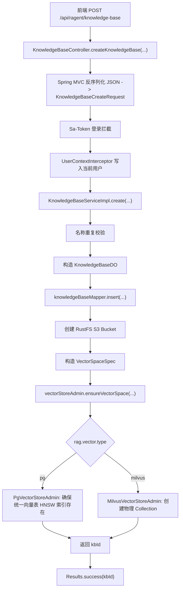
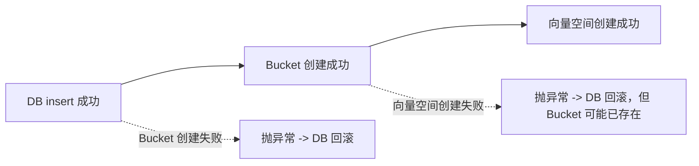

# Ragent 知识库创建链路详解

## 1. 文档目标

本文聚焦知识库创建接口 [KnowledgeBaseController.createKnowledgeBase](file:///e:/java/workspace/ragent/bootstrap/src/main/java/com/nageoffer/ai/ragent/knowledge/controller/KnowledgeBaseController.java#L52-L58)，完整解释下面这些问题：

- 前端发起一次“创建知识库”请求后，链路先进入哪里
- `Controller -> Request -> Service -> DB / 对象存储 / 向量空间` 是如何串起来的
- 为什么这个接口不仅会写数据库，还会同时创建对象存储桶和向量空间
- `collectionName`、`embeddingModel`、`kbId` 三者分别承担什么职责
- `@Transactional` 在这里到底保证了什么，又没有保证什么
- 当前 `pg` 模式和 `milvus` 模式下，向量空间初始化有什么本质差异
- 这条链路和后续“上传文档 / 分块 / 检索”之间是什么关系

本文的重点不是只解释某一段 Controller 代码，而是把“一个知识库在系统里是怎么落地成一组可用资源”的全过程讲清楚。

## 2. 接口快照

接口入口在 [KnowledgeBaseController](file:///e:/java/workspace/ragent/bootstrap/src/main/java/com/nageoffer/ai/ragent/knowledge/controller/KnowledgeBaseController.java#L52-L58)：

```java
/**
 * 创建知识库
 */
@PostMapping("/knowledge-base")
public Result<String> createKnowledgeBase(@RequestBody KnowledgeBaseCreateRequest requestParam) {
    return Results.success(knowledgeBaseService.create(requestParam));
}
```

这段代码很短，但背后串起了 3 类资源的初始化：

1. 知识库元数据记录：`t_knowledge_base`
2. 对象存储桶：RustFS 的 S3 Bucket
3. 向量空间：`pgvector` 或 `Milvus`

也就是说，这个接口的真实语义不是“插一条知识库记录”，而是：

> 创建一个可承载后续知识文档上传、分块、向量检索的完整知识空间。

## 3. 请求与响应

### 3.1 实际访问路径

项目在 [application.yaml](file:///e:/java/workspace/ragent/bootstrap/src/main/resources/application.yaml#L1-L5) 中配置了：

```yaml
server:
  servlet:
    context-path: /api/ragent
```

因此完整接口地址是：

```text
POST /api/ragent/knowledge-base
Content-Type: application/json
```

### 3.2 请求体对象

请求体定义在 [KnowledgeBaseCreateRequest](file:///e:/java/workspace/ragent/bootstrap/src/main/java/com/nageoffer/ai/ragent/knowledge/controller/request/KnowledgeBaseCreateRequest.java#L22-L38)：

```java
@Data
public class KnowledgeBaseCreateRequest {

    private String name;

    private String embeddingModel;

    private String collectionName;
}
```

三个字段的含义分别是：

- `name`
  - 知识库的业务名称，给用户和后台界面看
- `embeddingModel`
  - 该知识库后续做向量化时默认使用的嵌入模型
- `collectionName`
  - 该知识库绑定的“统一逻辑空间名”
  - 后面会同时用于：
    - RustFS Bucket 名
    - 向量空间 logical name
    - 后续文档上传、向量写入时的资源定位锚点

### 3.3 响应结构

Controller 返回的是 [Result<String>](file:///e:/java/workspace/ragent/framework/src/main/java/com/nageoffer/ai/ragent/framework/convention/Result.java#L36-L90)，由 [Results.success(...)](file:///e:/java/workspace/ragent/framework/src/main/java/com/nageoffer/ai/ragent/framework/web/Results.java#L39-L46) 构造。

成功响应形态大致如下：

```json
{
  "code": "0",
  "message": null,
  "data": "1912345678901234567",
  "requestId": null
}
```

其中 `data` 返回的是知识库主键 `kbId`。

### 3.4 一个典型请求示例

```json
{
  "name": "员工制度知识库",
  "embeddingModel": "qwen3-embedding:8b-fp16",
  "collectionName": "kb_employee_policy"
}
```

## 4. 链路总览

先给出整条链路的总框图。



这个图揭示了一个很重要的事实：

> 一个知识库不是单纯的数据库概念，它是“元数据 + 文件存储命名空间 + 向量检索命名空间”的组合体。

## 5. 入口层：`KnowledgeBaseController.createKnowledgeBase`

接口入口很薄，只有一行真正业务代码：

```java
return Results.success(knowledgeBaseService.create(requestParam));
```

这说明 Controller 层只承担 3 个职责：

1. 暴露 HTTP 路由
2. 让 Spring 把 JSON 绑定成 `KnowledgeBaseCreateRequest`
3. 用统一返回体包裹 Service 的结果

### 5.1 为什么这里没有复杂逻辑

这是比较标准的分层设计：

- `Controller`
  - 只处理协议层
- `Service`
  - 承担业务编排
- `Mapper`
  - 负责数据库访问
- `VectorStoreAdmin` / `S3Client`
  - 负责外部资源初始化

这样做的好处是：

- HTTP 细节和业务逻辑解耦
- 以后如果要做 RPC / MQ 触发，不必把业务逻辑搬来搬去

### 5.2 这里没有 `@Valid`

这段代码只有：

```java
@RequestBody KnowledgeBaseCreateRequest requestParam
```

没有：

- `@Valid`
- `@Validated`
- `@NotBlank`
- `@Pattern`

这意味着这条接口没有走 Bean Validation 自动参数校验。

因此很多输入约束并不是在 Controller 层被拦住，而是要么：

- 在 Service 里手工校验
- 要么直接在后续逻辑里触发异常

这个细节非常重要，因为它直接影响接口健壮性。

## 6. 认证与用户上下文

虽然 Controller 上没有显式写权限注解，但这条接口默认会经过全局拦截。

### 6.1 登录检查

在 [SaTokenConfig](file:///e:/java/workspace/ragent/bootstrap/src/main/java/com/nageoffer/ai/ragent/user/config/SaTokenConfig.java#L55-L93) 中，项目注册了 `SaInterceptor`：

```java
registry.addInterceptor(new SaInterceptor(handler -> {
    StpUtil.checkLogin();
}))
```

并且对 `/**` 生效，只排除了 `/auth/**` 和 `/error`。

所以正常情况下：

- 未登录请求会在进入 Controller 前被拦下
- 已登录请求才会继续往下执行

### 6.2 当前用户写入 `UserContext`

同样在 `SaTokenConfig` 里，还注册了 [UserContextInterceptor](file:///e:/java/workspace/ragent/bootstrap/src/main/java/com/nageoffer/ai/ragent/user/config/UserContextInterceptor.java#L61-L89)。

它会：

1. 从 Sa-Token 里取出 `loginId`
2. 查用户表得到完整用户信息
3. 封装成 `LoginUser`
4. 写入 [UserContext](file:///e:/java/workspace/ragent/framework/src/main/java/com/nageoffer/ai/ragent/framework/context/UserContext.java#L33-L99)

后面的业务层正是通过：

```java
UserContext.getUsername()
```

来给知识库记录填充 `createdBy` 和 `updatedBy`。

所以这条链路的一个隐藏前提是：

> 知识库创建并不是匿名接口，业务审计信息依赖请求线程里的登录用户上下文。

## 7. 服务入口：`KnowledgeBaseServiceImpl.create`

真正的业务主线在 [KnowledgeBaseServiceImpl.create](file:///e:/java/workspace/ragent/bootstrap/src/main/java/com/nageoffer/ai/ragent/knowledge/service/impl/KnowledgeBaseServiceImpl.java#L66-L112)：

```java
@Transactional
@Override
public String create(KnowledgeBaseCreateRequest requestParam) {
    ...
}
```

从业务动作上看，这个方法可以拆成 6 个阶段：

1. 名称重复校验
2. 组装知识库实体
3. 写入 `t_knowledge_base`
4. 创建 RustFS Bucket
5. 创建向量空间
6. 返回知识库 ID

下面按顺序展开。

## 8. 第一阶段：名称重复校验

代码在 [KnowledgeBaseServiceImpl](file:///e:/java/workspace/ragent/bootstrap/src/main/java/com/nageoffer/ai/ragent/knowledge/service/impl/KnowledgeBaseServiceImpl.java#L69-L78)：

```java
String name = requestParam.getName().replaceAll("\\s+", "");
Long count = knowledgeBaseMapper.selectCount(
        new LambdaQueryWrapper<KnowledgeBaseDO>()
                .eq(KnowledgeBaseDO::getName, name)
                .eq(KnowledgeBaseDO::getDeleted, 0)
);
if (count > 0) {
    throw new ServiceException("知识库名称已存在：" + requestParam.getName());
}
```

### 8.1 它在做什么

这里先把名称做了一次“空白字符归一化”：

- `知识库A`
- `知 识 库 A`
- `  知识库A  `

都会被压成去空白后的字符串再去查重。

这说明它想实现的是：

> 名称的业务唯一性，而不是字符串字面完全一致。

### 8.2 为什么还要带上 `deleted = 0`

[KnowledgeBaseDO](file:///e:/java/workspace/ragent/bootstrap/src/main/java/com/nageoffer/ai/ragent/knowledge/dao/entity/KnowledgeBaseDO.java#L40-L81) 使用了 `@TableLogic`：

```java
@TableLogic
private Integer deleted;
```

这表示知识库采用逻辑删除，而不是物理删除。

因此查重时必须排除已删除记录，否则被删除的历史知识库会永久占住名字。

### 8.3 这个实现有两个值得注意的点

第一，查重使用的是“去空白后的名字”，但真正入库时保存的是原始 `requestParam.getName()`。

也就是说：

- 校验语义按“归一化名称”判断
- 展示语义按“原始名称”保存

第二，当前代码没有先做空值保护。

如果 `requestParam.getName()` 为 `null`，这里的 `replaceAll(...)` 会直接触发空指针异常，而不是优雅返回参数错误。

这正是前面提到“接口没有 Bean Validation”带来的实际影响。

## 9. 第二阶段：组装知识库实体

代码在 [KnowledgeBaseServiceImpl](file:///e:/java/workspace/ragent/bootstrap/src/main/java/com/nageoffer/ai/ragent/knowledge/service/impl/KnowledgeBaseServiceImpl.java#L80-L87)：

```java
KnowledgeBaseDO kbDO = KnowledgeBaseDO.builder()
        .name(requestParam.getName())
        .embeddingModel(requestParam.getEmbeddingModel())
        .collectionName(requestParam.getCollectionName())
        .createdBy(UserContext.getUsername())
        .updatedBy(UserContext.getUsername())
        .deleted(0)
        .build();
```

这里构造的是 [KnowledgeBaseDO](file:///e:/java/workspace/ragent/bootstrap/src/main/java/com/nageoffer/ai/ragent/knowledge/dao/entity/KnowledgeBaseDO.java#L40-L81)，它映射表 `t_knowledge_base`。

### 9.1 关键字段解释

- `id`
  - 主键，`@TableId(type = IdType.ASSIGN_ID)`
  - 由 MyBatis-Plus 在插入时自动生成
- `name`
  - 知识库展示名
- `embeddingModel`
  - 后续文档向量化使用的嵌入模型标识
- `collectionName`
  - 知识空间的统一逻辑名
- `createdBy` / `updatedBy`
  - 当前登录用户名
- `createTime` / `updateTime`
  - 通过 `FieldFill` 自动填充
- `deleted`
  - 逻辑删除标记

### 9.2 为什么 `collectionName` 很关键

这个字段不是随便的备注名，而是整个知识库后续资源定位的核心主键之一。

它会在后续链路里继续承担三种角色：

1. 对象存储 Bucket 名
2. 向量空间 logical name / collection 名
3. 文档上传与向量写入时的命名空间标识

比如后续文档上传链路中，[KnowledgeDocumentServiceImpl.upload](file:///e:/java/workspace/ragent/bootstrap/src/main/java/com/nageoffer/ai/ragent/knowledge/service/impl/KnowledgeDocumentServiceImpl.java#L122-L154) 会直接用：

```java
resolveStoredFile(kbDO.getCollectionName(), ...)
```

把 `collectionName` 当作文件落桶的目标 bucket。

所以：

> 创建知识库时填下来的 `collectionName`，会贯穿知识库后续的全部文件与向量生命周期。

## 10. 第三阶段：写入知识库元数据

代码在 [KnowledgeBaseServiceImpl](file:///e:/java/workspace/ragent/bootstrap/src/main/java/com/nageoffer/ai/ragent/knowledge/service/impl/KnowledgeBaseServiceImpl.java#L89-L89)：

```java
knowledgeBaseMapper.insert(kbDO);
```

看起来只有一行，但背后有几个技术点。

### 10.1 使用的是 MyBatis-Plus 的 `BaseMapper`

[KnowledgeBaseMapper](file:///e:/java/workspace/ragent/bootstrap/src/main/java/com/nageoffer/ai/ragent/knowledge/dao/mapper/KnowledgeBaseMapper.java) 继承 `BaseMapper<KnowledgeBaseDO>`，因此具备标准 CRUD 能力。

这里不需要手写 SQL，原因是：

- 表结构简单
- 插入逻辑是标准单表写入

### 10.2 `kbId` 什么时候可用

由于 `KnowledgeBaseDO.id` 使用了：

```java
@TableId(type = IdType.ASSIGN_ID)
```

所以在 `insert(kbDO)` 之后，`kbDO.getId()` 已经可取。

这也是为什么方法最后能直接：

```java
return String.valueOf(kbDO.getId());
```

### 10.3 这里只是“元数据层成功”

这一行成功仅代表：

- 数据库里有了这条知识库记录

还不代表：

- 对象存储桶已经可用
- 向量空间已经可用

所以从系统语义上讲，知识库真正“可用”的判定必须等后续两个外部资源也初始化成功。

## 11. 第四阶段：创建 RustFS 对象存储桶

代码在 [KnowledgeBaseServiceImpl](file:///e:/java/workspace/ragent/bootstrap/src/main/java/com/nageoffer/ai/ragent/knowledge/service/impl/KnowledgeBaseServiceImpl.java#L91-L102)：

```java
String bucketName = requestParam.getCollectionName();
try {
    s3Client.createBucket(builder -> builder.bucket(bucketName));
    log.info("成功创建RestFS存储桶，Bucket名称: {}", bucketName);
} catch (BucketAlreadyOwnedByYouException | BucketAlreadyExistsException e) {
    ...
    throw new ServiceException("存储桶名称已被占用：" + bucketName);
}
```

### 11.1 为什么知识库创建要建 Bucket

因为这个项目里，知识文档的原始文件不是直接塞数据库，而是存到 S3 兼容对象存储中。

[RestFSS3Config](file:///e:/java/workspace/ragent/bootstrap/src/main/java/com/nageoffer/ai/ragent/rag/config/RestFSS3Config.java#L39-L75) 提供了 `S3Client` Bean，它连接的是：

```yaml
rustfs:
  url: http://localhost:9000
```

也就是 RustFS 提供的 S3 兼容服务。

### 11.2 为什么 `bucketName` 直接等于 `collectionName`

代码是：

```java
String bucketName = requestParam.getCollectionName();
```

这表示系统刻意把：

- 文件存储命名空间
- 向量空间命名空间

统一成同一个逻辑名字。

这样做的好处是：

- 一个知识库对应一个统一的资源命名空间
- 后续定位文件与向量不需要做额外映射表
- 代码实现更简单

代价是：

- `collectionName` 变成强约束字段
- 一旦命名策略有问题，会同时影响文件存储和向量空间

### 11.3 为什么只捕获两个异常

这里特意捕获的是：

- `BucketAlreadyOwnedByYouException`
- `BucketAlreadyExistsException`

这说明该接口最关心的是“命名冲突”。

如果 Bucket 名已经被占用，就直接抛：

```java
throw new ServiceException("存储桶名称已被占用：" + bucketName);
```

语义非常明确：

> 知识库的逻辑空间名必须在对象存储层也是唯一的。

### 11.4 这一步与后续上传链路的关系

后续文件上传服务 [S3FileStorageService](file:///e:/java/workspace/ragent/bootstrap/src/main/java/com/nageoffer/ai/ragent/rag/service/impl/S3FileStorageService.java#L145-L166) 在真正上传文件时，会直接：

```java
s3Client.putObject(... .bucket(bucketName) ...)
```

所以如果这里不提前建桶，后续上传文档时就没有落点。

因此：

> 创建知识库时建桶，本质上是在为未来的原始文档上传提前准备物理存储空间。

## 12. 第五阶段：创建向量空间

代码在 [KnowledgeBaseServiceImpl](file:///e:/java/workspace/ragent/bootstrap/src/main/java/com/nageoffer/ai/ragent/knowledge/service/impl/KnowledgeBaseServiceImpl.java#L104-L110)：

```java
VectorSpaceSpec spaceSpec = VectorSpaceSpec.builder()
        .spaceId(VectorSpaceId.builder()
                .logicalName(requestParam.getCollectionName())
                .build())
        .remark(requestParam.getName())
        .build();
vectorStoreAdmin.ensureVectorSpace(spaceSpec);
```

### 12.1 为什么要先抽象成 `VectorSpaceSpec`

[VectorStoreAdmin](file:///e:/java/workspace/ragent/bootstrap/src/main/java/com/nageoffer/ai/ragent/rag/core/vector/VectorStoreAdmin.java#L20-L37) 是一个跨向量引擎统一抽象：

```java
void ensureVectorSpace(VectorSpaceSpec spec);
```

也就是说，知识库服务层并不关心底层到底是：

- PostgreSQL + pgvector
- 还是 Milvus

它只表达一件事：

> 请确保这个逻辑向量空间存在。

这是一种典型的“业务层只依赖抽象，底层存储按配置切换”的设计。

### 12.2 `VectorSpaceId` 的语义

[VectorSpaceId](file:///e:/java/workspace/ragent/bootstrap/src/main/java/com/nageoffer/ai/ragent/rag/core/vector/VectorSpaceId.java#L29-L41) 里定义了：

- `logicalName`
- `namespace`

当前这里只设置了 `logicalName = collectionName`。

含义是：

- 业务层对这个知识空间的统一名字是 `collectionName`
- 至于底层怎么把这个名字映射成具体存储结构，由不同引擎实现决定

### 12.3 `remark` 有什么用

这里的：

```java
.remark(requestParam.getName())
```

本质上是在给向量空间附一个可读备注。

在 Milvus 模式下，这个值会被当作 collection 的描述信息写进去。

## 13. 向量空间初始化的两种实现

这是这条链路里最重要、最容易被忽略的技术点之一。

### 13.1 当前配置用的是 `pg`

[application.yaml](file:///e:/java/workspace/ragent/bootstrap/src/main/resources/application.yaml#L44-L51) 中当前配置是：

```yaml
rag:
  vector:
    type: pg
```

因此当前实际注入的 `vectorStoreAdmin` 是 [PgVectorStoreAdmin](file:///e:/java/workspace/ragent/bootstrap/src/main/java/com/nageoffer/ai/ragent/rag/core/vector/PgVectorStoreAdmin.java#L27-L63)。

### 13.2 `pg` 模式不是“每个知识库建一张向量表”

[PgVectorStoreAdmin.ensureVectorSpace](file:///e:/java/workspace/ragent/bootstrap/src/main/java/com/nageoffer/ai/ragent/rag/core/vector/PgVectorStoreAdmin.java#L37-L52) 的逻辑是：

1. 检查 `pg_indexes` 里是否存在固定名字的 HNSW 索引
2. 如果没有，就在统一表 `t_knowledge_vector` 上创建索引

也就是说，在 `pg` 模式下：

- 不会为每个 `collectionName` 真正创建独立物理表
- 也不会真的创建独立 collection
- `collectionName` 更像统一向量表中的逻辑空间标识

这一点还能从 [PgVectorStoreService](file:///e:/java/workspace/ragent/bootstrap/src/main/java/com/nageoffer/ai/ragent/rag/core/vector/PgVectorStoreService.java#L41-L123) 看出来：

- 向量统一写入 `t_knowledge_vector`
- `collectionName` 被塞到 `metadata.collection_name`
- 查询和删除时再按 metadata 过滤

所以在 `pg` 模式下，这条创建链路里的“创建向量空间”更准确地说是：

> 确保统一向量表具备索引能力，并约定后续把该知识库的数据按 `collectionName` 做逻辑隔离。

### 13.3 `milvus` 模式才会真正建物理 Collection

[MilvusVectorStoreAdmin.ensureVectorSpace](file:///e:/java/workspace/ragent/bootstrap/src/main/java/com/nageoffer/ai/ragent/rag/core/vector/MilvusVectorStoreAdmin.java#L46-L120) 则完全不同。

它会：

1. `hasCollection(logicalName)` 判断 collection 是否已存在
2. 定义字段：
   - `id`
   - `content`
   - `metadata`
   - `embedding`
3. 设置向量维度 `rag.default.dimension`
4. 配置 HNSW 索引和 `COSINE` 度量
5. 真正调用 `milvusClient.createCollection(...)`

所以在 `milvus` 模式下：

- `collectionName` 会映射成一个真实的 Milvus collection
- 不同知识库是物理隔离的

### 13.4 统一抽象带来的价值

虽然底层实现差异很大，但上层 `KnowledgeBaseServiceImpl.create(...)` 完全不需要改代码。

这体现了项目在向量层做的两个设计目标：

1. 业务层统一
2. 存储层可切换

这也是 `VectorStoreAdmin` 这个抽象存在的真正意义。

## 14. 第六阶段：返回知识库 ID

方法最后返回：

```java
return String.valueOf(kbDO.getId());
```

为什么这里返回的是 `kbId`，而不是整条知识库对象？

因为这个创建接口的职责偏“命令型”：

- 核心是完成创建动作
- 前端只要拿到主键，就可以再调详情接口或跳到知识库管理页

这属于比较典型的“创建后返回主键”的 API 风格。

## 15. 统一异常与返回收口

这条链路抛出来的异常最终会被 [GlobalExceptionHandler](file:///e:/java/workspace/ragent/framework/src/main/java/com/nageoffer/ai/ragent/framework/web/GlobalExceptionHandler.java#L55-L130) 收口。

### 15.1 业务异常

如果业务里抛的是：

- [ServiceException](file:///e:/java/workspace/ragent/framework/src/main/java/com/nageoffer/ai/ragent/framework/exception/ServiceException.java#L26-L55)
- [ClientException](file:///e:/java/workspace/ragent/framework/src/main/java/com/nageoffer/ai/ragent/framework/exception/ClientException.java#L23-L52)

都会进入：

```java
@ExceptionHandler(value = {AbstractException.class})
```

最后返回统一失败响应。

### 15.2 未知异常

如果这里因为空指针、网络错误等抛了未捕获异常，则会走：

```java
@ExceptionHandler(value = Throwable.class)
```

返回通用服务端错误。

这意味着：

- 业务层可以大胆抛异常
- Controller 不需要自己写 try-catch
- 整个接口响应格式能保持一致

## 16. 事务边界与一致性分析

这是这条链路最值得深入理解的工程点。

### 16.1 `@Transactional` 到底覆盖了什么

`create(...)` 方法标了：

```java
@Transactional
```

它能保证的是：

- 数据库操作在一个本地事务里
- 如果方法抛出运行时异常，数据库插入会回滚

它不能天然保证的是：

- RustFS Bucket 回滚
- Milvus / pgvector 外部资源回滚

因为这两者都不是同一个数据库事务资源。

### 16.2 资源创建顺序

当前顺序是：

1. `insert(kbDO)`
2. `createBucket(bucketName)`
3. `ensureVectorSpace(spaceSpec)`

所以不同失败点的后果不一样。



### 16.3 最关键的风险点

如果流程走到：

1. 数据库插入成功
2. Bucket 创建成功
3. `ensureVectorSpace(...)` 失败

那么结果会是：

- 数据库事务回滚
- 但已经创建出的 Bucket 不会自动删除

这就会留下“外部资源孤儿”。

因此从严格意义上讲，这条链路不是分布式强一致事务，而是：

> 以数据库事务为中心，外部资源 best effort 初始化的链路。

### 16.4 为什么项目仍然这样设计

因为对这个场景来说，完整引入分布式事务或补偿机制会让实现复杂度显著上升。

当前方案的优点是：

- 简单直接
- 主链路短
- 大多数情况下足够实用

它的代价是：

- 需要接受极少数情况下的外部残留资源
- 后续最好有后台治理或人工清理机制

这类取舍非常典型，面试时讲出来会显得你理解的是“真实工程”，不是纸面理想模型。

## 17. 这条链路和后续文档处理的关系

知识库创建只是知识链路的起点，后面还有两条重要子链路依赖它：

### 17.1 文件上传链路依赖 Bucket

后续文档上传时，[KnowledgeDocumentServiceImpl.upload](file:///e:/java/workspace/ragent/bootstrap/src/main/java/com/nageoffer/ai/ragent/knowledge/service/impl/KnowledgeDocumentServiceImpl.java#L122-L154) 会拿：

```java
kbDO.getCollectionName()
```

作为 bucket 名传给文件存储层。

所以如果知识库创建时没把对象存储准备好，后续上传文档根本无处落盘。

### 17.2 分块 / 向量化链路依赖 `embeddingModel` 与 `collectionName`

在分块链路里，[KnowledgeDocumentServiceImpl.runChunkProcess](file:///e:/java/workspace/ragent/bootstrap/src/main/java/com/nageoffer/ai/ragent/knowledge/service/impl/KnowledgeDocumentServiceImpl.java#L298-L322) 会用：

- `kbDO.getEmbeddingModel()`
  - 决定调用哪个 embedding 模型

而最终向量写入阶段会用：

- `kbDO.getCollectionName()`
  - 决定向量写到哪个逻辑空间

所以在知识库创建阶段填下来的这两个字段，其实提前决定了：

- 文档怎么向量化
- 向量往哪里写

### 17.3 检索阶段依赖同一个逻辑空间

检索阶段也会基于这个知识空间做范围收敛。

因此从生命周期角度看：

- `createKnowledgeBase`
  - 建立知识空间
- `uploadDocument`
  - 往空间里放原始文档
- `startChunk`
  - 把文档转换成 Chunk 和向量
- `retrieve`
  - 从该空间里检索知识

知识库创建是整条知识链路的“空间初始化入口”。

## 18. 这条接口的几个关键技术要点

### 18.1 接口不是只写一张表

它同时协调了：

- 元数据层
- 对象存储层
- 向量空间层

所以这是一个典型的“资源编排型接口”。

### 18.2 `collectionName` 是统一命名空间主线

它不是普通字段，而是整个知识库生命周期里的关键锚点：

- 建桶时用它
- 建向量空间时用它
- 上传文件时用它
- 写向量时用它

### 18.3 当前 `pg` 模式和 `milvus` 模式语义不同

上层 API 一样，但底层语义不同：

- `pg`
  - 逻辑隔离
- `milvus`
  - 物理 collection 隔离

这是非常重要的源码级理解点。

### 18.4 事务只覆盖数据库

这条链路不是强一致分布式事务，而是“数据库事务 + 外部资源初始化”模型。

### 18.5 参数校验仍有提升空间

从当前源码看，这个接口缺少：

- `name` 非空校验
- `collectionName` 命名规范校验
- `embeddingModel` 合法性校验

因此现在的鲁棒性更多依赖后续逻辑和外部系统报错。

## 19. 面试时可以怎么讲

你可以这样概括这条链路：

> 创建知识库接口表面上只是一个 `POST /knowledge-base`，但它背后实际上在初始化一个完整知识空间。业务层先做名称去重，再落 `t_knowledge_base` 元数据，然后基于 `collectionName` 同时创建 RustFS 的对象存储桶和向量空间。这里的关键点是 `collectionName` 贯穿了后续文件上传、分块、向量写入和检索；另外虽然方法标了 `@Transactional`，但事务只覆盖数据库，不覆盖 S3 和向量库，所以它属于数据库中心事务加外部资源初始化的模型。在当前 `pg` 配置下，所谓创建向量空间其实是确保统一向量表具备索引并通过 `collectionName` 做逻辑隔离；如果切到 Milvus，则会真正创建物理 collection。 

## 20. 一句话总结

这条 [createKnowledgeBase](file:///e:/java/workspace/ragent/bootstrap/src/main/java/com/nageoffer/ai/ragent/knowledge/controller/KnowledgeBaseController.java#L52-L58) 链路的本质是：

> 用一次同步接口调用，初始化一个知识库在系统中的三层基础设施形态：数据库元数据、对象存储命名空间、向量检索命名空间，从而为后续文档上传、分块和检索提供统一承载空间。
