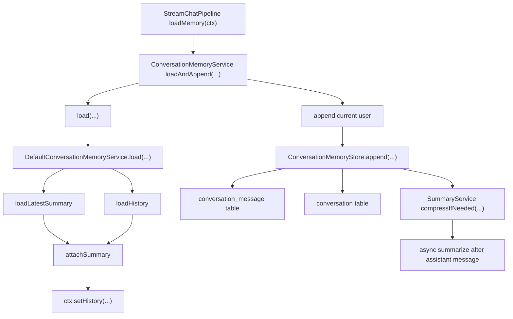

# Ragent 记忆加载链路详解

## 1. 文档目标

本文聚焦 Ragent 问答主链路中的“记忆加载”部分，完整解释以下问题：

- `StreamChatPipeline.loadMemory()` 到底做了什么
- 为什么它不是简单“查历史消息”
- 历史消息、会话摘要、当前问题三者是什么关系
- 摘要何时生成、何时加载、何时参与 Prompt
- 这套设计背后的工程权衡是什么

本文覆盖从流水线入口到数据库读写、再到摘要压缩回写的完整闭环。

## 2. 总框图



## 3. 入口在哪里

记忆加载从问答流水线第一步开始：

```java
private void loadMemory(StreamChatContext ctx) {
    List<ChatMessage> history = memoryService.loadAndAppend(
            ctx.getConversationId(),
            ctx.getUserId(),
            ChatMessage.user(ctx.getQuestion())
    );
    ctx.setHistory(history);
}
```

对应代码位置：

- `bootstrap/src/main/java/com/nageoffer/ai/ragent/rag/service/pipeline/StreamChatPipeline.java`
- `bootstrap/src/main/java/com/nageoffer/ai/ragent/rag/core/memory/ConversationMemoryService.java`
- `bootstrap/src/main/java/com/nageoffer/ai/ragent/rag/core/memory/DefaultConversationMemoryService.java`

这一步的核心结论只有一句：

> `loadMemory()` 不是“只读历史”，而是“先加载旧记忆，再追加本轮用户消息”。

这个顺序非常关键，后文会反复提到。

## 4. 记忆模型的核心概念

在理解代码前，先明确这套记忆系统中的 3 类信息：

### 4.1 最近历史消息

指最近若干轮原始对话消息，通常是：

- `user`
- `assistant`
- `user`
- `assistant`

它们的特点：

- 保真度最高
- 适合保留近距离上下文
- 成本随轮数线性增长

### 4.2 会话摘要

指对更早历史对话做压缩后的摘要文本。

它的特点：

- 压缩更早上下文
- 节省 token
- 以 `system` 消息形式注入模型上下文

### 4.3 当前用户问题

即本轮最新提问，例如：

- “这个接口为什么会走摘要加载？”

它的特点：

- 在 `loadMemory()` 阶段会先写入存储
- 但不会被塞进 `ctx.history`
- 后续在真正构造模型请求时，会作为“当前 user message”单独加入

这个设计避免了当前问题重复出现两次。

## 5. 第一层入口：`loadAndAppend()`

`ConversationMemoryService` 中的默认实现如下：

```java
default List<ChatMessage> loadAndAppend(String conversationId, String userId, ChatMessage message) {
    List<ChatMessage> history = load(conversationId, userId);
    append(conversationId, userId, message);
    return history;
}
```

这段代码确定了整条链路最重要的时序：

```text
先 load 历史
再 append 当前用户消息
最后返回旧历史
```

### 5.1 这个时序意味着什么

它意味着：

- `ctx.history` 中拿到的是“当前问题出现之前的历史”
- 当前问题已经入库，但不在返回的历史列表里
- 后续 Prompt 构造时，当前问题会单独再加一次

### 5.2 为什么不先 append 再 load

如果先把当前问题写入，再去读历史，会带来两个问题：

- 当前问题会混入历史，和后续单独追加的 user message 重复
- 查询改写、意图识别等阶段拿到的历史语义会变模糊

所以作者故意把它拆成：

- “旧记忆”负责描述上下文
- “当前问题”负责驱动本轮任务

## 6. 第二层：`load()` 如何加载旧记忆

`DefaultConversationMemoryService.load()` 是真正的旧记忆加载入口。

其核心逻辑可以概括成：

```text
参数校验
  ->
并行加载摘要
并行加载最近历史
  ->
等待两个任务完成
  ->
把摘要挂到历史最前面
  ->
返回最终 history
```

### 6.1 参数校验

如果 `conversationId` 或 `userId` 为空，直接返回空列表。

原因很直接：

- 记忆按“用户 + 会话”隔离
- 任一维缺失，都不该冒险读取别人的消息或错误上下文

### 6.2 并行加载的原因

代码使用两个 `CompletableFuture` 并发读取：

- 摘要
- 历史消息

这样做的设计动机是：

- 这两类数据来源不同
- 都是读操作，天然适合并发
- 对流式问答来说，首包速度很重要

因此这里不是为了炫技，而是为了尽量缩短问答入口阶段的冷启动等待。

## 7. 历史消息加载链路

最近历史消息由 `JdbcConversationMemoryStore.loadHistory()` 加载。

### 7.1 查询上限如何确定

历史保留条数来自配置：

- `rag.memory.history-keep-turns`

对应代码：

```java
private int resolveMaxHistoryMessages() {
    int maxTurns = memoryProperties.getHistoryKeepTurns();
    return maxTurns * 2;
}
```

这代表系统的基本假设是：

- 1 轮 = 1 条 `user` + 1 条 `assistant`

默认配置见 `MemoryProperties`：

- `historyKeepTurns = 8`

因此默认最多取最近 `16` 条消息。

### 7.2 数据从哪里查

`JdbcConversationMemoryStore.loadHistory()` 会调用：

- `ConversationMessageService.listMessages(...)`

再由 `ConversationMessageServiceImpl` 从 `conversation_message` 表读取。

查询特点：

- 按 `createTime` 排序
- 带 `limit`
- 只查当前 `conversationId + userId`
- 只查未删除消息

### 7.3 为什么传 `DESC` 最后又变成正序

在 `JdbcConversationMemoryStore` 中调用了：

- `ConversationMessageOrder.DESC`

但 `ConversationMessageServiceImpl.listMessages()` 在收到降序查询后，会在内存中 `Collections.reverse(records)`。

其最终效果是：

- 先高效地从数据库取最近 N 条消息
- 再在返回前转回时间正序

这样上层拿到的历史永远是：

```text
较早消息 -> 较晚消息
```

这很适合后续直接喂给模型。

### 7.4 消息如何转换为统一结构

数据库记录最终会被转成 `ChatMessage`：

- `user` -> `ChatMessage.user(...)`
- `assistant` -> `ChatMessage.assistant(...)`

统一数据结构的价值在于：

- 后续无论是 Prompt 组装还是模型调用，都只面对一种抽象
- 屏蔽了数据库表结构细节

### 7.5 为什么只保留 `user/assistant`

历史加载阶段会过滤消息，只保留：

- `USER`
- `ASSISTANT`

原因是：

- 历史对话本质上是对话轮次，不应混入别的系统消息
- 摘要会单独以 `SYSTEM` 角色追加
- 这样能避免角色语义混乱

### 7.6 `normalizeHistory()` 为什么要裁掉前缀 assistant

代码会把历史开头连续的 `ASSISTANT` 消息裁掉，直到遇到第一个 `USER` 为止。

这段逻辑非常有意思，它解决的是一个容易被忽视的 Prompt 质量问题：

- 如果只保留最近 N 条消息，可能截断在一轮对话中间
- 此时最前面可能是 `assistant` 回复
- 模型看到这样的上下文，语义上会不自然

所以系统选择：

- 让历史尽量从 `user` 开始

这会损失部分消息，但换来更好的上下文完整性。

### 7.7 历史加载失败怎么办

如果历史读取失败：

- 记 error 日志
- 返回空列表

这说明“记忆增强”不是主链路硬依赖，系统宁可降级，也不直接让聊天失败。

## 8. 摘要加载链路

摘要由 `JdbcConversationMemorySummaryService.loadLatestSummary()` 加载。

### 8.1 数据来源

摘要查询最终走：

- `ConversationGroupService.findLatestSummary(...)`

再由 `ConversationGroupServiceImpl` 从 `conversation_summary` 表中取最新一条摘要记录。

查询特点：

- 只按 `conversationId + userId`
- 只取未删除记录
- `order by id desc limit 1`

也就是说，系统只关心“这个会话最新的摘要快照”。

### 8.2 摘要为什么被转成 `SYSTEM` 消息

代码中：

```java
return new ChatMessage(ChatMessage.Role.SYSTEM, record.getContent());
```

这意味着摘要被当成系统上下文，而不是普通对话历史。

原因是：

- 摘要是压缩后的背景说明
- 它不属于用户自然发言
- 也不属于模型真实输出

从 LLM 视角看，它更像：

> 系统提供的、可用于理解上下文的辅助背景。

### 8.3 摘要还会再包一层模板

摘要不会直接裸塞进上下文，而是走 `decorateIfNeeded()`：

```text
<conversation-summary>
...
</conversation-summary>
```

模板来自：

- `bootstrap/src/main/resources/prompt/context-format.st`

这样做的价值很大：

- 让模型明确知道这是一段摘要，而不是普通聊天记录
- 降低模型把摘要当成“当前用户发言”的风险
- 让 Prompt 结构更稳定、可控

### 8.4 摘要加载失败怎么办

如果摘要读取异常：

- 记 warn 日志
- 返回 `null`

这里日志等级是 `warn`，而不是 `error`，说明作者认为：

- 摘要是增强项
- 没有摘要不是致命错误

## 9. 摘要和历史是如何拼接的

当两个并行任务都完成后，`attachSummary()` 负责合并结果。

逻辑如下：

- 如果历史为空，直接返回空列表
- 如果没有摘要，直接返回历史
- 如果有摘要，把装饰后的摘要放到最前面，再拼接历史

最终结构通常是：

```text
[system]   <conversation-summary>...</conversation-summary>
[user]     最近几轮问题 1
[assistant]最近几轮回答 1
[user]     最近几轮问题 2
[assistant]最近几轮回答 2
...
```

### 9.1 这里有一个重要行为细节

如果“历史为空但摘要存在”，当前实现仍然返回空列表，而不是只返回摘要。

这是因为 `attachSummary()` 第一行就是：

- `if (CollUtil.isEmpty(messages)) return List.of();`

这意味着：

- 摘要不是独立存在的上下文载体
- 它被设计成“最近历史的前缀增强”

这不一定是问题，但它是一个值得面试时提出来讨论的实现细节。

## 10. 当前用户消息的追加链路

`load()` 结束后，`loadAndAppend()` 会调用 `append()` 写入本轮用户消息。

### 10.1 追加入口

`DefaultConversationMemoryService.append()` 做两件事：

1. `memoryStore.append(...)`
2. `summaryService.compressIfNeeded(...)`

这说明“写消息”和“触发摘要压缩”被绑定在一次追加动作里。

### 10.2 用户消息如何落库

`JdbcConversationMemoryStore.append()` 会把 `ChatMessage` 转为 `ConversationMessageBO`，再调用：

- `ConversationMessageService.addMessage(...)`

从而写入 `conversation_message` 表。

此外，如果当前消息是 `USER`，还会额外调用：

- `ConversationService.createOrUpdate(...)`

作用是：

- 创建或更新会话主记录
- 更新最近问题
- 更新最近时间

所以在 `loadMemory()` 阶段，虽然问答还没开始，但会话已经先被“激活”了。

### 10.3 为什么要在这么早就写入用户消息

这样做有几个明显好处：

- 即使后续链路失败，用户问题仍然能被记录
- 管理台/聊天页可以尽早看到本轮输入
- 有利于后续会话标题、失败兜底、重试分析

这是一种典型的“先记用户输入，再处理业务”的工程策略。

## 11. 摘要压缩链路

虽然本文主题是“记忆加载”，但摘要压缩和它天然构成闭环，因此必须一起理解。

### 11.1 什么时候触发摘要压缩

`compressIfNeeded()` 有两个硬条件：

- `summaryEnabled == true`
- 当前追加消息的角色是 `ASSISTANT`

也就是说：

- 用户消息写入时不会触发摘要压缩
- 只有一轮问答完成、assistant 消息落库后，才会异步检查是否要生成新摘要

这点非常关键，因为它决定了：

> 本次 `loadMemory()` 读到的摘要，一定来自“更早的一次或多次对话”，而不是当前这轮新问题。

### 11.2 为什么只在 assistant 消息后压缩

因为一轮对话的语义通常在 assistant 回复后才完整闭环。

如果在 user 消息写入后就压缩，会出现：

- 只压进问题，没有答案
- 摘要语义不完整

所以作者把触发时机放在 assistant 完成之后，这是合理的。

### 11.3 压缩是同步还是异步

压缩通过 `CompletableFuture.runAsync(...)` 异步执行。

这样设计的原因：

- 摘要生成要调用 LLM，成本高、耗时长
- 不应阻塞主聊天请求

因此摘要压缩属于后台维护型任务，而不是实时强一致链路。

### 11.4 为什么需要分布式锁

摘要任务使用了 Redisson 分布式锁：

- 锁 key：`ragent:memory:summary:lock:{userId}:{conversationId}`

其目的在于：

- 防止同一会话在多实例环境下并发生成重复摘要
- 保证同一会话摘要更新的串行性

这说明作者明确考虑了分布式部署场景，而不是只按单机思路写代码。

### 11.5 何时开始生成摘要

阈值来自配置：

- `summaryStartTurns`

系统统计的是：

- 当前会话的 `user` 消息总数

只有当用户轮次数达到阈值后，才进入摘要逻辑。

默认值：

- `summaryStartTurns = 9`

配合默认 `historyKeepTurns = 8`，含义是：

- 当对话轮数刚刚超过“原文保留上限”时，开始把更早消息压成摘要

这是一种很自然的切换点设计。

### 11.6 哪一段消息会被压缩

压缩逻辑的核心边界是：

- 保留最近 `historyKeepTurns` 轮 user turn 对应的消息不动
- 将更早、且尚未被摘要覆盖的消息取出来做摘要

这里借助了几个查询：

- `countUserMessages(...)`
- `findLatestSummary(...)`
- `listLatestUserOnlyMessages(...)`
- `listMessagesBetweenIds(...)`
- `findMaxMessageIdAtOrBefore(...)`

其中最关键的两个边界点是：

- `afterId`：上一次摘要已经覆盖到哪里
- `cutoffId`：这次要保留的最新窗口从哪里开始

最终只对 `(afterId, cutoffId)` 之间的消息生成新摘要。

### 11.7 为什么摘要支持增量合并

摘要生成时，如果已有旧摘要，系统会把旧摘要作为一条 `assistant` 消息放进压缩提示词里：

- 明确要求“仅用于合并去重，不得作为事实新增来源”
- 如果与本轮对话冲突，以本轮对话为准

这说明摘要不是每次全量重算，而是：

- 旧摘要 + 新增历史消息 -> 合并生成新摘要

这样做的优点：

- 成本更低
- 不必每次把所有历史都重新喂给模型

### 11.8 为什么摘要有长度上限

摘要生成提示中明确约束：

- 严格不超过 `summaryMaxChars`
- 仅一行

默认：

- `summaryMaxChars = 200`

这么做是为了保证摘要真正起到“压缩”作用，而不是从长对话变成另一段长对话。

## 12. 记忆加载和摘要压缩的时间关系

这条链路最容易搞混的是“读取摘要”和“生成摘要”的先后关系。

可以用下面这张时序图理解：

```text
第 N 轮开始:
  load old summary + recent history
  append current user message
  ... 执行问答 ...
  append assistant answer
  async compressIfNeeded

第 N+1 轮开始:
  load latest summary generated after round N
  load recent history
  append current user message
```

因此有一个非常重要的结论：

> 当前轮看到的摘要，来自之前轮次的压缩结果；当前轮产生的新摘要，最早也是下一轮加载时才会被读到。

## 13. 配置项如何影响整条链路

配置类为 `MemoryProperties`，关键项如下：

### 13.1 `historyKeepTurns`

作用：

- 最近保留多少轮原始消息

影响：

- `loadHistory()` 的最大消息条数
- 摘要压缩时的保留窗口

### 13.2 `summaryEnabled`

作用：

- 是否开启摘要压缩

影响：

- 关闭时，系统只保留最近几轮原文，不生成摘要

### 13.3 `summaryStartTurns`

作用：

- 从第几轮开始触发摘要

影响：

- 过小会导致过早压缩
- 过大会导致历史膨胀

### 13.4 `summaryMaxChars`

作用：

- 摘要最大长度

影响：

- 太短会丢信息
- 太长会失去压缩意义

## 14. 这套设计背后的核心思想

### 14.1 “短期记忆 + 长期摘要”

这是整套方案最核心的思想：

- 近处上下文保留原文，保证细节
- 远处上下文压缩成摘要，控制成本

这在 LLM 应用里是非常典型且实用的方案。

### 14.2 “加载与压缩解耦”

加载发生在问答入口，要求：

- 快
- 稳
- 可降级

压缩发生在后台异步阶段，要求：

- 不阻塞用户
- 能增量推进

两者解耦后，用户体验和系统成本都更容易平衡。

### 14.3 “当前问题与历史分离”

系统刻意让：

- `history` 只代表旧上下文
- 当前问题单独进入本轮模型输入

这样可以降低重复、歧义和上下文污染。

### 14.4 “容错优先”

无论是：

- 摘要加载失败
- 历史加载失败
- 摘要压缩失败

系统都不会直接让问答主链路报错，而是尽量降级为“无记忆”或“无摘要”模式。

这是典型的生产系统思路。

## 15. 值得注意的实现细节

### 15.1 `loadMemory()` 本质上是读写混合操作

名字叫“load”，但实际做的是：

- 读旧记忆
- 写当前消息

这在阅读源码时必须牢记。

### 15.2 旧历史不包含当前问题

这是 Prompt 组装时避免重复的关键。

### 15.3 摘要是 `SYSTEM` 而不是 `ASSISTANT`

这是一种显式的 Prompt 工程策略，不是随便选的角色。

### 15.4 摘要有模板包装，不是裸文本

这能帮助模型更稳定地理解“这是一段摘要”。

### 15.5 历史从 `USER` 开始做归一化

这体现了作者对“上下文是否自然完整”的敏感度。

### 15.6 摘要压缩只在 assistant 消息后触发

这保证了被压缩的是完整轮次，而不是半轮对话。

## 16. 可能的边界场景

### 16.1 只有摘要，没有最近历史

当前实现会返回空列表，不会只返回摘要。

这可能导致：

- 某些极端场景下，已有摘要但未被使用

如果未来要增强，可以考虑：

- 当历史为空但摘要存在时，允许只返回摘要

### 16.2 摘要压缩失败

系统会回退为旧摘要或不使用摘要，不影响主问答流程。

### 16.3 历史窗口截断在 assistant 开头

`normalizeHistory()` 会主动裁剪，避免不自然上下文。

### 16.4 多实例同时压缩同一会话

Redisson 分布式锁负责避免重复压缩。

## 17. 学习这条链路的建议顺序

建议按下面顺序阅读源码：

1. `StreamChatPipeline.loadMemory()`
2. `ConversationMemoryService.loadAndAppend()`
3. `DefaultConversationMemoryService.load()`
4. `JdbcConversationMemoryStore.loadHistory()`
5. `JdbcConversationMemorySummaryService.loadLatestSummary()`
6. `DefaultConversationMemoryService.attachSummary()`
7. `DefaultConversationMemoryService.append()`
8. `JdbcConversationMemorySummaryService.compressIfNeeded()`
9. `JdbcConversationMemorySummaryService.doCompressIfNeeded()`

这样能最顺畅地把“加载链路”和“压缩链路”连起来。

## 18. 一句话总结

Ragent 的记忆加载链路本质上是一套“近端原文保留、远端摘要压缩、加载与压缩解耦、当前问题独立建模”的多轮对话上下文管理方案：它在问答入口并行读取最近历史和最新摘要，将摘要包装成 `system` 上下文拼接到历史前方，同时提前持久化当前用户问题，并在 assistant 回复落库后异步触发增量摘要压缩，从而在上下文质量、Token 成本和系统稳定性之间取得平衡。
